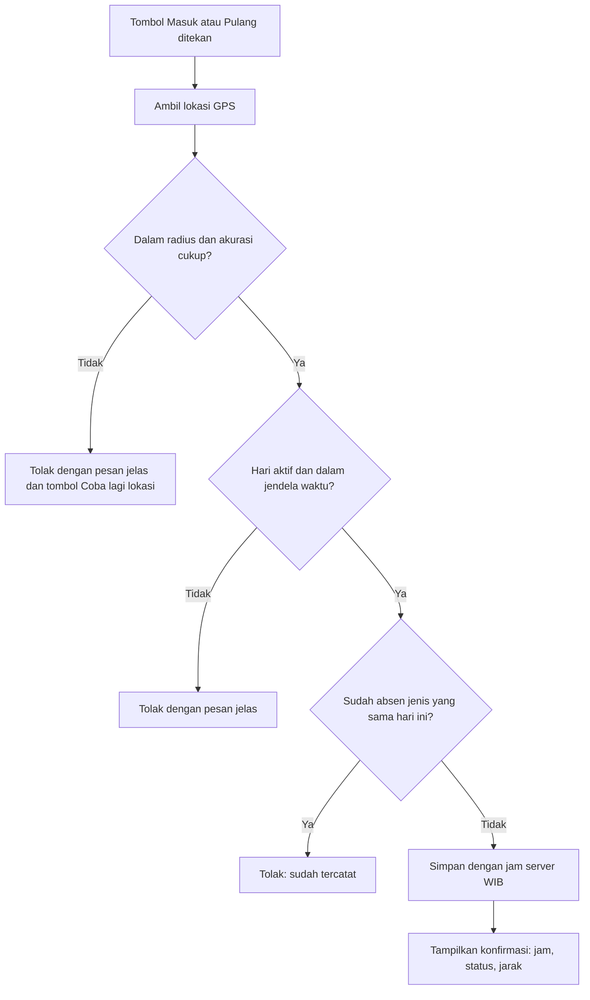
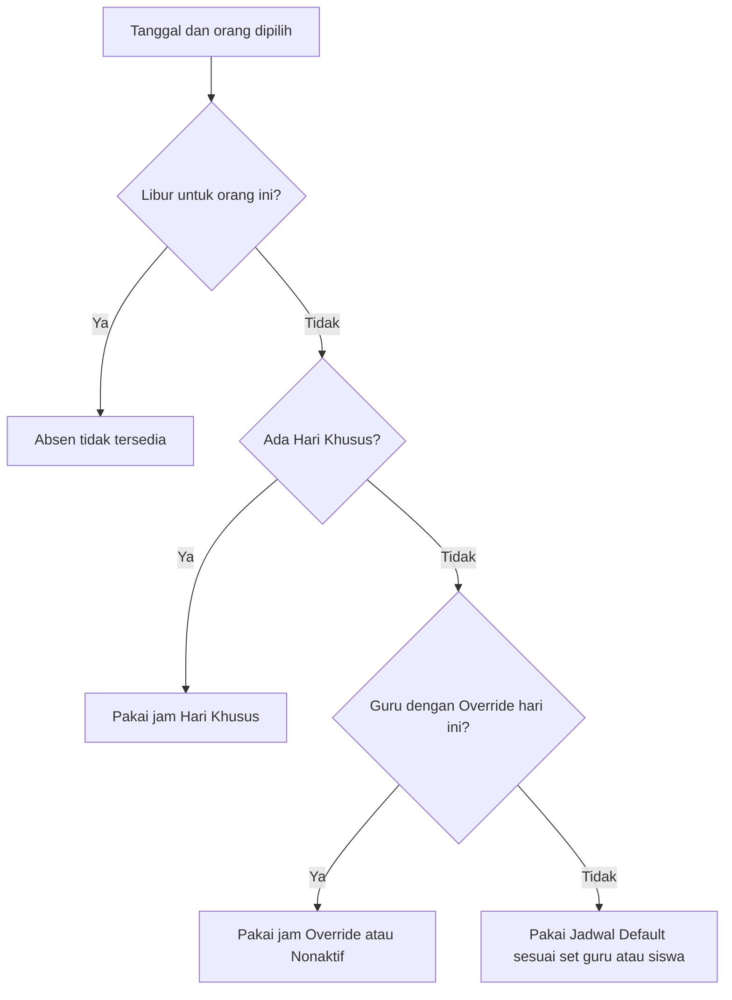

# Business Requirements Document (BRD)

## Aplikasi Absensi Guru dan Siswa Berbasis Geo Tagging

| | |
|---|---|
| **Versi** | 1.1 (draf untuk persetujuan; menambah PK-F) |
| **Tanggal** | 5 Oktober 2026 |
| **Sumber utama** | Rancangan Final v1.0 (4 Oktober 2026) |
| **Pemilik produk** | Lembaga (madrasah) |
| **Dokumen turunan** | Functional Spec → Data Model → Wireframe/UI-UX → Prompt Playbook |

> ### ⚠️ Dokumen ini mengikat pada **Pedoman Konsistensi (Bagian 3)**
> Setiap kebutuhan, desain layar, dan hasil pembangunan **wajib** mematuhi Pedoman Konsistensi: **(A) ramah desktop dan mobile, (B) ramah pemula, (C) tampilan modern minimalis, (D) istilah dan format baku, (E) konsistensi rancangan, (F) menjaga struktur tetap sederhana dan tidak rawan konflik**. Ketidaksesuaian terhadap pedoman dihitung sebagai **cacat** dan **tidak lulus UAT** (Bagian 16).

**Prinsip utama:** setiap proses cukup 1–3 ketukan, data diisi sekali, dan sistem bekerja otomatis.

---

## Daftar Isi

1. [Informasi Dokumen](#1-informasi-dokumen)
2. [Ringkasan Eksekutif](#2-ringkasan-eksekutif)
3. [**Pedoman Konsistensi (Mengikat)**](#3-pedoman-konsistensi-mengikat)
4. [Latar Belakang dan Masalah Bisnis](#4-latar-belakang-dan-masalah-bisnis)
5. [Tujuan Bisnis dan Indikator Keberhasilan](#5-tujuan-bisnis-dan-indikator-keberhasilan)
6. [Ruang Lingkup](#6-ruang-lingkup)
7. [Pemangku Kepentingan dan Peran Pengguna](#7-pemangku-kepentingan-dan-peran-pengguna)
8. [Asumsi, Batasan, dan Ketergantungan](#8-asumsi-batasan-dan-ketergantungan)
9. [Kebutuhan Bisnis](#9-kebutuhan-bisnis)
10. [Aturan Bisnis](#10-aturan-bisnis)
11. [Kebutuhan Data](#11-kebutuhan-data)
12. [Kebutuhan Non-Fungsional](#12-kebutuhan-non-fungsional)
13. [Proses Bisnis Utama](#13-proses-bisnis-utama)
14. [Laporan dan Keluaran](#14-laporan-dan-keluaran)
15. [Matriks Hak Akses](#15-matriks-hak-akses)
16. [Kriteria Penerimaan (UAT)](#16-kriteria-penerimaan-uat)
17. [Risiko dan Mitigasi](#17-risiko-dan-mitigasi)
18. [Rencana Rilis dan Pembangunan](#18-rencana-rilis-dan-pembangunan)
19. [Catatan Keputusan](#19-catatan-keputusan)
20. [Glosarium](#20-glosarium)
21. [Matriks Keterlacakan](#21-matriks-keterlacakan)
22. [Persetujuan](#22-persetujuan)

---

## 1. Informasi Dokumen

### 1.1 Tujuan Dokumen
BRD ini menetapkan **apa** yang dibutuhkan lembaga dari aplikasi absensi guru dan siswa berbasis geo tagging, **mengapa** dibutuhkan, dan **bagaimana keberhasilannya diukur**. Detail layar, alur teknis, dan struktur data dijabarkan di dokumen turunan.

### 1.2 Cara Membaca Dokumen
| Kode | Arti | Contoh |
|---|---|---|
| **PK-xx** | Pedoman Konsistensi | PK-A5 |
| **BR-xx-nn** | Kebutuhan Bisnis | BR-AG-01 |
| **AB-nn** | Aturan Bisnis | AB-05 |
| **NFR-xx-nn** | Kebutuhan Non-Fungsional | NFR-KP-01 |
| **UAT-nn** | Skenario Uji Penerimaan | UAT-07 |
| **R-nn** | Risiko | R-03 |
| **D-nn** | Keputusan | D-04 |

### 1.3 Prinsip Penulisan (bagian dari PK-E)
- Setiap aturan ditulis **satu kali** di bagian pemiliknya; bagian lain hanya merujuk.
- Angka yang dapat berubah (radius, toleransi, jendela waktu) hanya didefinisikan di **Pengaturan**.
- Perubahan dicatat sebagai **versi baru**, tidak diubah diam-diam.

### 1.4 Riwayat Revisi
| Versi | Tanggal | Perubahan |
|---|---|---|
| 1.0 | 4 Okt 2026 | BRD baru disusun dari Rancangan Final v1.0 |
| 1.1 | 5 Okt 2026 | Pedoman Konsistensi diperluas dengan **PK-F** (struktur sederhana dan tidak rawan konflik): callout awal, Bagian 3.6 (baru), Daftar Periksa 16.3, NFR-KP-01, D-12, R-11, matriks keterlacakan |

---

## 2. Ringkasan Eksekutif

Lembaga membutuhkan aplikasi web yang **mencatat kehadiran guru dan siswa** menggunakan **lokasi GPS (geo tagging)**, dengan prosedur yang praktis dan mudah dipakai pemula.

**Inti solusi:**

- **Guru** absen sendiri lewat satu tombol besar **Masuk/Pulang**; lokasi harus berada dalam radius madrasah.
- **Siswa** absen **Masuk dan Pulang** setiap hari; guru memindai **Kartu QR** (atau mengetik NISN). Siswa dan orang tua memiliki **akun lihat-saja** untuk melihat rekap.
- **Jadwal fleksibel:** jadwal default (guru dan siswa terpisah), kalender libur dan hari khusus, serta override per guru.
- **Status otomatis:** Hadir, Terlambat, Izin, Sakit, Dinas Luar, Alpa, ditambah penanda Pulang Awal dan Tidak Lengkap.
- **Izin dan koreksi** dengan alur sederhana dan tercatat di log.
- **Laporan** harian, mingguan, dan bulanan (filter rentang tanggal), siap cetak dan ekspor.
- **Antarmuka** ramah desktop dan mobile, ramah pemula, dan bergaya modern minimalis, sesuai **Pedoman Konsistensi**.

**Pendekatan pembangunan:** bertahap, **frontend (fokus layout) lebih dulu**, kemudian **backend (kelola database)**, lalu uji lapangan terbatas sebelum peluncuran.

---

## 3. Pedoman Konsistensi (Mengikat)

> **Status: WAJIB.** Pedoman terdiri dari enam kategori (**PK-A s.d. PK-F**) dan berlaku untuk seluruh kebutuhan, desain layar, struktur data, dan kode. Setiap kebutuhan di Bagian 9 menyebut pedoman yang paling relevan. Setiap layar harus lulus **Daftar Periksa Pedoman (Bagian 16.3)** sebelum dianggap selesai.

### 3.1 PK-A: Ramah Desktop dan Mobile

| ID | Ketentuan | Cara verifikasi |
|---|---|---|
| **PK-A1** | **Mobile-first:** layar dirancang dari lebar HP (360–430 px), lalu diperluas ke tablet dan desktop. | Uji tampilan pada ±375 px dan ±1280 px untuk setiap modul. |
| **PK-A2** | Aksi harian guru (**Masuk, Pulang, Scan Siswa**) dioptimalkan untuk HP. Pengelolaan data (master data, jadwal, laporan) nyaman di desktop, tetapi tetap bisa dipakai di HP. | Skenario UAT dijalankan di HP dan desktop. |
| **PK-A3** | **Navigasi:** HP memakai bilah menu bawah (maksimal 5 item); desktop memakai sidebar kiri. Struktur menu sama di kedua perangkat. | Pemeriksaan visual. |
| **PK-A4** | **Tabel** lebar di HP berubah menjadi daftar kartu atau dapat digeser ke samping; kolom terpenting tampil lebih dulu. | Pemeriksaan visual di ±375 px. |
| **PK-A5** | **Target sentuh ≥ 44 px**; teks isi **≥ 16 px** di HP sehingga tidak perlu memperbesar layar. | Pengukuran pada komponen. |
| **PK-A6** | **Tanpa instalasi:** berjalan di peramban modern (Chrome, Edge, Safari). Halaman ringan, gambar dikompres, tetap lancar di sinyal lemah. | Uji di jaringan lambat. |
| **PK-A7** | **Izin perangkat:** lokasi dan kamera diminta lewat peramban; bila izin ditolak, tampil panduan singkat cara mengaktifkannya. | Uji dengan izin ditolak. |

### 3.2 PK-B: Ramah Pemula

| ID | Ketentuan | Cara verifikasi |
|---|---|---|
| **PK-B1** | **Bahasa Indonesia sehari-hari**, tanpa istilah teknis; istilah mengikuti glosarium baku (PK-D). | Tinjauan teks seluruh layar. |
| **PK-B2** | **Satu layar satu tujuan**, dengan **satu tombol aksi utama** yang menonjol. | Pemeriksaan visual. |
| **PK-B3** | **Alur absen 1–3 ketukan** (prinsip utama). | Hitung ketukan pada UAT absen. |
| **PK-B4** | **Pesan yang menolong:** setiap pesan menjelaskan *apa yang terjadi* dan *apa yang harus dilakukan*. Contoh: "Anda 340 m dari madrasah. Dekati area madrasah lalu tekan Coba lagi lokasi." | Uji semua pesan kesalahan. |
| **PK-B5** | **Keadaan kosong berisi petunjuk**, misalnya "Belum ada data guru. Unduh template Excel lalu impor." | Pemeriksaan layar tanpa data. |
| **PK-B6** | **Konfirmasi aksi berisiko** (nonaktifkan data, koreksi, impor) dengan ringkasan akibatnya. | Uji aksi berisiko. |
| **PK-B7** | **Bantuan di tempat:** teks bantu singkat, ikon info, halaman Bantuan, dan template Excel dengan contoh baris. | Pemeriksaan keberadaan. |
| **PK-B8** | **Formulir sederhana:** label di atas isian, validasi langsung, nilai bawaan yang masuk akal. | Uji formulir. |
| **PK-B9** | **Umpan balik instan:** setiap aksi menampilkan status berhasil, gagal, atau sedang diproses. | Uji semua aksi. |

### 3.3 PK-C: Tampilan Modern Minimalis

| ID | Ketentuan | Cara verifikasi |
|---|---|---|
| **PK-C1** | **Palet terbatas:** satu warna utama (hijau tua), warna netral (putih dan abu), dan **empat warna status**. Warna status **selalu disertai teks/ikon**, tidak hanya warna. | Tinjauan desain. |
| **PK-C2** | **Satu keluarga huruf** sans-serif dengan **tiga tingkat ukuran**: judul, isi, keterangan. | Tinjauan desain. |
| **PK-C3** | **Ruang kosong lapang**, kartu bersudut halus, garis atau bayangan tipis, tanpa dekorasi berlebihan. | Tinjauan desain. |
| **PK-C4** | **Satu set ikon** bergaya garis (outline) yang konsisten. | Tinjauan desain. |
| **PK-C5** | **Data sebagai fokus**; maksimal satu aksi utama per layar. | Pemeriksaan visual. |
| **PK-C6** | **Kontras** memenuhi standar keterbacaan (WCAG AA). | Alat pemeriksa kontras. |
| **PK-C7** | **Komponen seragam** (tombol, isian, tabel, kartu, lencana status, jendela konfirmasi, pesan singkat) dibuat **satu kali** dan dipakai di semua halaman. | Tinjauan kode/desain. |

**Warna status baku:**

| Status | Warna | Label tampil |
|---|---|---|
| Hadir | Hijau | Hadir |
| Terlambat | Kuning/oranye | Terlambat |
| Izin, Sakit, Dinas Luar | Biru | Izin / Sakit / Dinas Luar |
| Alpa | Merah | Alpa |

### 3.4 PK-D: Istilah dan Format Baku

| ID | Hal | Ketentuan baku |
|---|---|---|
| **PK-D1** | Peran | **Admin**, Kepala, Guru, Siswa. *Wali kelas* adalah guru yang ditunjuk di data Kelas, **bukan peran tersendiri**. |
| **PK-D2** | Tombol absen | **Masuk** dan **Pulang** (bukan "Datang"). |
| **PK-D3** | Status | Hadir, Terlambat, Izin, Sakit, Dinas Luar (khusus guru), Alpa. |
| **PK-D4** | Penanda | Pulang Awal, Tidak Lengkap, Dikoreksi, Lokasi Mencurigakan. |
| **PK-D5** | Jadwal | Jadwal Default, Hari Khusus, Libur, Override Guru. |
| **PK-D6** | Tombol umum | Simpan, Batal, Ajukan, Setujui, Tolak, Unduh, Cetak. |
| **PK-D7** | Format | Jam **24 jam WIB** (contoh 07:00); tanggal ditulis **4 Okt 2026**. |

### 3.5 PK-E: Konsistensi Rancangan dan Proses

| ID | Ketentuan |
|---|---|
| **PK-E1** | Setiap aturan ditulis **satu kali** di bagian pemiliknya; bagian lain merujuk. |
| **PK-E2** | Angka yang dapat berubah hanya didefinisikan di **Pengaturan**. |
| **PK-E3** | Perubahan rancangan dicatat sebagai **versi baru**. |
| **PK-E4** | Temuan uji yang mengubah aturan **dikembalikan ke dokumen** (BRD/FS) **sebelum kode diubah**. |
| **PK-E5** | Pembangunan dilakukan **satu modul per siklus** (rancang, bangun, uji, simpan versi); setiap prompt pembangunan **menyertakan Pedoman Konsistensi** dan glosarium baku. |

### 3.6 PK-F: Struktur Sederhana dan Tidak Rawan Konflik

> Struktur (data, aturan, dan alur) dijaga **sekecil dan sejelas mungkin**. **Aturan penentu bila ragu:** pilih opsi yang menambah **paling sedikit** tabel, kolom, status, layar, dan aturan.

| ID | Ketentuan | Cara verifikasi |
|---|---|---|
| **PK-F1** | **Satu fakta, satu tempat.** Tidak ada data atau aturan yang disimpan atau ditulis di dua tempat; angka bisnis hanya di Pengaturan; hasil yang dapat dihitung (jadwal per hari, persentase, "Belum Absen") **tidak disimpan ulang**. | Tinjauan skema; pencarian angka bisnis tertanam di kode (harus nol). |
| **PK-F2** | **Struktur data minimal.** Tabel, kolom, status, atau kode baru **hanya** bila ada kebutuhan di BRD dan lewat **versi baru** Data Model. | Skema basis data identik dengan Data Model. |
| **PK-F3** | **Integritas dijaga basis data:** kunci unik, aturan CHECK, dan kunci asing mencegah data tidak sah; validasi layar hanya lapisan tambahan. | Skenario uji data (Data Model). |
| **PK-F4** | **Satu aturan, satu fungsi.** Logika yang dipakai banyak layar (jadwal efektif, penentuan status, penerapan izin, tutup hari) berada di **satu fungsi bersama** dan tidak disalin per layar. | Tinjauan kode. |
| **PK-F5** | **Riwayat tidak berubah:** data tidak dihapus; perubahan master, jadwal, atau pengaturan tidak menggeser catatan lama (AB-12, AB-17, AB-18). | UAT-25, UAT-26. |
| **PK-F6** | **Prioritas tertulis untuk aturan yang bisa bertabrakan:** urutan jadwal (AB-11), izin vs Alpa vs scan (AB-08), entri kalender spesifik vs umum. Tidak ada dua aturan berlaku bersamaan tanpa urutan. | UAT-08..10, UAT-16, UAT-17. |
| **PK-F7** | **Satu pelaksana per jenis keputusan:** izin guru → Kepala; koreksi guru → Admin; koreksi siswa → wali kelas; Admin dapat semua koreksi (AB-16). | UAT-18..20. |
| **PK-F8** | **Cakupan terkendali:** fitur yang menambah kerumitan ditunda ke Fase 2 (Bagian 6.3 dan B-3). | Tinjauan cakupan per modul. |

### 3.7 Cara Pedoman Diterapkan
1. Setiap kebutuhan di Bagian 9 memuat kolom **Pedoman** yang menyebut ID relevan.
2. Setiap layar wajib lulus **Daftar Periksa Pedoman** (Bagian 16.3).
3. Ketidaksesuaian dicatat sebagai **cacat**; modul **tidak dinyatakan selesai** sebelum cacat pedoman ditutup.

---

## 4. Latar Belakang dan Masalah Bisnis

| # | Masalah saat ini | Dampak |
|---|---|---|
| 1 | Absensi guru dan siswa dilakukan manual (buku absen, rekap Excel). | Memakan waktu, rawan salah, rekap terlambat. |
| 2 | Kehadiran guru sulit diverifikasi (waktu dan lokasi). | Data kurang akurat dan sulit dipertanggungjawabkan. |
| 3 | Keterlambatan siswa dan siswa pulang sebelum waktunya sulit dikontrol. | Kepala tidak punya data real-time. |
| 4 | Proses izin dan sakit tidak terstruktur (lisan, WhatsApp, surat lepas). | Data izin tercecer dan tidak sinkron dengan absensi. |
| 5 | Orang tua tidak punya akses langsung ke kehadiran anak. | Informasi bergantung pada guru. |
| 6 | Pengguna beragam tingkat kemahiran teknologi. | Aplikasi yang rumit akan ditinggalkan. |

---

## 5. Tujuan Bisnis dan Indikator Keberhasilan

| ID | Tujuan bisnis | Indikator keberhasilan (usulan target) |
|---|---|---|
| **TB-1** | Mencatat kehadiran guru akurat (waktu dan lokasi) tanpa mesin absen. | ≥ 95% absen guru tercatat lewat aplikasi pada bulan ke-2. |
| **TB-2** | Mempercepat absensi siswa Masuk dan Pulang tanpa rekap manual. | Rekap manual dihentikan; waktu scan per siswa ≤ 3 detik pada scan beruntun. |
| **TB-3** | Memberi Kepala informasi kehadiran real-time dan laporan siap cetak. | Dashboard hari ini tersedia kapan saja; laporan bulanan terbit ≤ 5 menit. |
| **TB-4** | Menyederhanakan izin dan sakit dari pengajuan sampai persetujuan. | 100% izin tercatat di sistem dan tercermin otomatis pada absensi. |
| **TB-5** | Memberi siswa dan orang tua akses lihat-saja ke rekap individu. | Seluruh siswa aktif memiliki akun. |
| **TB-6** | Mengganti administrasi manual dengan laporan otomatis. | Buku absen manual dihentikan setelah masa uji lapangan. |
| **TB-7** | Aplikasi mudah dipakai pemula. | Pengguna baru dapat absen tanpa pelatihan; ≤ 3 ketukan per absen (PK-B3). |

> Nilai target adalah **usulan** dan dapat disesuaikan lembaga saat persetujuan.

---

## 6. Ruang Lingkup

### 6.1 Dalam Lingkup, Fase 1 (Inti)
- Master data dan **impor Excel** (akun dibuat otomatis).
- Jadwal: default guru/siswa, kalender (libur dan hari khusus), override guru.
- **Absen guru** (GPS) dan **absen siswa** (QR/NISN, Masuk dan Pulang, scan beruntun).
- Izin guru dan izin siswa; koreksi absen.
- Laporan berbasis rentang tanggal (harian/mingguan/bulanan), ekspor Excel dan PDF.
- **Akun siswa lihat-saja**; Kartu QR; Log Aktivitas.
- Pengaturan lembaga dan jendela waktu.

### 6.2 Dalam Lingkup, Fase 2 (Penyempurnaan)
- Notifikasi dorong dan pengingat absen.
- Mode offline (antrean scan siswa saat sinyal putus).
- Dashboard grafik dan tren.

### 6.3 Di Luar Lingkup
- Absen siswa **per jam pelajaran** (absen siswa selalu per hari).
- Mode Ceklis Kelas dengan default "Hadir" semua.
- Pengajuan izin oleh siswa sendiri.
- Peran terpisah untuk orang tua (orang tua memakai akun siswa).
- Pelacakan lokasi terus-menerus.
- Integrasi dengan sistem lain (mis. penggajian).

---

## 7. Pemangku Kepentingan dan Peran Pengguna

| Peran | Kepentingan / tugas utama | Perangkat utama |
|---|---|---|
| **Kepala** | Memantau kehadiran, menyetujui izin guru, melihat laporan dan log. Absen GPS **opsional**. | HP dan desktop |
| **Admin** | Mengelola master data, jadwal, pengaturan; memproses dan melakukan semua koreksi; laporan. Tidak wajib absen. | Desktop |
| **Guru** | Absen sendiri; memindai absen siswa; mengajukan izin dan koreksi; melihat rekap pribadi. Guru **wali kelas** juga mengelola izin dan koreksi siswa kelasnya. | HP |
| **Siswa / orang tua** | Akun lihat-saja: rekap kehadiran, Kartu QR, ganti password. | HP |

---

## 8. Asumsi, Batasan, dan Ketergantungan

### 8.1 Asumsi
- A-1: Skala lembaga sekitar puluhan guru dan ratusan siswa (satu lokasi madrasah).
- A-2: Guru memiliki HP dengan GPS, kamera, dan peramban modern.
- A-3: Madrasah berada di zona waktu **WIB**.
- A-4: Lembaga memiliki domain email untuk akun (mis. `akademik.sch.id`).
- A-5: Koneksi internet tersedia di area madrasah (sinyal bisa lemah di titik tertentu).

### 8.2 Batasan
- B-1: Aplikasi berbasis web (tanpa instalasi); keandalan GPS bergantung perangkat dan lingkungan.
- B-2: Aplikasi web tidak dapat mendeteksi lokasi palsu secara pasti; mitigasi berupa penanda **Lokasi Mencurigakan** (AB-20).
- B-3: Prosedur dijaga sederhana; fitur yang menambah kerumitan ditunda ke Fase 2.

### 8.3 Ketergantungan
- Titik koordinat dan radius madrasah ditetapkan lembaga.
- Data guru dan siswa tersedia dalam template Excel.
- Kartu QR siswa tersedia (cetak atau tampil di HP).

---

## 9. Kebutuhan Bisnis

**Keterangan:** Prioritas **W** = Wajib, **P** = Penting. Fase **1** atau **2**. Kolom *Pedoman* menyebut ID Pedoman Konsistensi yang paling relevan (kategori A–F selalu berlaku).

### 9.1 Akun dan Akses (AK)
| ID | Kebutuhan | Prio | Fase | Pedoman |
|---|---|---|---|---|
| BR-AK-01 | Semua peran login dengan **email dan password**; sesi tetap aktif agar tidak login berulang. | W | 1 | PK-B2, PK-B3 |
| BR-AK-02 | Akun Admin dan Kepala tersedia sebagai akun awal; akun Guru dan Siswa dibuat **otomatis saat impor** dan langsung aktif (tanpa prosedur aktivasi). | W | 1 | PK-B1 |
| BR-AK-03 | Semua pengguna dapat **mengganti password sendiri**. Tidak ada kewajiban ganti password saat login pertama (D-05). | W | 1 | PK-B7 |
| BR-AK-04 | Hak akses mengikuti **Matriks Hak Akses** (Bagian 15). | W | 1 | PK-A3 |
| BR-AK-05 | Akun siswa bersifat **lihat-saja** dan dapat dipakai bersama siswa dan orang tua. | W | 1 | PK-B1, PK-D1 |

### 9.2 Master Data (MD)
| ID | Kebutuhan | Prio | Fase | Pedoman |
|---|---|---|---|---|
| BR-MD-01 | Mengelola **Data Lembaga**: nama, NPSN/NSM, alamat, logo, **koordinat (lat/long)**, **radius**, domain email, tahun ajaran aktif. | W | 1 | PK-B8 |
| BR-MD-02 | **Admin dan Kepala** diinput lewat formulir; pergantian Kepala dengan menonaktifkan data lama dan menambah data baru. | W | 1 | PK-B6, PK-B8 |
| BR-MD-03 | **Guru dan Siswa** diinput lewat **impor Excel** dengan template berisi contoh baris dan tombol **Unduh template**. | W | 1 | PK-B5, PK-B7 |
| BR-MD-04 | Jika email siswa kosong, sistem membuat otomatis **`NISN@siswa.[domain email lembaga]`**. | W | 1 | PK-B1 |
| BR-MD-05 | **Hak edit:** Guru mengubah profil sendiri kecuali **email dan NIP/ID**; Siswa tidak mengubah profil (diedit Admin); **NISN dan email** tidak dapat diubah sendiri. | W | 1 | PK-B8 |
| BR-MD-06 | Mengelola **Kelas** (nama, wali kelas, tahun ajaran) dan **kenaikan kelas massal** di akhir tahun ajaran tanpa input ulang. | W | 1 | PK-B6 |
| BR-MD-07 | Data **tidak dihapus**, hanya **dinonaktifkan**, agar riwayat absen aman. | W | 1 | PK-B6 |

### 9.3 Jadwal dan Pengaturan (JD)
| ID | Kebutuhan | Prio | Fase | Pedoman |
|---|---|---|---|---|
| BR-JD-01 | **Jadwal default dua set**: untuk Guru dan untuk Siswa (struktur sama), per hari: aktif, jam masuk, jam pulang. | W | 1 | PK-A2, PK-B8 |
| BR-JD-02 | **Kalender** libur dan hari khusus dengan kolom **Untuk** (Semua/Guru/Siswa) dan jam khusus. | W | 1 | PK-B8 |
| BR-JD-03 | **Override guru** per hari dalam seminggu (Default / Override jam sendiri / Nonaktif); tidak per tanggal. | W | 1 | PK-B2 |
| BR-JD-04 | Jadwal efektif dihitung **satu fungsi** dengan urutan Libur → Hari Khusus → Override Guru → Default (AB-11). | W | 1 | PK-E1 |
| BR-JD-05 | Perubahan jadwal berlaku **mulai hari berikutnya** (AB-12). | W | 1 | PK-B6 |
| BR-JD-06 | **Pengaturan** (Admin): radius, akurasi maksimal, buka absen Masuk, toleransi terlambat, tutup absen Masuk, buka absen Pulang, domain email. | W | 1 | PK-E2 |

### 9.4 Absen Guru (AG)
| ID | Kebutuhan | Prio | Fase | Pedoman |
|---|---|---|---|---|
| BR-AG-01 | Beranda guru menampilkan **satu tombol besar Masuk atau Pulang** sesuai kondisi, beserta status hari ini. | W | 1 | PK-A2, PK-B2, PK-B3, PK-C5 |
| BR-AG-02 | Absen melalui pemeriksaan standar (AB-01) dengan **geo tag**. | W | 1 | PK-A7, PK-B4 |
| BR-AG-03 | Setelah absen, tampil **konfirmasi**: jam, status, jarak dari titik madrasah. | W | 1 | PK-B9 |
| BR-AG-04 | **Kepala** absen GPS opsional; **Admin** tidak wajib absen (AB-14). | W | 1 | PK-D1 |
| BR-AG-05 | Guru dapat **mengajukan koreksi** bila lupa absen, dengan alasan. | W | 1 | PK-B8 |

### 9.5 Absen Siswa (AS)
| ID | Kebutuhan | Prio | Fase | Pedoman |
|---|---|---|---|---|
| BR-AS-01 | Absen siswa **per hari: Masuk dan Pulang**; **Pulang wajib**. | W | 1 | PK-D2 |
| BR-AS-02 | Guru mengidentifikasi siswa dengan **memindai QR** atau **mengetik NISN**. | W | 1 | PK-A2, PK-B3 |
| BR-AS-03 | **Scan beruntun:** kamera tetap terbuka, tiap siswa tercatat tanpa ketukan tambahan. | W | 1 | PK-A2, PK-B3 |
| BR-AS-04 | Pemindai adalah guru yang sedang login dan berada dalam radius; **pemindai dicatat**. | W | 1 | PK-A7 |
| BR-AS-05 | Siswa tanpa absen dan tanpa izin otomatis **Alpa** di akhir hari; wali kelas mengubahnya menjadi Izin/Sakit bila ada keterangan. | W | 1 | PK-B1 |
| BR-AS-06 | **"Belum Absen"** hanya tampilan sementara di dashboard hari berjalan, bukan status tersimpan. | W | 1 | PK-D3 |
| BR-AS-07 | Wali kelas dapat **mengoreksi** jam/status lupa scan dengan **alasan wajib**; bertanda **Dikoreksi**. | W | 1 | PK-B6 |

### 9.6 Izin dan Koreksi (IZ)
| ID | Kebutuhan | Prio | Fase | Pedoman |
|---|---|---|---|---|
| BR-IZ-01 | **Izin guru:** guru mengajukan (Sakit, Izin, Cuti, Dinas Luar; tanggal; alasan; lampiran opsional) → **Kepala** menyetujui atau menolak (dengan catatan). | W | 1 | PK-B2, PK-D6 |
| BR-IZ-02 | **Admin** dapat menginput izin atas nama guru. | P | 1 | PK-B8 |
| BR-IZ-03 | **Izin siswa** diinput **wali kelas atau Admin**; siswa tidak mengajukan sendiri. | W | 1 | PK-D1 |
| BR-IZ-04 | Izin disetujui/diinput otomatis mengubah absensi (AB-08). | W | 1 | PK-B9 |
| BR-IZ-05 | Guru melihat status izin di halaman **Izin Saya**. | W | 1 | PK-B9 |
| BR-KR-01 | Pelaksana koreksi sesuai tabel (AB-16); **Admin** dapat melakukan semua koreksi. | W | 1 | PK-B6 |
| BR-KR-02 | **Log Aktivitas** mencatat perubahan data dan semua koreksi (siapa, aksi, data lama/baru, waktu). | W | 1 | PK-B6 |

### 9.7 Laporan (LP)
| ID | Kebutuhan | Prio | Fase | Pedoman |
|---|---|---|---|---|
| BR-LP-01 | Laporan dengan **filter rentang tanggal**; pilihan cepat **Harian, Mingguan, Bulanan**. | W | 1 | PK-A4, PK-B2 |
| BR-LP-02 | **Filter**: tanggal, kelas, guru, status. | W | 1 | PK-A4 |
| BR-LP-03 | **Ekspor Excel** dan **cetak PDF** dengan kop lembaga dan kolom tanda tangan Kepala. | W | 1 | PK-D7 |
| BR-LP-04 | **Dashboard** Kepala/Admin: angka hari ini sekilas (mis. "Guru hadir 18/20, siswa hadir 412/430"). | W | 1 | PK-C5, PK-A3 |
| BR-LP-05 | **Rekap pribadi**: guru melihat rekap sendiri; siswa melihat kalender kehadiran, jam masuk/pulang, dan persentase. | W | 1 | PK-A1, PK-C3 |
| BR-LP-06 | Laporan kelas pada tahun lalu tetap akurat (AB-18). | W | 1 | PK-E1 |

### 9.8 Fitur Pendukung (PD)
| ID | Kebutuhan | Prio | Fase | Pedoman |
|---|---|---|---|---|
| BR-PD-01 | **Kartu QR siswa**: cetak massal (PDF per kelas; foto, nama, NISN) dan **"Kartu QR saya"** tampil di HP siswa. | W | 1 | PK-A1, PK-C3 |
| BR-PD-02 | **Cadangan data (backup)** rutin dan dukungan **tahun ajaran**. | W | 1 | PK-E3 |
| BR-PD-03 | **Halaman Bantuan** di aplikasi, termasuk panduan GPS/kamera tidak terbaca. | W | 1 | PK-A7, PK-B7 |

### 9.9 Fase 2 (F2)
| ID | Kebutuhan | Prio | Fase | Pedoman |
|---|---|---|---|---|
| BR-F2-01 | Notifikasi dorong dan pengingat absen. | P | 2 | PK-B9 |
| BR-F2-02 | Mode offline: antrean scan siswa saat sinyal putus. | P | 2 | PK-A6 |
| BR-F2-03 | Dashboard grafik dan tren. | P | 2 | PK-C1, PK-C5 |

---

## 10. Aturan Bisnis

> Seluruh aturan ditulis **satu kali** di sini (PK-E1). Bagian lain hanya merujuk.

### 10.1 Pemeriksaan dan Pencatatan Absen
| ID | Aturan |
|---|---|
| **AB-01** | Absen tersimpan hanya jika: (1) lokasi dalam radius lembaga *(untuk siswa: lokasi guru pemindai)*; (2) akurasi GPS cukup (mis. ≤ 50 m); (3) hari tersebut hari aktif dan waktu dalam jendela absen; (4) belum absen Masuk/Pulang yang sama pada hari itu. |
| **AB-02** | Waktu memakai **jam server WIB 24 jam**, bukan jam HP. |
| **AB-03** | Satu orang hanya dapat absen **Masuk satu kali dan Pulang satu kali** per hari. |
| **AB-09** | Di luar radius: absen ditolak dengan pesan jelas (mis. "Anda 340 m dari madrasah") dan tombol **Coba lagi lokasi**. |
| **AB-10** | **Privasi:** lokasi hanya diambil saat tombol absen ditekan, tidak dilacak terus-menerus, dan hal ini diberitahukan kepada pengguna. |
| **AB-19** | Validasi lokasi dan jam dilakukan **di server**, bukan hanya di aplikasi. |

### 10.2 Jendela Waktu (di Pengaturan)
| ID | Pengaturan | Nilai awal | Arti |
|---|---|---|---|
| **AB-04a** | Buka absen Masuk | 30 menit sebelum jam masuk | Tombol Masuk mulai aktif |
| **AB-04b** | Toleransi terlambat | 10 menit setelah jam masuk | Masuk sampai batas ini tetap Hadir |
| **AB-04c** | Tutup absen Masuk | 180 menit setelah jam masuk (contoh) | Setelah ini Masuk tidak dapat dilakukan |
| **AB-04d** | Buka absen Pulang | 60 menit sebelum jam pulang (contoh) | Pulang sebelum batas ini dicatat **Pulang Awal** |

Nilai berlaku sama untuk guru dan siswa; jam masuk dan pulang mengikuti jadwal masing-masing (AB-11). **AB-07:** Absen Pulang **tidak diblokir**: tombol Pulang aktif setelah Masuk dan tetap aktif sampai akhir hari.

### 10.3 Status dan Penanda
| ID | Status utama | Aturan |
|---|---|---|
| **AB-05** | Hadir | Masuk dalam jendela hingga jam masuk + toleransi |
| | Terlambat | Masuk setelah toleransi hingga batas tutup absen Masuk |
| | Izin / Sakit | Dari izin disetujui (guru) atau diinput wali kelas/Admin (siswa) |
| | Dinas Luar | Khusus guru, dari izin disetujui |
| | Alpa | Hari aktif tanpa absen dan tanpa izin; dibuat otomatis di akhir hari |

Libur **bukan status** dan tidak menyimpan baris; hari libur tidak dihitung Alpa.

| ID | Penanda | Aturan |
|---|---|---|
| **AB-06** | Pulang Awal | Pulang sebelum jendela buka Pulang (AB-04d) |
| | Tidak Lengkap | Ada Masuk tanpa Pulang sampai akhir hari |
| | Dikoreksi | Data diubah lewat koreksi |
| **AB-20** | Lokasi Mencurigakan | Akurasi buruk atau perpindahan terlalu jauh dalam waktu singkat; **hanya ditandai** untuk dicek Admin, tidak diblokir |

Status utama dan penanda disimpan **terpisah**, sehingga seseorang bisa Terlambat sekaligus Pulang Awal. **AB-15:** siswa dengan penanda Tidak Lengkap tetap **dihitung hadir**.

### 10.4 Prioritas Data
| ID | Aturan |
|---|---|
| **AB-08** | **Izin mengalahkan Alpa** (termasuk izin yang diinput setelah hari berlalu). **Scan mengalahkan izin**: siswa yang tetap hadir dan ter-scan tercatat Hadir. |

### 10.5 Jadwal
| ID | Aturan |
|---|---|
| **AB-11** | Urutan prioritas jadwal efektif: **(1) Libur → (2) Hari Khusus → (3) Override Guru → (4) Default.** Hari Khusus **mengganti jam, bukan status aktif**; guru yang nonaktif pada hari itu tidak dihitung Alpa dan boleh tetap absen bila hadir. Kolom **Untuk** pada kalender membatasi berlakunya libur/hari khusus (Semua/Guru/Siswa). Override guru berlaku **per hari dalam seminggu**. |
| **AB-12** | Perubahan jadwal berlaku **mulai hari berikutnya**; hari yang lewat tidak dihitung ulang. |
| **AB-21** | Nilai awal jadwal default (dapat diubah Admin, terpisah untuk guru dan siswa): **Sabtu–Rabu 07:00–14:00; Kamis 07:00–12:00; Jumat Libur.** |

### 10.6 Proses Akhir Hari dan Kewajiban Absen
| ID | Aturan |
|---|---|
| **AB-13** | Tugas terjadwal **"tutup hari"** berjalan **23:30 WIB (16:30 UTC)**: membuat Alpa untuk yang *wajib absen* tanpa absensi dan tanpa izin, serta menandai Tidak Lengkap. |
| **AB-14** | **wajib_absen:** Guru = ya; Kepala dan Admin = tidak (kecuali diubah). Tugas Alpa hanya memproses yang wajib absen. Jika Kepala memilih absen, ia memakai jadwal guru. |

### 10.7 Koreksi dan Data
| ID | Aturan |
|---|---|
| **AB-16** | Pelaksana koreksi: **izin guru** → Kepala menyetujui; **koreksi absen guru** (lupa absen) → guru mengajukan, **Admin** memproses (Kepala memantau lewat log); **koreksi absen siswa** → wali kelas dengan alasan wajib; **semua koreksi** → Admin boleh. |
| **AB-17** | Data tidak dihapus, hanya dinonaktifkan. |
| **AB-18** | Kelas siswa **disimpan pada setiap catatan absen** agar laporan kelas pada tahun lalu tetap akurat setelah kenaikan kelas. |

---

## 11. Kebutuhan Data

Struktur ringkas **13 tabel** (detail kolom dan tipe dijabarkan di Data Model).

| Tabel | Fungsi | Isi penting |
|---|---|---|
| `lembaga` | Pengaturan lembaga (1 baris) | Identitas, lat/long, radius, akurasi maks, buka/tutup masuk, toleransi, buka pulang, domain email, tahun ajaran aktif |
| `users` | Akun semua peran | email (unik), password_hash, role, nomor_induk (NIP/NISN, unik), nama, foto, kontak, aktif, wajib_absen |
| `siswa` | Profil siswa (1:1 dengan users) | user_id, jenis kelamin, kelas_id, kontak wali |
| `kelas` | Data kelas | Nama, tahun ajaran, wali_user_id |
| `jadwal_default` | Jadwal default | untuk (guru/siswa), hari, aktif, jam masuk, jam pulang |
| `jadwal_override_guru` | Pengecualian jadwal guru | user_id, hari, aktif, jam masuk, jam pulang |
| `kalender` | Libur dan hari khusus | tanggal, jenis, untuk (semua/guru/siswa), keterangan, jam khusus |
| `absensi_guru` | Absensi guru (1 baris/hari) | jam masuk/pulang, koordinat, akurasi, status, pulang_awal, tidak_lengkap, flag_curiga, dikoreksi, catatan |
| `absensi_siswa` | Absensi siswa (1 baris/hari) | Seperti absensi_guru + kelas_id (saat absen) + discan_oleh |
| `izin_guru` | Izin guru | jenis, rentang tanggal, alasan, lampiran, status, diputuskan_oleh |
| `izin_siswa` | Izin siswa | jenis (izin/sakit), rentang tanggal, keterangan, lampiran, diinput_oleh |
| `pengajuan_koreksi` | Pengajuan koreksi guru | tanggal, alasan, usulan jam, status, diproses_oleh |
| `log_aktivitas` | Jejak audit | siapa, aksi, data lama/baru, waktu |

**Prinsip data:**
- **Masuk dan Pulang satu baris** per orang per hari (unik: orang + tanggal) sehingga laporan cukup agregasi sederhana.
- **Jadwal tidak disimpan per hari**; dihitung oleh satu fungsi (AB-11).
- Data historis tidak dihapus (AB-17).

---

## 12. Kebutuhan Non-Fungsional

| ID | Kategori | Kebutuhan |
|---|---|---|
| **NFR-KP-01** | Kepatuhan pedoman | Seluruh layar dan komponen **mematuhi Pedoman Konsistensi PK-A s.d. PK-F** (Bagian 3). |
| **NFR-KP-02** | Responsif | Tampilan benar pada lebar **360 px hingga ≥ 1280 px** (PK-A1). |
| **NFR-KP-03** | Kemudahan | Pengguna baru dapat absen tanpa pelatihan; ≤ 3 ketukan (PK-B3). |
| **NFR-KN-01** | Kinerja (usulan) | Proses absen selesai ≤ 5 detik pada sinyal normal; scan beruntun ≤ 3 detik per siswa; halaman utama memuat ≤ 3 detik. |
| **NFR-KN-02** | Kompatibilitas | Chrome, Edge, Safari versi terbaru; Android dan iOS; tanpa instalasi (PK-A6). |
| **NFR-KM-01** | Keamanan | Password disimpan sebagai **hash**; komunikasi HTTPS; akses berdasarkan peran; validasi lokasi dan jam di server (AB-19). |
| **NFR-KM-02** | Keputusan password awal | Password awal seragam per peran, tanpa aktivasi dan tanpa wajib ganti, **diterima lembaga sebagai risiko** (D-05, R-04). |
| **NFR-PV-01** | Privasi | Lokasi hanya diambil saat absen (AB-10); siswa hanya melihat data miliknya; data anak tidak dibuka ke publik. |
| **NFR-AU-01** | Audit | Setiap perubahan data dan koreksi tercatat di Log Aktivitas. |
| **NFR-KT-01** | Ketersediaan data | Cadangan rutin; pemulihan data diuji sebelum peluncuran. |
| **NFR-WK-01** | Waktu | Seluruh waktu WIB 24 jam; tugas terjadwal memperhitungkan UTC (23:30 WIB = 16:30 UTC). |

---

## 13. Proses Bisnis Utama

### 13.1 Pemeriksaan Absen (berlaku guru dan siswa)

### 13.2 Absen Guru
1. Guru membuka aplikasi (sesi sudah aktif).
2. Guru menekan tombol besar **Masuk** (atau **Pulang**).
3. Sistem menjalankan pemeriksaan (13.1) dan menentukan status (AB-05) serta penanda (AB-06).
4. Tampil konfirmasi.
5. Jika lupa absen: guru **mengajukan koreksi** → Admin memproses → tercatat di log.

### 13.3 Absen Siswa
1. Siswa menunjukkan **Kartu QR** (cetak atau di HP); jika tidak ada, guru mengetik **NISN**.
2. Guru membuka **Absen Siswa**, memilih **Masuk** atau **Pulang**, lalu memindai (scan beruntun tersedia).
3. Sistem menjalankan pemeriksaan (13.1) memakai **lokasi guru**.
4. Tampil nama siswa dan status.
5. Akhir hari: siswa tanpa absen dan tanpa izin → **Alpa** otomatis; wali kelas dapat mengubah ke Izin/Sakit.

### 13.4 Izin Guru
1. Guru memilih jenis, tanggal mulai dan selesai, alasan, lampiran (opsional) → **Ajukan**.
2. Status **Menunggu** di halaman Izin Saya; pengajuan masuk ke Kepala.
3. Kepala **Setujui** atau **Tolak** (dengan catatan).
4. Jika disetujui, absensi pada tanggal tersebut otomatis berubah dan tidak dihitung Alpa.

### 13.5 Izin Siswa
1. Orang tua menghubungi wali kelas (WhatsApp atau surat).
2. Wali kelas (atau Admin) menginput jenis, tanggal, keterangan, lampiran (opsional).
3. Langsung tercatat; Alpa dibatalkan/diubah (AB-08).

### 13.6 Penentuan Jadwal Efektif

### 13.7 Tutup Hari (otomatis, 23:30 WIB)
1. Untuk setiap orang **wajib absen** pada hari aktif tanpa absensi dan tanpa izin → buat **Alpa**.
2. Tandai **Tidak Lengkap** untuk Masuk tanpa Pulang.
3. Hari libur dilewati.

---

## 14. Laporan dan Keluaran

| Laporan | Isi | Pengguna |
|---|---|---|
| **Harian** | Hadir, terlambat, izin, sakit, alpa, belum absen (dashboard); daftar nama dan jam | Kepala, Admin, Wali Kelas |
| **Mingguan** | Rekap per hari dan per orang; tren keterlambatan | Kepala, Admin |
| **Bulanan** | Rekap per guru, per siswa, per kelas; persentase kehadiran; alpa dan terlambat terbanyak | Kepala, Admin, Wali Kelas |
| **Rekap pribadi** | Kalender kehadiran, jam masuk/pulang, persentase | Guru, Siswa |

**Fitur pendukung:** filter (tanggal, kelas, guru, status); ekspor Excel; cetak PDF dengan kop lembaga dan tanda tangan Kepala; dashboard hari ini.

**Keluaran lain:** Kartu QR siswa (PDF per kelas); template impor Excel (dengan contoh baris).

---

## 15. Matriks Hak Akses

| Menu | Admin | Kepala | Guru | Siswa |
|---|:-:|:-:|:-:|:-:|
| Dashboard | ✔ | ✔ | ✔ (pribadi) | ✔ (rekap pribadi) |
| Absen Saya (Masuk/Pulang) | - | opsional | ✔ | - |
| Absen Siswa (scan QR/NISN, scan beruntun) | - | - | ✔ | - |
| Master Data | ✔ | lihat | edit profil sendiri (kecuali email dan NIP) | - |
| Jadwal, Kalender, Override | ✔ | lihat | - | - |
| Izin Guru | input atas nama | **persetujuan** | ajukan | - |
| Izin Siswa | ✔ | lihat | ✔ (wali kelas) | - |
| Koreksi Absen | ✔ (semua) | lihat via log | ajukan (guru); koreksi siswa (wali kelas) | - |
| Laporan (rentang tanggal) | ✔ | ✔ | pribadi + kelas (wali kelas) | - |
| Pengaturan | ✔ | - | - | - |
| Log Aktivitas | ✔ | ✔ | - | - |
| Kartu QR | cetak massal | - | - | Kartu QR saya |
| Ganti Password | ✔ | ✔ | ✔ | ✔ |

**Akun standar:** Admin dan Kepala memakai akun awal berformat `admin@[domain]` dan `kepala@[domain]`; Guru dan Siswa memakai email dari data impor (siswa tanpa email: `NISN@siswa.[domain]`). **Nilai password awal per peran tercantum di Rancangan Final v1.0 Bagian 4.1** (ditulis satu kali, PK-E1).

---

## 16. Kriteria Penerimaan (UAT)

### 16.1 Prasyarat
Data uji: 1 lembaga dengan koordinat dan radius; ≥ 3 guru (satu wali kelas); ≥ 2 kelas; ≥ 10 siswa; jadwal default sesuai AB-21; satu hari libur dan satu hari khusus di kalender.

### 16.2 Skenario Uji

| ID | Skenario | Hasil yang diharapkan | Kebutuhan |
|---|---|---|---|
| UAT-01 | Guru menekan **Masuk** dalam radius, sebelum jam masuk + toleransi | Tersimpan **Hadir**, konfirmasi menampilkan jam, status, jarak | BR-AG-01..03 |
| UAT-02 | Guru Masuk setelah toleransi | Status **Terlambat** | AB-05 |
| UAT-03 | Guru Masuk di luar radius | Ditolak; pesan menyebut jarak; tombol **Coba lagi lokasi** | AB-09 |
| UAT-04 | Guru Masuk dua kali | Percobaan kedua ditolak | AB-03 |
| UAT-05 | Guru Pulang sebelum jendela buka Pulang | Tersimpan dengan penanda **Pulang Awal** (tidak diblokir) | AB-06, AB-07 |
| UAT-06 | Guru Masuk tanpa Pulang sampai tutup hari | Penanda **Tidak Lengkap** | AB-13 |
| UAT-07 | Guru tanpa absen dan tanpa izin pada hari aktif | **Alpa** otomatis setelah tutup hari | AB-13 |
| UAT-08 | Hari libur / guru dengan Override nonaktif | Tombol absen tidak tersedia; tidak dihitung Alpa | AB-11 |
| UAT-09 | Libur "Untuk: Siswa" | Siswa tidak dapat absen; guru tetap dapat absen | AB-11 |
| UAT-10 | Hari Khusus dan guru nonaktif pada hari itu | Jam mengikuti Hari Khusus; guru nonaktif tidak Alpa | AB-11 |
| UAT-11 | Guru memindai QR siswa (Masuk) dalam radius | Siswa **Hadir**/**Terlambat**; pemindai tercatat | BR-AS-02, 04 |
| UAT-12 | Scan beruntun 10 siswa | Semua tercatat tanpa ketukan tambahan | BR-AS-03 |
| UAT-13 | Kartu hilang: guru mengetik NISN | Siswa tercatat sama seperti scan QR | BR-AS-02 |
| UAT-14 | Siswa tidak scan dan tanpa izin | **Alpa** otomatis; wali kelas dapat ubah ke Izin/Sakit | BR-AS-05 |
| UAT-15 | Siswa Masuk tanpa Pulang | Penanda Tidak Lengkap; tetap dihitung hadir | AB-15 |
| UAT-16 | Izin siswa diinput setelah Alpa tercipta | Alpa berubah menjadi Izin/Sakit | AB-08 |
| UAT-17 | Siswa berizin tetapi ter-scan | Tercatat **Hadir** | AB-08 |
| UAT-18 | Guru mengajukan izin; Kepala menyetujui | Absensi tanggal terkait otomatis berubah; bukan Alpa | BR-IZ-01, 04 |
| UAT-19 | Guru lupa absen → ajukan koreksi | Admin memproses; log tercatat; bertanda **Dikoreksi** | BR-AG-05, KR-01 |
| UAT-20 | Wali kelas mengoreksi siswa tanpa alasan | Ditolak; alasan wajib | BR-AS-07 |
| UAT-21 | Impor Excel guru dan siswa | Akun dibuat otomatis; siswa tanpa email mendapat `NISN@siswa.[domain]` | BR-MD-03, 04 |
| UAT-22 | Login siswa | Hanya melihat rekap sendiri, Kartu QR saya, ganti password | BR-AK-05 |
| UAT-23 | Guru mengedit profil sendiri | Email dan NIP tidak dapat diubah | BR-MD-05 |
| UAT-24 | Laporan rentang tanggal, ekspor Excel dan PDF | Data benar; kop dan tanda tangan Kepala tampil | BR-LP-01..03 |
| UAT-25 | Kenaikan kelas, lalu laporan kelas tahun lalu | Laporan lama tetap benar | AB-18 |
| UAT-26 | Ubah jadwal hari ini | Berlaku mulai besok; hari ini tidak berubah | AB-12 |
| UAT-27 | Kepala tanpa absen pada hari aktif | Tidak dihitung Alpa | AB-14 |

### 16.3 Daftar Periksa Pedoman (setiap layar wajib lulus)

**A. Desktop dan mobile**
- [ ] Tampil benar di ±375 px dan ±1280 px (PK-A1)
- [ ] Aksi harian guru nyaman di HP (PK-A2)
- [ ] Navigasi bawah (HP) / sidebar (desktop), struktur sama (PK-A3)
- [ ] Tabel berubah jadi kartu atau dapat digeser (PK-A4)
- [ ] Target sentuh ≥ 44 px; teks ≥ 16 px di HP (PK-A5)
- [ ] Ringan di sinyal lemah (PK-A6)
- [ ] Panduan tampil saat izin lokasi/kamera ditolak (PK-A7)

**B. Ramah pemula**
- [ ] Bahasa sehari-hari, sesuai glosarium (PK-B1)
- [ ] Satu layar satu tujuan, satu tombol aksi utama (PK-B2)
- [ ] Absen ≤ 3 ketukan (PK-B3)
- [ ] Pesan menjelaskan apa yang terjadi dan apa yang harus dilakukan (PK-B4)
- [ ] Keadaan kosong berisi petunjuk (PK-B5)
- [ ] Aksi berisiko meminta konfirmasi dengan ringkasan akibat (PK-B6)
- [ ] Bantuan di tempat tersedia (PK-B7)
- [ ] Formulir: label di atas, validasi langsung, nilai bawaan wajar (PK-B8)
- [ ] Umpan balik berhasil/gagal/diproses (PK-B9)

**C. Modern minimalis**
- [ ] Palet: satu warna utama + netral + empat warna status (PK-C1)
- [ ] Warna status selalu disertai teks/ikon (PK-C1)
- [ ] Satu keluarga huruf, tiga tingkat ukuran (PK-C2)
- [ ] Ruang kosong lapang, tanpa dekorasi berlebihan (PK-C3)
- [ ] Ikon outline konsisten (PK-C4)
- [ ] Maksimal satu aksi utama per layar (PK-C5)
- [ ] Kontras memenuhi WCAG AA (PK-C6)
- [ ] Memakai komponen seragam, tidak membuat gaya baru (PK-C7)

**D. Istilah dan format baku**
- [ ] Istilah sesuai PK-D1..D6; **Masuk/Pulang** (bukan "Datang")
- [ ] Jam 24 jam WIB; tanggal 4 Okt 2026 (PK-D7)

**E. Konsistensi proses**
- [ ] Aturan tidak ditulis ganda; angka berubah hanya di Pengaturan (PK-E1, E2)
- [ ] Perubahan aturan dicatat sebagai versi baru (PK-E3, E4)

**F. Struktur sederhana dan tidak rawan konflik**
- [ ] Tidak ada data atau aturan ganda; angka bisnis hanya di Pengaturan (PK-F1)
- [ ] Tidak ada tabel, kolom, status, atau kode di luar Data Model (PK-F2)
- [ ] Integritas dijaga kunci unik/CHECK, bukan hanya layar (PK-F3)
- [ ] Logika bersama memakai satu fungsi; layar tidak menghitung ulang (PK-F4)
- [ ] Riwayat tidak dihapus dan tidak bergeser (PK-F5)
- [ ] Aturan yang bisa bertabrakan memiliki prioritas tertulis (PK-F6)
- [ ] Satu pelaksana per jenis keputusan (PK-F7)
- [ ] Tidak ada fitur di luar cakupan fase berjalan (PK-F8)

**Kriteria lulus modul:** semua skenario UAT modul **lulus** **dan** seluruh Daftar Periksa Pedoman **terpenuhi**.

---

## 17. Risiko dan Mitigasi

| ID | Risiko | Dampak | Mitigasi |
|---|---|---|---|
| R-01 | Akurasi GPS di dalam gedung rendah | Absen sah ditolak | Batas akurasi disesuaikan di Pengaturan; tombol Coba lagi; uji lapangan; koreksi oleh Admin |
| R-02 | Lokasi palsu (fake GPS) tidak terdeteksi pada aplikasi web | Data tidak sah | Validasi server, penanda Lokasi Mencurigakan, peninjauan Admin (AB-20) |
| R-03 | Sinyal lemah saat scan siswa | Antrean lambat | Scan beruntun; halaman ringan; mode offline di Fase 2 |
| R-04 | Password awal seragam dan tanpa wajib ganti | Akun dapat dipakai pihak lain | **Risiko diterima lembaga (D-05).** Pengguna dianjurkan mengganti password lewat Bantuan; Log Aktivitas menjadi jejak audit |
| R-05 | Beban guru memindai siswa saat Pulang | Antrean di gerbang | Scan beruntun; guru piket; ≤ 3 detik per siswa |
| R-06 | Data impor Excel salah atau tidak lengkap | Akun/kelas keliru | Template dengan contoh, validasi saat impor, ringkasan sebelum simpan (PK-B6) |
| R-07 | Pengguna pemula kesulitan | Adopsi rendah | Kepatuhan PK-B; halaman Bantuan; uji lapangan terbatas |
| R-08 | Aturan berubah di tengah pembangunan | Pengerjaan ulang | PK-E3/E4: perubahan lewat versi baru; satu modul per siklus |
| R-09 | Kepala/guru pindah atau pergantian | Riwayat hilang | Data dinonaktifkan, bukan dihapus (AB-17) |
| R-10 | Tampilan tidak konsisten antar modul | Pengguna bingung | Sistem komponen tunggal (PK-C7); Daftar Periksa Pedoman |
| R-11 | Struktur bertambah rumit atau muncul aturan ganda seiring perubahan | Data tidak konsisten, rawan konflik | PK-F1..F8; perubahan struktur hanya lewat versi baru (PK-E3); skenario uji data |

---

## 18. Rencana Rilis dan Pembangunan

### 18.1 Cakupan Fase
| Fase | Cakupan |
|---|---|
| **Fase 1 (inti)** | Seluruh kebutuhan Bagian 9.1–9.8 |
| **Fase 2 (penyempurnaan)** | Notifikasi dorong, mode offline, dashboard grafik (Bagian 9.9) |

### 18.2 Urutan Pembangunan
| Tahap | Kegiatan | Keluaran | Gerbang lulus |
|---|---|---|---|
| **0** | Bekukan Rancangan Final v1.0 dan BRD ini | BRD v1.0 disetujui | Persetujuan (Bagian 22) |
| **1** | Selaraskan **Functional Spec** dan **Data Model** | FS dan Data Model sesuai BRD | Tidak ada konflik dengan BRD |
| **2** | **Wireframe** per modul + **sistem komponen** | Desain layar + komponen (warna, huruf, tombol, kartu, lencana status) | Daftar Periksa Pedoman (16.3) |
| **3** | **Fase Frontend (layout):** bangun semua layar dengan data contoh berstruktur sama dengan 13 tabel | Layar interaktif responsif | Uji ±375 px dan ±1280 px per modul |
| **4** | **Fase Backend (database):** database dan login, fungsi jadwal efektif, absen dengan validasi server, impor Excel, tugas tutup hari, laporan | Fungsi berjalan dengan data nyata | UAT-01..27 |
| **5** | **Uji lapangan terbatas (pilot)** 1–2 minggu: beberapa guru dan 1–2 kelas | Temuan dan perbaikan | Tidak ada cacat berat |
| **6** | Peluncuran bertahap | Aplikasi dipakai seluruh lembaga | Persetujuan Kepala |
| **7** | Fase 2 | Fitur penyempurnaan | Setelah Fase 1 stabil |

### 18.3 Urutan Modul Wireframe dan Pembangunan
1. Login
2. **Beranda Guru** (Masuk/Pulang), paling sering dipakai
3. **Absen Siswa** (scan/NISN, scan beruntun), paling sering dipakai
4. Dashboard (Kepala/Admin)
5. Master Data (impor, formulir)
6. Jadwal, Kalender, Override, Pengaturan
7. Izin dan Koreksi
8. Laporan
9. Rekap Siswa (akun lihat-saja) dan Kartu QR

### 18.4 Cara Kerja Per Modul (PK-E5)
Satu modul per siklus: **rancang → bangun → uji → simpan versi**. Setiap prompt pembangunan menyertakan **Pedoman Konsistensi** dan glosarium baku. Temuan uji yang mengubah aturan dikembalikan ke dokumen **sebelum** kode diubah (PK-E4).

---

## 19. Catatan Keputusan

| ID | Keputusan | Tanggal |
|---|---|---|
| D-01 | Absen siswa per hari, **Masuk dan Pulang**, Pulang wajib; tanpa Mode Ceklis dan tanpa jam pelajaran. | 4 Okt 2026 |
| D-02 | Siswa memiliki **akun lihat-saja** (siswa/orang tua melihat rekap); masuk **Fase 1**. | 4 Okt 2026 |
| D-03 | Prioritas jadwal: **Libur → Hari Khusus → Override Guru → Default**; override per hari mingguan. | 4 Okt 2026 |
| D-04 | Alpa siswa otomatis; wali kelas mengubah ke Izin/Sakit. Izin guru disetujui Kepala; koreksi guru diproses Admin; Admin dapat semua koreksi. | 4 Okt 2026 |
| D-05 | **Password awal seragam per peran**, tanpa prosedur aktivasi dan tanpa wajib ganti saat login pertama; risiko diterima. | 4 Okt 2026 |
| D-06 | Kepala absen GPS opsional; Admin tidak wajib absen. | 4 Okt 2026 |
| D-07 | Status utama dan penanda disimpan terpisah; Tidak Lengkap pada siswa tetap dihitung hadir. | 4 Okt 2026 |
| D-08 | Kalender memakai kolom **Untuk** (Semua/Guru/Siswa). | 4 Okt 2026 |
| D-09 | Pembangunan bertahap: **frontend dahulu, lalu backend**. | 4 Okt 2026 |
| D-10 | **Pedoman Konsistensi** (ramah desktop dan mobile, ramah pemula, modern minimalis) bersifat **mengikat**. | 4 Okt 2026 |
| D-11 | Zona waktu tetap **WIB**; tidak ada pengaturan zona waktu. | 4 Okt 2026 |
| D-12 | **Pedoman Konsistensi diperluas dengan PK-F** (menjaga struktur tetap sederhana dan tidak rawan konflik); mengikat seperti PK-A..E. | 5 Okt 2026 |

---

## 20. Glosarium

| Istilah | Arti |
|---|---|
| **Geo tagging** | Pencatatan lokasi (koordinat) saat absen |
| **Radius** | Jarak maksimal dari titik madrasah agar absen diterima |
| **Akurasi GPS** | Perkiraan ketelitian lokasi dari perangkat (dalam meter) |
| **Jendela waktu** | Rentang waktu absen Masuk/Pulang dibuka |
| **Toleransi terlambat** | Menit setelah jam masuk yang masih dihitung Hadir |
| **Hari Khusus** | Hari dengan jam berbeda (ujian, rapat), dapat untuk Semua/Guru/Siswa |
| **Override Guru** | Jadwal pribadi guru per hari dalam seminggu |
| **Wali kelas** | Guru yang ditunjuk pada data Kelas; mengelola izin dan koreksi siswa kelasnya |
| **Scan beruntun** | Mode kamera terbuka terus; tiap siswa tercatat tanpa ketukan tambahan |
| **Kartu QR** | Kartu berisi QR NISN siswa (cetak atau tampil di HP) |
| **Penanda** | Informasi tambahan pada absensi: Pulang Awal, Tidak Lengkap, Dikoreksi, Lokasi Mencurigakan |
| **Tutup hari** | Proses otomatis akhir hari yang membuat Alpa dan menandai Tidak Lengkap |
| **wajib_absen** | Penanda apakah pengguna wajib absen (Guru = ya) |
| **UAT** | User Acceptance Test, uji penerimaan oleh pengguna |

---

## 21. Matriks Keterlacakan

| Domain | Kebutuhan | Aturan Bisnis | Pedoman utama | Skenario UAT |
|---|---|---|---|---|
| Akun dan akses | BR-AK-01..05 | AB-14 | PK-B1, B2, B7, D1 | UAT-22, 23 |
| Master data | BR-MD-01..07 | AB-17 | PK-B5, B6, B7, B8 | UAT-21, 23, 25 |
| Jadwal | BR-JD-01..06 | AB-04, 11, 12, 21 | PK-A2, B8, E1, E2 | UAT-08..10, 26 |
| Absen guru | BR-AG-01..05 | AB-01..03, 05..07, 09, 10, 19 | PK-A2, A7, B2, B3, B4, C5 | UAT-01..07, 27 |
| Absen siswa | BR-AS-01..07 | AB-01, 05, 06, 08, 15 | PK-A2, B3, D2, D3 | UAT-11..17 |
| Izin dan koreksi | BR-IZ-01..05, BR-KR-01..02 | AB-08, 16 | PK-B6, B8, B9, D1 | UAT-16..20 |
| Laporan | BR-LP-01..06 | AB-18 | PK-A4, C5, D7 | UAT-24, 25 |
| Pendukung | BR-PD-01..03 | n/a | PK-A7, B7, C3 | UAT-21 |
| Non-fungsional | NFR-* | AB-02, 13, 19 | PK-A..F | UAT-01..27 + 16.3 |
| Struktur data dan logika | BR-* | AB-08, 11, 16, 17, 18 | PK-F1..F8 | UAT-08..10, 16..20, 25, 26 + 16.3 (F) |
| Proses | n/a | n/a | PK-E1..E5 | Tahap 0 dan 5 |

---

## 22. Persetujuan

| Peran | Nama | Tanda tangan | Tanggal |
|---|---|---|---|
| Kepala | | | |
| Admin / Pemilik proses | | | |
| Pelaksana pembangunan | | | |

*Dokumen ini dinyatakan final setelah disetujui. Perubahan berikutnya dicatat sebagai versi baru pada Bagian 1.4 (PK-E3).*
