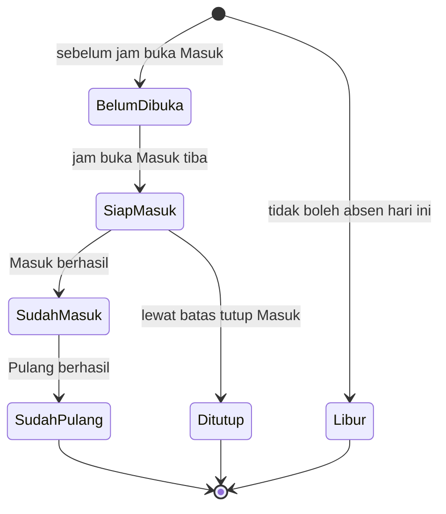
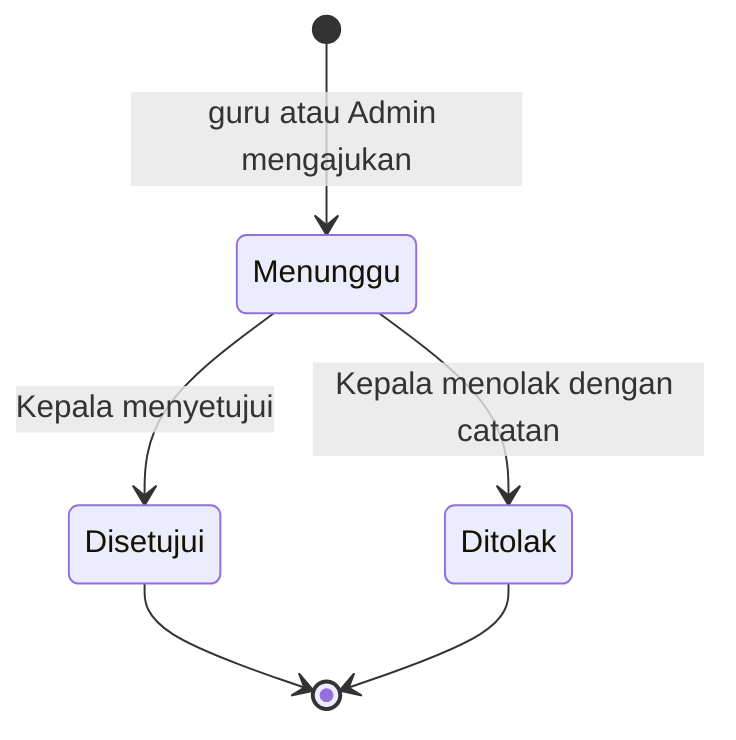

# Functional Specification (FS)

## Aplikasi Absensi Guru dan Siswa Berbasis Geo Tagging

| | |
|---|---|
| **Versi** | 1.2 (dark mode disetujui pada 2.5 dan dicatat sebagai H-08) |
| **Tanggal** | 5 Oktober 2026 |
| **Sumber** | BRD v1.1 (PK-F ditambahkan), Data Model v1.0, dan Rancangan Final v1.0 |
| **Dokumen turunan** | Wireframe/UI-UX → Prompt Playbook → Pembangunan (Data Model v1.0 sudah disusun) |

> ### ⚠️ Dokumen ini mengikat pada **Pedoman Konsistensi (Bagian 2)**
> Setiap kebutuhan, desain layar, dan hasil pembangunan **wajib** mematuhi Pedoman Konsistensi: **(A) ramah desktop dan mobile, (B) ramah pemula, (C) tampilan modern minimalis, (D) istilah dan format baku, (E) konsistensi rancangan, (F) menjaga struktur tetap sederhana dan tidak rawan konflik**. Ketidaksesuaian terhadap pedoman dihitung sebagai **cacat** dan **tidak lulus UAT**.
>
> Pedoman didefinisikan di **BRD Bagian 3** (PK-A s.d. PK-F). FS ini **menurunkannya menjadi spesifikasi konkret**: breakpoint, navigasi, token visual, komponen, katalog pesan, keadaan layar wajib, dan aturan struktur (PK-F).

**Prinsip utama:** setiap proses cukup 1–3 ketukan, data diisi sekali, dan sistem bekerja otomatis.

---

## Daftar Isi

1. [Informasi Dokumen](#1-informasi-dokumen)
2. [**Pedoman Konsistensi (Mengikat)**](#2-pedoman-konsistensi-mengikat)
3. [Gambaran Fungsional](#3-gambaran-fungsional)
4. [Konvensi Umum](#4-konvensi-umum)
5. [Fungsi Inti Sistem (SF)](#5-fungsi-inti-sistem-sf)
6. [Spesifikasi Fungsional per Modul](#6-spesifikasi-fungsional-per-modul)
7. [Laporan dan Keluaran](#7-laporan-dan-keluaran)
8. [Impor Excel dan Kartu QR](#8-impor-excel-dan-kartu-qr)
9. [Hak Akses dan Kepemilikan Data](#9-hak-akses-dan-kepemilikan-data)
10. [Kebutuhan Data per Fungsi dan Penyelarasan Data Model](#10-kebutuhan-data-per-fungsi-dan-penyelarasan-data-model)
11. [Rencana Fase Frontend dan Backend](#11-rencana-fase-frontend-dan-backend)
12. [Pengujian dan Keterlacakan](#12-pengujian-dan-keterlacakan)
13. [Hal Terbuka dan Usulan](#13-hal-terbuka-dan-usulan)
- [Lampiran A: Katalog Pesan dan Keadaan Kosong](#lampiran-a-katalog-pesan-dan-keadaan-kosong)
14. [Persetujuan](#14-persetujuan)

---

## 1. Informasi Dokumen

### 1.1 Tujuan
FS ini menjelaskan **bagaimana** aplikasi berperilaku agar kebutuhan di BRD terpenuhi: fungsi, aturan validasi, layar, pesan, dan hasil keluaran. FS menjadi dasar Data Model, wireframe, dan prompt pembangunan.

### 1.2 Cara Membaca
| Kode | Arti | Contoh |
|---|---|---|
| **BR / AB / PK** | Kebutuhan, Aturan Bisnis, dan Pedoman dari BRD | BR-AG-01, AB-05, PK-B3 |
| **FR-xx-nn** | Kebutuhan Fungsional | FR-AG-02 |
| **SF-nn** | Fungsi Inti Sistem (logika bersama) | SF-04 |
| **SCR-nn** | Layar | SCR-02 |
| **KOM-nn** | Komponen UI baku | KOM-05 |
| **MSG-nn / ES-nn** | Pesan / Keadaan Kosong (Lampiran A) | MSG-01 |
| **T-nn** | Batas teknis tetap (Bagian 4.2) | T-04 |
| **H-nn** | Hal terbuka dan usulan (Bagian 13) | H-01 |
| **DM-Dn / DT-nn** | Keputusan dan skenario uji Data Model v1.0 | DM-D2, DT-01 |
| **UAT-nn** | Skenario uji; 01–27 dari BRD, 28 dst. tambahan FS | UAT-28 |

### 1.3 Prinsip Penulisan (PK-E)
- Aturan bisnis **tidak ditulis ulang**; FS merujuk ke ID BRD (PK-E1).
- Angka bisnis yang dapat berubah (radius, akurasi, jendela waktu, toleransi, domain email) hanya hidup di **Pengaturan** (PK-E2). Di FS, pengaturan ditulis sebagai nama, misalnya `{radius_m}`.
- Batas teknis yang tetap (Bagian 4.2) berubah **hanya lewat versi baru FS** (PK-E3).
- Temuan uji yang mengubah aturan **dikembalikan ke BRD/FS sebelum kode diubah** (PK-E4).

### 1.4 Riwayat Revisi
| Versi | Tanggal | Perubahan |
|---|---|---|
| 1.0 | 4 Okt 2026 | FS disusun dari BRD v1.0 |
| 1.1 | 5 Okt 2026 | **PK-F** ditambahkan ke Pedoman Konsistensi (callout awal, 2.1, 2.9 baru, Daftar Periksa 2.10); penyelarasan dengan **Data Model v1.0** (10.2, FR-MD-01, FR-KR-03/04, SF-01/03/07, 6.2.1, MSG-25); UAT-40 dan UAT-41; H-07 |
| 1.2 | 5 Okt 2026 | Dark mode (prefers-color-scheme) disetujui; token.css mengikuti FS 2.5; H-08 dicatat |

---

## 2. Pedoman Konsistensi (Mengikat)

> **Status: WAJIB.** Bagian ini mengubah PK-A..F (BRD Bagian 3) menjadi spesifikasi yang dapat langsung dipakai desainer dan pengembang. Jika ada pertentangan antara bagian lain FS dan Bagian 2 ini, **Bagian 2 menang**, lalu dokumen diperbaiki sebelum kode ditulis (PK-E4).

### 2.1 Pemetaan Pedoman ke Spesifikasi

| Pedoman (BRD) | Diwujudkan di FS |
|---|---|
| **PK-A** Ramah desktop dan mobile | 2.2 Responsif; 2.3 Navigasi; KOM-06..07; setiap layar menyebut perilaku HP dan desktop |
| **PK-B** Ramah pemula | 2.4 Pola ramah pemula; Lampiran A (pesan, keadaan kosong); alur 1–3 ketukan di Bagian 6 |
| **PK-C** Modern minimalis | 2.5 Token visual; 2.6 Komponen baku |
| **PK-D** Istilah dan format baku | 2.7 Glosarium dan format |
| **PK-E** Konsistensi rancangan | 1.3; 2.8; Bagian 12 |
| **PK-F** Struktur sederhana dan tidak rawan konflik | 2.9; Bagian 5 (SF); Bagian 10; Data Model v1.0 |

### 2.2 PK-A: Spesifikasi Responsif

| Item | Spesifikasi |
|---|---|
| **Breakpoint** | **HP** < 768 px (dirancang 360–430 px); **Tablet** 768–1023 px; **Desktop** ≥ 1024 px (diuji ±1280 px). |
| **Pendekatan** | **Mobile-first:** gaya dasar untuk HP, diperluas dengan aturan untuk lebar lebih besar (PK-A1). |
| **Perangkat utama** | Guru: HP (Beranda, Absen Siswa). Admin: desktop (Master Data, Jadwal, Laporan). Seluruh fungsi tetap dapat dipakai di HP (PK-A2). |
| **Navigasi** | HP dan tablet: **bilah menu bawah** (maks 5 item). Desktop: **sidebar kiri**. Struktur dan nama menu sama (PK-A3). |
| **Tabel** | Desktop: tabel. HP: **daftar kartu** (nama + status di baris utama; detail di baris kedua) atau tabel dengan geser horizontal untuk laporan matriks (PK-A4). |
| **Sentuh dan teks** | Target sentuh **≥ 44 px**, jarak antar target ≥ 8 px. Teks isi **≥ 16 px** di HP (PK-A5). |
| **Lebar konten** | Konten desktop maksimal 1200 px, rata tengah; formulir maksimal 640 px. |
| **Orientasi** | Potret diutamakan; lanskap tidak boleh merusak tata letak. |
| **Ringan** | Tanpa pustaka berat; gambar dikompres (T-06); daftar dimuat bertahap (T-09) (PK-A6). |
| **Izin perangkat** | Lokasi dan kamera diminta saat dibutuhkan, bukan saat aplikasi dibuka. Bila ditolak tampil MSG-03/MSG-16 dengan tautan Bantuan (PK-A7). |

### 2.3 Navigasi per Peran

**HP/tablet (bilah bawah, maksimal 5 item) dan desktop (sidebar):**

| Peran | Item utama | Dalam menu "Lainnya" (HP) / sidebar (desktop) |
|---|---|---|
| **Guru** | Beranda · Absen Siswa · Izin · Rekap · Lainnya | Kelas Saya (hanya wali kelas), Akun, Bantuan |
| **Kepala** | Dashboard · Laporan · Izin · Log · Lainnya | Master Data (lihat), Jadwal (lihat), Akun, Bantuan |
| **Admin** | Dashboard · Master Data · Jadwal · Laporan · Lainnya | Izin, Koreksi, Pengaturan, Log, Kartu QR, Akun, Bantuan |
| **Siswa** | Rekap · Kartu QR · Akun | Bantuan (di Akun) |

Aturan: item menu aktif ditandai warna utama dan teks tebal; ikon selalu disertai label teks; di desktop semua item tampil di sidebar tanpa "Lainnya".

### 2.4 PK-B: Pola Ramah Pemula

| Pola | Spesifikasi | PK |
|---|---|---|
| **Satu layar satu tujuan** | Setiap layar punya satu **tombol aksi utama** (KOM-01 gaya Utama). Aksi lain bergaya Sekunder atau Teks. | B2, C5 |
| **Alur 1–3 ketukan** | Absen Masuk/Pulang guru = **1 ketukan** (sesi sudah aktif). Absen siswa = **0 ketukan tambahan** pada scan beruntun. Tidak ada jendela konfirmasi pada absen. | B3 |
| **Pesan yang menolong** | Format: **apa yang terjadi + apa yang harus dilakukan**. Seluruh teks ada di Lampiran A dan **tidak boleh dikarang ulang** di layar. | B4 |
| **Keadaan kosong** | Setiap daftar punya ES-xx berisi petunjuk langkah pertama dan tombol aksi. | B5 |
| **Konfirmasi aksi berisiko** | Nonaktifkan data, koreksi, impor, kenaikan kelas, pembatalan izin: tampil jendela konfirmasi (KOM-09) berisi **ringkasan akibat** dan tombol `Batal` + tombol aksi bernama jelas (bukan "Ya/Tidak"). | B6 |
| **Bantuan di tempat** | Teks bantu 14 px di bawah isian rumit; ikon info ⓘ membuka penjelasan singkat; halaman **Bantuan** (SCR-27); template Excel berisi **contoh baris**. | B7 |
| **Formulir** | Label di atas isian; validasi saat meninggalkan isian dan saat Simpan; pesan galat di bawah isian; nilai bawaan wajar; tombol Simpan tidak dinonaktifkan diam-diam (jika ada isian salah, fokus pindah ke isian pertama yang salah). | B8 |
| **Umpan balik instan** | Setiap aksi: tombol berubah menjadi **"Memproses…"** dengan indikator; selesai → **pesan singkat** berhasil (KOM-10) atau galat dengan MSG. | B9 |
| **Bahasa** | Bahasa Indonesia sehari-hari; tanpa istilah teknis (mis. "server", "GPS error", "token"). | B1 |

### 2.5 PK-C: Token Visual

> Implementasi menyediakan token terang dan gelap; keduanya memakai nama variabel yang sama.

**Warna** (nilai awal; **wajib diverifikasi** kontras ≥ 4,5:1 untuk teks isi dan ≥ 3:1 untuk komponen besar, PK-C6):

| Token | Nilai | Pemakaian |
|---|---|---|
| `--warna-utama` | `#1F5C4A` | Tombol utama, tautan, item menu aktif |
| `--warna-utama-lembut` | `#EEF5F2` | Latar item aktif, kartu info |
| `--teks` | `#1F2933` | Teks isi |
| `--teks-redup` | `#52606D` | Keterangan dan teks bantu |
| `--garis` | `#E4E7EB` | Garis dan batas kartu |
| `--latar` | `#F7F9FA` | Latar halaman |
| `--permukaan` | `#FFFFFF` | Kartu, formulir |

**Warna status** (empat warna; selalu disertai **teks dan ikon**, PK-C1):

| Status | Teks | Latar | Ikon (outline) | Label |
|---|---|---|---|---|
| Hadir | `#1B5E20` | `#E8F5E9` | check-circle | Hadir |
| Terlambat | `#8A5300` | `#FFF4E0` | clock | Terlambat |
| Izin / Sakit / Dinas Luar | `#0D47A1` | `#E3F2FD` | file-text / heart-pulse / briefcase | Izin / Sakit / Dinas Luar |
| Alpa (dan galat) | `#B71C1C` | `#FDECEA` | x-circle | Alpa |

Status persetujuan memakai palet yang sama dengan teks: **Menunggu** (kuning), **Disetujui** (hijau), **Ditolak** (merah). **Penanda** (Pulang Awal, Tidak Lengkap, Dikoreksi) tampil sebagai lencana netral abu bergaris tipis dengan ikon dan teks; **Lokasi Mencurigakan** hanya terlihat oleh Admin dan Kepala.

**Tipografi (PK-C2):** satu keluarga huruf sans-serif (Inter; cadangan `system-ui`, `Segoe UI`, `Roboto`, `sans-serif`), **tiga tingkat ukuran**:

| Tingkat | HP | Desktop | Berat |
|---|---|---|---|
| **Judul** (judul halaman, angka ringkasan) | 20 px | 24 px | Semibold |
| **Isi** (teks, isian, tombol) | 16 px | 16 px | Regular (tombol: Semibold) |
| **Keterangan** (teks bantu, metadata) | 14 px | 14 px | Regular, `--teks-redup` |

**Ruang dan bentuk (PK-C3):** skala jarak 4/8/12/16/24/32 px; padding halaman 16 px (HP) / 24 px (desktop); sudut kartu 12 px, isian dan tombol 10 px, lencana berbentuk pil; kartu memakai **garis tipis `--garis` tanpa bayangan**; bayangan tipis hanya untuk jendela konfirmasi dan menu mengambang.

**Ikon (PK-C4):** satu set ikon **outline** (mis. Lucide) dengan tebal garis seragam; ukuran 20 px (di dalam teks) dan 24 px (menu).

### 2.6 PK-C7: Komponen Baku

> Komponen dibuat **sekali** dan dipakai di semua layar. Dilarang membuat gaya baru per layar.

| ID | Komponen | Spesifikasi singkat |
|---|---|---|
| **KOM-01** | Tombol | Gaya: **Utama** (isi `--warna-utama`, teks putih), **Sekunder** (garis), **Bahaya** (garis/isi merah, untuk Nonaktifkan/Tolak), **Teks**. Tinggi ≥ 48 px (HP) / 44 px (desktop). |
| **KOM-02** | Tombol Absen Besar | Tinggi ≥ 72 px; lebar penuh di HP, maks 360 px di desktop; teks Judul; berubah label **Masuk**/**Pulang**; keadaan: aktif, nonaktif (abu, disertai alasan), memproses. |
| **KOM-03** | Isian | Label di atas, tinggi 48 px, teks bantu di bawah, galat inline (merah + ikon). Isian angka memakai papan ketik angka (`inputmode`). |
| **KOM-04** | Pilihan | Dropdown (≥ 6 opsi), kontrol segmen (2–4 opsi), sakelar (ya/tidak). |
| **KOM-05** | Lencana Status | Pil berisi ikon + label sesuai tabel warna status. |
| **KOM-06** | Tabel | Desktop: baris 48 px, kepala tabel tetap, urut kolom. HP: otomatis menjadi **Daftar Kartu** (KOM-07). |
| **KOM-07** | Daftar Kartu | Kartu per baris data: judul, lencana status, 2 baris metadata, aksi di kanan/menu `⋯`. |
| **KOM-08** | Kartu | Wadah putih dengan garis tipis; satu topik per kartu. |
| **KOM-09** | Jendela Konfirmasi | Desktop: dialog tengah. HP: **lembar bawah** (bottom sheet). Berisi judul, ringkasan akibat, `Batal` dan tombol aksi. |
| **KOM-10** | Pesan Singkat | Muncul 4 detik di atas (HP) / pojok kanan atas (desktop); **galat bertahan** sampai ditutup. |
| **KOM-11** | Keadaan Kosong | Ikon + 1 kalimat petunjuk + tombol aksi (Lampiran A). |
| **KOM-12** | Pemuat | Kerangka (skeleton) untuk daftar/kartu; indikator berputar di tombol. |
| **KOM-13** | Banner Info | Kartu `--warna-utama-lembut` untuk catatan (mis. "Berlaku mulai besok"). |
| **KOM-14** | Kalender Kehadiran | Grid bulan; tiap hari berisi huruf status (H/T/I/S/D/A) berwarna + ikon kecil; hari libur diarsir dengan label. |
| **KOM-15** | Pencarian | Isian dengan ikon kaca pembesar; mencari nama, NIP, atau NISN. |
| **KOM-16** | Unggah File | Tombol `Pilih berkas` + keterangan format dan ukuran; pratinjau nama berkas. |
| **KOM-17** | Header Halaman | Judul (Judul) + satu tombol aksi utama di kanan (desktop) / di bawah judul (HP). |
| **KOM-18** | Pemindai QR | Bingkai kamera dengan penanda area, status lokasi, hitungan tercatat, dan daftar 5 pemindaian terakhir. |

### 2.7 PK-D: Glosarium dan Format Baku (Implementasi)

- Istilah **mengikuti BRD PK-D1..D6** dan Glosarium BRD (Bagian 20). Teks layar tidak boleh memakai sinonim ("Datang", "Absen datang", "Operator" sebagai nama peran, "Terlambat masuk" sebagai status).
- **Jam:** `HH:MM`, 24 jam, WIB (contoh `07:00`). **Tanggal:** `4 Okt 2026`; dengan hari: `Sabtu, 4 Okt 2026`. **Bulan:** `Okt 2026`. **Durasi:** `3 hari`.
- **Jarak:** `45 m`. **Persentase:** satu desimal bila perlu (`92,5%`), pemisah desimal koma.
- **Urutan hari** pada jadwal dan kalender: **Sabtu, Ahad, Senin, Selasa, Rabu, Kamis, Jumat**. **Awal pekan: Sabtu** (T-12).
- Tombol umum hanya: `Simpan`, `Batal`, `Ajukan`, `Setujui`, `Tolak`, `Unduh`, `Cetak`; tombol absen: `Masuk`, `Pulang`.

### 2.8 Keadaan Wajib Setiap Layar (PK-B5, B9)

Setiap layar **wajib** mengimplementasikan lima keadaan berikut. Keadaan ini juga dipakai pada data contoh di fase frontend (Bagian 11).

| Keadaan | Tampilan |
|---|---|
| **Normal** | Konten lengkap |
| **Memuat** | Kerangka (KOM-12), bukan layar kosong |
| **Kosong** | KOM-11 dengan ES-xx |
| **Galat** | Pesan MSG yang menolong + tombol `Coba lagi` |
| **Tanpa koneksi** | MSG-21; data yang sudah tampil tidak hilang; aksi simpan ditunda dengan pesan jelas (antrean offline baru Fase 2) |

### 2.9 PK-F: Spesifikasi Struktur Sederhana dan Tidak Rawan Konflik

> **Aturan penentu bila ragu:** pilih opsi yang menambah **paling sedikit** tabel, kolom, status, layar, dan aturan. Struktur data mengikuti **Data Model v1.0 (13 tabel)**.

| ID | Wujud konkret di FS dan Data Model | Cara verifikasi |
|---|---|---|
| **PK-F1** Satu fakta, satu tempat | Angka bisnis hanya di `lembaga` lewat SCR-18 (6.3.1); aturan bisnis hanya di BRD (FS merujuk); satu informasi, satu sumber (mis. radius tidak diisi di dua layar; SCR-10 hanya menautkan ke Pengaturan); jadwal per hari, persentase, dan "Belum Absen" **dihitung**, tidak disimpan. | Pencarian angka bisnis tertanam di kode = nol; tinjauan skema. |
| **PK-F2** Struktur data minimal | Tabel, kolom, status, kode, atau layar baru **hanya** bila ada BR dan lewat versi baru Data Model/FS (PK-E3). | Skema basis data identik dengan Data Model. |
| **PK-F3** Integritas dijaga basis data | Kunci unik, CHECK, dan kunci asing `RESTRICT` (Data Model Bagian 6) menjaga integritas; validasi layar (PK-B8) hanya lapisan tambahan. | DT-01..DT-16. |
| **PK-F4** Satu aturan, satu fungsi | **SF-01..SF-10 adalah satu-satunya implementasi** logikanya; layar dan fungsi lain memanggilnya (jadwal efektif hanya lewat `jadwal_efektif`; status absen hanya dihitung SF-04, SF-06, SF-07). | Tinjauan kode: tidak ada logika jadwal/status yang disalin ke layar. |
| **PK-F5** Riwayat tidak berubah | Data tidak dihapus (AB-17); `absensi_siswa.kelas_id` menyimpan kelas saat absen; perubahan jadwal dan pengaturan berlaku mulai hari berikutnya (AB-12) dan tidak menghitung ulang hari lalu. | UAT-25, UAT-26; DT-13. |
| **PK-F6** Prioritas tertulis | SF-01 (Libur → Hari Khusus → Override → Default; entri spesifik menang atas "Semua"); SF-04/SF-06 (izin mengalahkan Alpa; absen mengalahkan izin); FR-KR-01 (pelaksana koreksi). | UAT-08..10, 16, 17; DT-12. |
| **PK-F7** Satu pelaksana per keputusan | Izin guru → Kepala; koreksi guru → Admin; koreksi siswa → wali kelas; Admin semua; satu pengajuan Menunggu per orang per tanggal. | UAT-18..20; DT-10. |
| **PK-F8** Cakupan terkendali | Fitur yang menambah kerumitan (notifikasi dorong, mode offline, grafik) tetap di Fase 2; tidak ada fitur batal izin guru, antrean, atau jalur ganda pada Fase 1. | Tinjauan cakupan per modul. |

**Pantangan (melanggar PK-F):**
1. Menyimpan hasil hitung yang dapat dihitung ulang (jadwal per hari, persentase, "Belum Absen").
2. Menyalin aturan ke beberapa layar atau fungsi.
3. Menambah status atau kode di luar daftar Data Model (Bagian 4.4).
4. Menghapus data selain yang dikecualikan FR-JD-05.
5. Membuat dua fungsi berbeda untuk tujuan yang sama (satu fungsi boleh punya beberapa pintu masuk layar, mis. FR-IZ-05 dari SCR-06 dan SCR-19).

### 2.10 Daftar Periksa Pedoman per Layar (Gerbang Selesai)

Setiap layar **tidak dinyatakan selesai** sebelum seluruh butir berikut terpenuhi (turunan BRD 16.3):

- [ ] **A:** tampil benar di ±375 px dan ±1280 px; navigasi sesuai 2.3; tabel→kartu di HP; sentuh ≥ 44 px, teks ≥ 16 px
- [ ] **B:** satu tombol aksi utama; pesan memakai Lampiran A; ES-xx ada; konfirmasi aksi berisiko; teks bantu; umpan balik "Memproses…" dan hasil
- [ ] **C:** hanya token 2.5 dan komponen 2.6; status berwarna disertai teks/ikon; kontras terverifikasi
- [ ] **D:** istilah dan format sesuai 2.7
- [ ] **Keadaan:** lima keadaan (2.8) tersedia
- [ ] **E:** tidak ada aturan baru yang ditulis di layar tanpa rujukan BRD/FS
- [ ] **F:** tidak ada data/aturan ganda; layar memanggil fungsi bersama (SF), tidak menghitung ulang; tidak ada tabel, kolom, atau status di luar Data Model; riwayat tidak dihapus; prioritas aturan mengikuti 2.9; tidak ada fitur di luar fase berjalan

---

## 3. Gambaran Fungsional

### 3.1 Modul
| Modul | Cakupan | Layar | BR |
|---|---|---|---|
| **M1 Akun dan Akses** | Login, sesi, ganti password, profil | SCR-01, 26 | BR-AK |
| **M2 Master Data** | Lembaga, Admin/Kepala, Guru, Siswa, Kelas, kenaikan kelas | SCR-10..14 | BR-MD |
| **M3 Jadwal dan Pengaturan** | Default, Override, Kalender, Pengaturan | SCR-15..18 | BR-JD |
| **M4 Absen Guru** | Beranda, Masuk/Pulang, pengajuan koreksi | SCR-02 | BR-AG |
| **M5 Absen Siswa** | Pemindai QR/NISN, scan beruntun, Kelas Saya | SCR-03, 06 | BR-AS |
| **M6 Izin dan Koreksi** | Izin guru/siswa, persetujuan, koreksi, log | SCR-05, 09, 19, 20, 22 | BR-IZ, KR |
| **M7 Laporan dan Dashboard** | Dashboard, laporan, rekap pribadi | SCR-04, 07, 08, 21, 24 | BR-LP |
| **M8 Pendukung** | Kartu QR, Bantuan | SCR-23, 25, 27 | BR-PD |

### 3.2 Daftar Layar
| ID | Layar | Peran | Perangkat utama |
|---|---|---|---|
| SCR-01 | Login | Semua | HP |
| SCR-02 | Beranda Guru (Masuk/Pulang) | Guru; Kepala (kartu opsional di SCR-07) | HP |
| SCR-03 | Absen Siswa (QR/NISN) | Guru | HP |
| SCR-04 | Rekap Saya | Guru | HP |
| SCR-05 | Izin Saya | Guru | HP |
| SCR-06 | Kelas Saya | Guru (wali kelas) | HP |
| SCR-07 | Dashboard Kepala | Kepala | HP, desktop |
| SCR-08 | Dashboard Admin | Admin | Desktop |
| SCR-09 | Persetujuan Izin Guru | Kepala | HP, desktop |
| SCR-10 | Master Data: Lembaga | Admin | Desktop |
| SCR-11 | Master Data: Admin dan Kepala | Admin | Desktop |
| SCR-12 | Master Data: Guru | Admin | Desktop |
| SCR-13 | Master Data: Siswa | Admin | Desktop |
| SCR-14 | Master Data: Kelas dan Kenaikan Kelas | Admin | Desktop |
| SCR-15 | Jadwal Default | Admin | Desktop |
| SCR-16 | Override Guru | Admin | Desktop |
| SCR-17 | Kalender | Admin | Desktop |
| SCR-18 | Pengaturan | Admin | Desktop |
| SCR-19 | Izin (input Admin) | Admin | Desktop |
| SCR-20 | Koreksi Absen | Admin | Desktop |
| SCR-21 | Laporan | Admin, Kepala, Wali Kelas | Desktop, HP |
| SCR-22 | Log Aktivitas | Admin, Kepala | Desktop |
| SCR-23 | Kartu QR (cetak massal) | Admin | Desktop |
| SCR-24 | Rekap Siswa | Siswa | HP |
| SCR-25 | Kartu QR Saya | Siswa | HP |
| SCR-26 | Akun dan Ganti Password | Semua | HP, desktop |
| SCR-27 | Bantuan | Semua | HP, desktop |

---

## 4. Konvensi Umum

### 4.1 Aturan Umum
- **Waktu:** seluruh perhitungan memakai **jam server WIB** (AB-02); tampilan 24 jam.
- **Otorisasi:** setiap fungsi memeriksa **peran** dan **kepemilikan data** di server (AB-19; Bagian 9).
- **Soft delete:** data tidak dihapus, hanya dinonaktifkan (AB-17). Pengecualian tegas hanya pada entri Kalender masa depan (FR-JD-05) dan pembatalan izin siswa (FR-IZ-06) yang dijelaskan sendiri.
- **Log Aktivitas:** semua perubahan master data, jadwal, pengaturan, izin, koreksi, dan atur-ulang password dicatat. **Absen normal tidak dicatat di log** (datanya sudah ada di tabel absensi).
- **Satu aksi, satu hasil:** tombol dinonaktifkan sementara selama pemrosesan untuk mencegah klik ganda; server tetap menolak duplikat (AB-03).
- **Pencarian dan daftar:** semua daftar memiliki pencarian (KOM-15) bila memuat lebih dari 10 data.

### 4.2 Batas Teknis Tetap
> Bukan parameter lembaga. Berubah **hanya lewat versi baru FS** (PK-E2, E3).

| ID | Batas | Nilai |
|---|---|---|
| T-01 | Sesi login | Tetap aktif sampai `Keluar` atau 30 hari tidak dipakai |
| T-02 | Panjang password | Minimal 6 karakter |
| T-03 | Pembacaan GPS | Batas waktu 15 detik; hingga 3 percobaan otomatis, pilih yang paling akurat |
| T-04 | Usia pembacaan lokasi pada sesi scan beruntun | Maksimal 60 detik; lebih tua → ambil ulang |
| T-05 | Jeda anti-duplikat QR yang sama | 3 detik |
| T-06 | Foto profil | JPG/PNG ≤ 1 MB; dikompres ke sisi terpanjang 512 px; dipangkas persegi |
| T-07 | Lampiran izin | JPG, PNG, atau PDF ≤ 2 MB |
| T-08 | Impor Excel | `.xlsx`, ≤ 5 MB, ≤ 1000 baris |
| T-09 | Daftar | Desktop 20 baris/halaman; HP tombol `Muat lebih banyak` |
| T-10 | Penyegaran dashboard | Otomatis tiap 60 detik dan tombol `Segarkan` |
| T-11 | Rentang pengajuan | Izin guru boleh dimulai maks 7 hari ke belakang; durasi izin maks 90 hari; pengajuan koreksi guru maks 30 hari ke belakang |
| T-12 | Awal pekan | Sabtu |
| T-13 | Panjang teks | Alasan izin guru ≤ 300 karakter; keterangan izin siswa ≤ 200; alasan koreksi ≤ 300; catatan penolakan ≤ 200 |
| T-14 | Rasio penanda Lokasi Mencurigakan | Lihat SF-05 (80% akurasi maks; 50% radius per < 1 menit; 3 koordinat identik berturut-turut) |

---

## 5. Fungsi Inti Sistem (SF)

> Logika bersama yang dipakai banyak layar. Aturan bisnisnya berasal dari BRD; di sini ditulis **cara kerjanya**. Setiap SF adalah **satu-satunya implementasi** logikanya (PK-F4): layar dan fungsi lain memanggilnya, tidak menyalin.

### SF-01 Jadwal Efektif *(BR-JD-04; AB-11, AB-12, AB-14)*

Masukan: `orang` (guru/kepala atau siswa), `tanggal`. Keluaran: `{boleh_absen, wajib, jam_masuk, jam_pulang, sumber, keterangan}`.

```text
untuk    = (orang.role == siswa) ? "siswa" : "guru"       # kepala memakai set "guru"
hari     = hariDalamPekan(tanggal)

libur    = kalender[tanggal, jenis=libur,  untuk IN ("semua", untuk)]
khusus   = kalender[tanggal, jenis=khusus, untuk IN ("semua", untuk)]
override = (untuk == "guru") ? jadwal_override_guru[orang, hari] : kosong
default  = jadwal_default[untuk, hari]

1. JIKA libur ada            -> {boleh_absen:false, wajib:false, sumber:"libur"}
2. nonaktif_guru = override ada DAN override.aktif == false
3. JIKA nonaktif_guru:
      JIKA khusus ada -> {boleh_absen:true,  wajib:false, jam:khusus, sumber:"khusus"}   # guru boleh tetap absen (AB-11)
      LAINNYA         -> {boleh_absen:false, wajib:false, sumber:"override"}
4. aktif = khusus ada ? true : (override ada ? override.aktif : default.aktif)            # H-02
5. JIKA !aktif               -> {boleh_absen:false, wajib:false, sumber:"default"}
6. jam   = khusus.jam ?? override.jam ?? default.jam                                     # urutan AB-11
7. wajib = aktif DAN orang.wajib_absen                                                    # kepala/admin: false (AB-14)
   -> {boleh_absen:true, wajib, jam_masuk, jam_pulang, sumber}
```

Catatan: **Admin** tidak memiliki tombol absen. **Kepala** (wajib_absen = tidak) memperoleh `boleh_absen` sesuai jadwal guru, tetapi `wajib = false`. Jadwal tidak disimpan per hari; fungsi ini dihitung setiap dipakai. **Implementasi:** fungsi basis data `jadwal_efektif` (Data Model Bagian 7); siswa selalu `wajib = true` (DM-D5).

### SF-02 Pembacaan Lokasi (di perangkat) *(AB-01, AB-10; PK-A7)*
1. Dipanggil **hanya** saat tombol absen ditekan atau sesi scan dimulai. Tidak ada pelacakan di latar belakang.
2. Meminta izin lokasi; bila ditolak → MSG-03.
3. Membaca lokasi akurasi tinggi dengan batas T-03; mengirim `lat`, `lng`, `akurasi`, dan waktu pembacaan ke server.
4. Bila akurasi > `{akurasi_maks_m}` setelah percobaan → MSG-02 dan tombol `Coba lagi lokasi`.
5. Pada sesi scan beruntun: lokasi diambil saat `Mulai Scan` dan diambil ulang hanya bila usianya melewati T-04; berhenti saat sesi berakhir.

### SF-03 Pemeriksaan Radius (di server) *(AB-01, AB-09, AB-19)*
Bila koordinat lembaga (`lat`/`lng`) **belum diisi** → tolak dengan **MSG-25** (DM-H1). Hitung jarak (rumus haversine) antara `lat/lng` kiriman dan titik `lembaga`. Jarak ≤ `{radius_m}` → lolos. Bila tidak → MSG-01 dengan jarak dibulatkan ke meter. Untuk absen siswa, **yang diperiksa adalah lokasi guru pemindai**.

### SF-04 Catat Absen *(AB-01..03, AB-05..08, AB-15, AB-19)*

```text
catatAbsen(subjek, jenis, lokasi, pemindai?):
 1. t = jamServerWIB();  tanggal = tanggal(t)
 2. j = SF-01(subjek, tanggal)
    JIKA !j.boleh_absen -> tolak(MSG-06)
 3. SF-03(lokasi)  -> tolak(MSG-02 / MSG-01) bila gagal
 4. rec = absensi[subjek, tanggal]

 JIKA jenis == Masuk:
    batas_buka    = j.jam_masuk - {buka_masuk_menit}
    batas_hadir   = j.jam_masuk + {toleransi_menit}
    batas_tutup   = j.jam_masuk + {tutup_masuk_menit}
    JIKA rec.jam_masuk ada  -> tolak(MSG-07)
    JIKA t < batas_buka     -> tolak(MSG-04)
    JIKA t > batas_tutup    -> tolak(MSG-05)
    status = (t <= batas_hadir) ? Hadir : Terlambat
    simpan jam_masuk=t, koordinat, akurasi, jarak, status, kelas_id (siswa), pemindai
    # rec berstatus izin/sakit/dinas_luar tanpa jam_masuk -> status diganti hasil di atas
    # (scan mengalahkan izin; guru: H-01)

 JIKA jenis == Pulang:
    JIKA rec.jam_masuk kosong -> tolak(MSG-08)
    JIKA rec.jam_pulang ada   -> tolak(MSG-07)
    pulang_awal = t < (j.jam_pulang - {buka_pulang_menit})        # AB-06
    simpan jam_pulang=t, koordinat, akurasi, jarak, pulang_awal, pemindai

 5. flag_curiga = SF-05(...)                                       # hanya menandai
 6. kembalikan {status, jam, jarak, penanda} untuk konfirmasi (MSG-09..11)
```

Catatan: Pulang **tidak diblokir** di luar jendela (AB-07); hanya ditandai Pulang Awal. Tombol Pulang tetap aktif sampai akhir hari.

### SF-05 Penanda Lokasi Mencurigakan *(AB-20)*
Menandai (tidak memblokir) bila salah satu terpenuhi:
- **Akurasi mendekati batas:** akurasi ≥ 80% dari `{akurasi_maks_m}`.
- **Lompatan:** dua pembacaan berurutan pengguna yang sama terpaut > 50% dari `{radius_m}` dalam < 1 menit.
- **Koordinat identik:** `lat/lng` sama persis (6 desimal) pada 3 absen berturut-turut pengguna yang sama.

Rasio di atas adalah bagian aturan dan berubah **hanya lewat versi baru FS** (T-14). Penanda tampil bagi Admin/Kepala; tidak ditampilkan kepada guru/siswa.

### SF-06 Terapkan Izin *(AB-08)*
Dipanggil saat izin guru **disetujui** atau izin siswa **diinput**; masukan: jenis dan rentang tanggal.

```text
untuk setiap tanggal T dalam rentang:
   j = SF-01(orang, T);  JIKA !j.wajib -> lewati
   rec = absensi[orang, T]
   JIKA T < hari_ini:
        rec tidak ada                      -> buat baris status = jenis izin
        rec berstatus Alpa                 -> ubah ke jenis izin
        rec lain (ada jam_masuk)           -> biarkan (absen mengalahkan izin)
   JIKA T == hari_ini:
        rec berstatus Alpa                 -> ubah ke jenis izin
        lainnya                            -> biarkan; "tutup hari" yang menyelesaikan
   JIKA T > hari_ini                       -> tidak ada tindakan; SF-07 menanganinya pada harinya
```

Status jenis izin: Izin, Sakit, Dinas Luar (Cuti dicatat sebagai **Izin** pada status, jenis aslinya tersimpan di data izin).

### SF-07 Tutup Hari *(AB-13, AB-14, AB-15)*
Berjalan **23:30 WIB** (cron 16:30 UTC). Bersifat **idempotent** (penyisipan memakai `ON CONFLICT DO NOTHING` pada kunci unik, Data Model Bagian 6) dan menyusul tanggal yang terlewat.

```text
untuk setiap tanggal T dari (tutup_hari_terakhir + 1) sampai hari ini:
   untuk setiap orang aktif yang wajib absen (guru wajib_absen=ya; semua siswa aktif):
      j = SF-01(orang, T);  JIKA !j.wajib -> lewati
      rec = absensi[orang, T]
      JIKA rec tidak ada:
           JIKA ada izin yang mencakup T (disetujui untuk guru)  -> buat baris status izin
           LAINNYA                                                -> buat baris status Alpa
      JIKA rec.jam_masuk ada DAN rec.jam_pulang kosong            -> tidak_lengkap = true
   tutup_hari_terakhir = T
```

Kegagalan job dicatat di Log; Dashboard Admin menampilkan banner bila ada tanggal yang belum ditutup (KOM-13).

### SF-08 Email Siswa Otomatis *(BR-MD-04)*
Jika email siswa kosong saat impor/tambah: `email = NISN + "@siswa." + {domain_email}` (huruf kecil). Jika sudah dipakai akun lain → baris ditandai galat (bukan ditimpa).

### SF-09 Rekap dan Persentase *(BR-LP; Bagian 7)*
- **Hari aktif (wajib)** = hari dalam rentang dengan `wajib = true` bagi orang tersebut (SF-01).
- **Persentase kehadiran** = (jumlah **Hadir + Terlambat**) ÷ (jumlah hari aktif yang punya baris absensi) × 100. Penanda Tidak Lengkap dan Pulang Awal **tidak** mengurangi kehadiran (AB-15).
- Hari libur dan hari tidak aktif **tidak** masuk penyebut.

### SF-10 Pencatatan Log
Setiap perubahan yang disebut di 4.1 mencatat: `siapa`, `aksi`, `entitas`, `data lama`, `data baru`, `waktu`. Log tidak dapat diubah atau dihapus.

---

## 6. Spesifikasi Fungsional per Modul

> Kolom **Otorisasi** menyebut peran yang boleh. **BR/AB** menunjuk sumber di BRD. Kolom **PK** menyebut pedoman yang paling diuji pada fungsi itu (kategori A–F selalu berlaku).

### 6.1 M1: Akun dan Akses

| ID | Fungsi | Aturan dan validasi | Otorisasi | BR/AB | PK |
|---|---|---|---|---|---|
| **FR-AK-01** | **Login** (SCR-01) | Isian `Email` dan `Password`, tombol `Masuk` (satu aksi utama), ikon tampilkan/sembunyikan password. Galat generik MSG-15 (tidak menyebut mana yang salah). Berhasil → arahkan: Guru → SCR-02; Kepala/Admin → Dashboard; Siswa → SCR-24. | Semua | BR-AK-01 | B2, B4 |
| **FR-AK-02** | **Sesi** | Sesi tetap aktif (T-01); `Keluar` tersedia di SCR-26. Setelah sesi berakhir → SCR-01 dengan pesan singkat. | Semua | BR-AK-01 | B3 |
| **FR-AK-03** | **Akun awal** | Akun Admin dan Kepala tersedia sebagai akun awal; nilai password awal per peran mengikuti **Rancangan Final §4.1** (ditulis satu kali, PK-E1). Akun Guru dan Siswa dibuat saat impor (FR-MD-04) dan **langsung aktif**, tanpa prosedur aktivasi. | Sistem | BR-AK-02; D-05 | B1 |
| **FR-AK-04** | **Ganti password** (SCR-26) | Isian: Password lama, Password baru, Ulangi password baru. Validasi: min T-02, tidak sama dengan password lama, ulangan sama. **Tidak ada kewajiban ganti saat login pertama** (D-05). Berhasil → MSG singkat. | Semua | BR-AK-03 | B8, B9 |
| **FR-AK-05** | **Profil sendiri** (SCR-26) | **Guru:** boleh ubah nama, kontak, foto (T-06); **tidak** email dan NIP/ID (tampil sebagai teks terkunci dengan ikon gembok + teks bantu "Hubungi Admin untuk mengubah"). **Siswa, Kepala, Admin:** profil hanya lihat (diubah lewat Master Data oleh Admin); ganti password tetap tersedia. | Guru; lainnya lihat | BR-MD-05 | B7 |
| **FR-AK-06** | **Pembatasan akses** | Setiap permintaan diperiksa menurut peran dan kepemilikan (Bagian 9). Akses ke layar yang bukan hak peran → layar "Halaman tidak tersedia untuk Anda" dengan tombol `Kembali ke Beranda`. | Sistem | BR-AK-04 | B4 |
| **FR-AK-07** | **Akun siswa lihat-saja** | Siswa hanya melihat SCR-24, SCR-25, SCR-26, SCR-27 dan **hanya data miliknya**. Akun dapat dipakai bersama siswa dan orang tua. | Siswa | BR-AK-05; D-02 | A2, B1 |
| **FR-AK-08** *(usulan, H-04)* | **Atur ulang password oleh Admin** | Di daftar Master Data: `⋯` → `Atur ulang password` → konfirmasi (KOM-09) → password kembali ke password awal peran; tercatat di log. | Admin | (turunan) | B6 |

### 6.2 M2: Master Data

| ID | Fungsi | Aturan dan validasi | Otorisasi | BR/AB | PK |
|---|---|---|---|---|---|
| **FR-MD-01** | **Data Lembaga** (SCR-10) | Isian: Nama, NPSN/NSM, Alamat, Logo (T-06), **Lintang**, **Bujur**, **Radius (m)**, Domain email, Tahun ajaran aktif (format `2026/2027`). Tombol bantu **`Gunakan lokasi saya sekarang`** untuk mengisi lintang/bujur dari perangkat Admin. Lintang −90..90; bujur −180..180. **Selama koordinat kosong, absen ditolak (MSG-25)** dan Dashboard Admin menampilkan banner pengingat. Radius dan domain email juga muncul di Pengaturan (SCR-18) sebagai satu sumber data yang sama, **tidak diisi di dua tempat**: SCR-10 menampilkannya sebagai tautan "Ubah di Pengaturan". | Admin | BR-MD-01 | B7, B8, F1 |
| **FR-MD-02** | **Admin dan Kepala** (SCR-11) | Form: NIP/ID, Nama, Email, Foto, Kontak, Status. **Admin dan Kepala diinput lewat formulir.** **Pergantian Kepala:** `Nonaktifkan` Kepala lama (KOM-09: "Akun tidak bisa login…"), lalu `Tambah Kepala`. Hanya **satu Kepala aktif** pada satu waktu (validasi). Minimal **satu Admin aktif** (tidak boleh menonaktifkan Admin terakhir). | Admin | BR-MD-02 | B6, B8 |
| **FR-MD-03** | **Daftar Guru dan Siswa** (SCR-12, 13) | Daftar dengan pencarian (nama, NIP/NISN, email), filter Status dan (siswa) Kelas; Daftar Kartu di HP. Aksi per baris: `Lihat/Ubah`, `Nonaktifkan/Aktifkan`, (siswa) `Cetak kartu`, `Atur ulang password` (H-04). Keadaan kosong ES-03/ES-04. | Admin; Kepala lihat | BR-MD-03, 07 | A4, B5 |
| **FR-MD-04** | **Impor Excel Guru/Siswa** | Alur dan validasi di **Bagian 8.1**. Akun dibuat otomatis dan langsung aktif. | Admin | BR-MD-03 | B5, B6, B7 |
| **FR-MD-05** | **Tambah/ubah satu data** (pelengkap impor) | Formulir yang sama dengan impor satu baris. Validasi field di tabel 6.2.1. NISN dan email **tidak dapat diubah** setelah dibuat; NIP/ID juga terkunci. | Admin | BR-MD-05 | B8 |
| **FR-MD-06** | **Nonaktifkan/Aktifkan** | Jendela konfirmasi: "Nonaktifkan {nama}? Akun tidak bisa login dan tidak muncul di absen. Riwayat tetap tersimpan." (MSG-17). Data **tidak dihapus** (AB-17). Guru wali kelas aktif tidak dapat dinonaktifkan sebelum wali kelas diganti (validasi, pesan jelas). | Admin | BR-MD-07; AB-17 | B6, F5 |
| **FR-MD-07** | **Kelas** (SCR-14) | Form: Nama kelas, Tahun ajaran, Wali kelas (pilih guru aktif). **Satu guru maksimal satu kelas** pada satu tahun ajaran. Wali kelas adalah **guru yang ditunjuk**, bukan peran baru (PK-D1). | Admin | BR-MD-06 | B8, D1 |
| **FR-MD-08** | **Kenaikan Kelas Massal** (SCR-14) | **Wizard 3 langkah:** (1) **Tahun ajaran baru**: isi `2027/2028`; sistem menyiapkan salinan daftar kelas (nama dan wali kelas dapat diubah). (2) **Pemetaan**: untuk tiap kelas asal pilih **kelas tujuan** atau **Lulus**. (3) **Pratinjau dan konfirmasi**: ringkasan jumlah siswa pindah dan jumlah lulus; tombol `Terapkan` (KOM-09). Hasil: `kelas_id` siswa diperbarui, siswa **Lulus** dinonaktifkan, `tahun_ajaran_aktif` diperbarui, dicatat di log. **Riwayat absen tidak berubah** (AB-18). | Admin | BR-MD-06; AB-18 | B6, B9, F5 |
| **FR-MD-09** | **Siswa pindah kelas tengah tahun** *(H-06)* | Admin mengubah kelas di form siswa; berlaku mulai hari berikutnya; catatan lama tetap kelas lama. | Admin | AB-18 | B6, F5 |

#### 6.2.1 Validasi Field Master Data

| Field | Aturan |
|---|---|
| NIP/ID | Wajib, **unik dalam perannya** (DM-D2), huruf/angka tanpa spasi, 5–30 karakter |
| NISN | Wajib, unik, **hanya angka** (umumnya 10 digit) |
| Nama | Wajib, 3–100 karakter |
| Email | Wajib (guru, admin, kepala), unik, format email valid; siswa: opsional (SF-08) |
| Kontak / Kontak wali | Opsional; angka dengan awalan `+` boleh; 8–15 digit |
| Jenis kelamin | Wajib untuk siswa: `L` atau `P` |
| Kelas | Wajib untuk siswa: harus kelas yang sudah ada pada tahun ajaran aktif |
| Foto | Opsional; T-06 |
| Status | Aktif atau Nonaktif; bawaan Aktif |
| `wajib_absen` | Bawaan: Guru = ya; Kepala dan Admin = tidak (dapat diubah Admin pada form). **Siswa selalu wajib**; kolom ini diabaikan untuk siswa (DM-D5) |

### 6.3 M3: Jadwal dan Pengaturan

| ID | Fungsi | Aturan dan validasi | Otorisasi | BR/AB | PK |
|---|---|---|---|---|---|
| **FR-JD-01** | **Jadwal Default** (SCR-15) | Dua tab: **Guru** | **Siswa** (struktur sama). Tujuh baris (Sabtu..Jumat): sakelar `Aktif`, `Masuk`, `Pulang`. Validasi: bila aktif, jam wajib dan `Pulang` > `Masuk`. Nilai awal mengikuti **BRD AB-21**. Banner KOM-13: "Perubahan berlaku mulai besok." | Admin; Kepala lihat | BR-JD-01; AB-12, AB-21 | B8 |
| **FR-JD-02** | **Override Guru** (SCR-16) | Pilih guru (KOM-15). Tujuh baris dengan kontrol segmen: **Default / Override / Nonaktif**. Pilihan *Override* menampilkan `Masuk` dan `Pulang`. Guru yang punya pengecualian diberi lencana di daftar. Berlaku **per hari dalam seminggu**, bukan per tanggal. Banner "Berlaku mulai besok." | Admin; Kepala lihat | BR-JD-03; AB-11, AB-12 | B2 |
| **FR-JD-03** | **Kalender** (SCR-17) | Tampilan bulan + daftar. Tambah entri: tanggal (satu hari atau rentang), **Jenis** (Libur / Hari Khusus), **Untuk** (Semua / Guru / Siswa), Keterangan, dan **jam masuk/pulang** (hanya Hari Khusus, wajib). Rentang menghasilkan satu entri per tanggal. Hari Khusus tidak boleh bertabrakan dengan Libur pada tanggal dan sasaran yang sama (validasi). | Admin; Kepala lihat | BR-JD-02; AB-11 | B8 |
| **FR-JD-04** | **Aturan tanggal Kalender** | Entri hanya boleh ditambahkan untuk **tanggal ≥ besok** (AB-12). Usulan pelonggaran untuk libur mendadak: **H-03**. | Admin | AB-12 | B4, F5 |
| **FR-JD-05** | **Hapus entri Kalender** | Hanya entri dengan **tanggal ≥ besok** yang dapat dihapus (konfirmasi KOM-09); entri hari ini dan lampau tidak dapat dihapus (menjaga riwayat). Tercatat di log. | Admin | AB-12, AB-17 | B6, F5 |
| **FR-JD-06** | **Pengaturan** (SCR-18) | Satu layar berisi isian di Tabel 6.3.1. Setiap isian punya teks bantu dan rentang valid. Perubahan berlaku **mulai hari berikutnya** (AB-12), kecuali koordinat/radius (berlaku langsung); ditampilkan di banner. Tercatat di log. | Admin | BR-JD-06 | B7, B8, E2, F1 |

#### 6.3.1 Pengaturan (Satu-satunya Tempat Angka Bisnis, PK-E2)

| Pengaturan | Isian | Rentang valid | Keterangan bantu (teks layar) |
|---|---|---|---|
| Radius madrasah | `{radius_m}` | 20–1000 m | "Jarak maksimal dari titik madrasah agar absen diterima." |
| Akurasi lokasi maksimal | `{akurasi_maks_m}` | 10–200 m | "Jika lokasi kurang akurat dari batas ini, absen diminta diulang." |
| Buka absen Masuk | `{buka_masuk_menit}` | 0–120 menit sebelum jam masuk | "Tombol Masuk mulai aktif." |
| Toleransi terlambat | `{toleransi_menit}` | 0–60 menit setelah jam masuk | "Masuk sampai batas ini tetap Hadir." |
| Tutup absen Masuk | `{tutup_masuk_menit}` | 30–480 menit setelah jam masuk; ≥ toleransi | "Setelah batas ini, Masuk tidak dapat dilakukan." |
| Buka absen Pulang | `{buka_pulang_menit}` | 0–240 menit sebelum jam pulang | "Pulang sebelum batas ini ditandai Pulang Awal." |
| Domain email | `{domain_email}` | Format domain valid | "Dipakai untuk email siswa otomatis." |

Nilai awal mengikuti **BRD (AB-01, AB-04a..d)**; radius awal 200 m. Bila terjadi perbedaan, **BRD yang berlaku**.

### 6.4 M4: Absen Guru (SCR-02)

#### Keadaan Tombol Beranda Guru



| Keadaan | Tampilan dan tombol |
|---|---|
| **Libur / tidak aktif** | Kartu info "Hari ini libur: {keterangan}" atau "Hari ini bukan hari aktif Anda." Tanpa tombol absen. |
| **Belum dibuka** | KOM-02 **nonaktif** (abu) berlabel `Masuk`, teks bantu "Absen Masuk dibuka pukul {HH:MM}." (MSG-04) |
| **Siap Masuk** | KOM-02 **aktif** berlabel `Masuk` |
| **Sudah Masuk** | Ringkasan "Masuk {HH:MM} · {Status}"; KOM-02 aktif berlabel `Pulang` |
| **Sudah Pulang** | Ringkasan Masuk dan Pulang + penanda; **tidak ada tombol** ("Selesai untuk hari ini") |
| **Ditutup** | MSG-05 + tautan `Ajukan koreksi` |
| **Izin disetujui hari ini** | Kartu info "Hari ini tercatat {Izin/Sakit/Dinas Luar}." Tombol `Masuk` tetap ada bila guru hadir (H-01) |

| ID | Fungsi | Aturan dan validasi | Otorisasi | BR/AB | PK |
|---|---|---|---|---|---|
| **FR-AG-01** | **Tampilan Beranda** | Sapaan sesuai waktu ("Selamat pagi, {nama}"), tanggal dengan hari, **Jadwal hari ini** `{masuk}–{pulang}` (SF-01), kartu status hari ini, dan **satu tombol besar** (KOM-02) sesuai keadaan di atas. Tautan kecil: `Rekap saya`, `Ajukan koreksi`. | Guru | BR-AG-01 | A2, B2, B3, C5 |
| **FR-AG-02** | **Tekan Masuk** | 1 ketukan. Tombol berubah "Mencari lokasi…" → SF-02 → SF-04. Berhasil → konfirmasi **MSG-09** (jam, status, jarak) dan beranda diperbarui. Gagal → MSG sesuai (MSG-01..08). | Guru; Kepala (opsional) | BR-AG-02, 03 | B3, B4, B9 |
| **FR-AG-03** | **Tekan Pulang** | Sama seperti FR-AG-02 dengan SF-04 jenis Pulang. Berhasil → **MSG-10** (+ lencana **Pulang Awal** bila berlaku). | Guru; Kepala (opsional) | BR-AG-02, 03; AB-06, 07 | B3, B9 |
| **FR-AG-04** | **Kepala opsional** | Kepala melihat kartu **"Absen saya (opsional)"** di Dashboard (SCR-07) dengan tombol yang sama (KOM-02). Kepala memakai jadwal guru dan tidak pernah dihitung Alpa (`wajib=false`). **Admin tidak memiliki tombol absen.** | Kepala | BR-AG-04; AB-14 | D1 |
| **FR-AG-05** | **Ajukan koreksi (lupa absen)** | Form: Tanggal (maks 30 hari ke belakang, T-11), Usulan jam Masuk, Usulan jam Pulang (minimal salah satu), Alasan (wajib, ≤ 300). Satu pengajuan **Menunggu** per tanggal. Masuk ke Admin (FR-KR-02). Status terlihat di daftar "Pengajuan saya" pada SCR-05. | Guru | BR-AG-05; AB-16 | B8 |
| **FR-AG-06** | **Rekap Saya** (SCR-04) | Pilih bulan (bawaan bulan ini). Kartu ringkasan (Hadir, Terlambat, Izin/Sakit/Dinas Luar, Alpa, Persentase) + KOM-14 + daftar harian. Ketuk hari → rincian (jam, status, penanda, keterangan izin) dan tautan `Ajukan koreksi`. | Guru | BR-LP-05 | A1, C3 |

### 6.5 M5: Absen Siswa

#### 6.5.1 Layar Absen Siswa (SCR-03), Pemindai QR

| Elemen | Spesifikasi |
|---|---|
| **Kontrol jenis** | Kontrol segmen **Masuk / Pulang**. Bawaan: `Masuk` bila waktu sekarang sebelum jendela buka Pulang jadwal siswa hari ini, selain itu `Pulang`. |
| **Tombol** | **`Mulai Scan`** (aksi utama) → meminta kamera (MSG-16 bila ditolak) → SF-02 (lokasi). |
| **Chip lokasi** | "Lokasi: dalam radius ✔ (±{akurasi} m)" atau MSG-01/02 dengan tombol `Coba lagi lokasi`; **scan dinonaktifkan** sampai lokasi valid. |
| **Pemindai (KOM-18)** | Kamera tetap terbuka (**scan beruntun**). QR berisi **NISN**. Duplikat QR yang sama dalam T-05 diabaikan. |
| **Ketik NISN** | Tombol `Ketik NISN` membuka isian angka + tombol `Catat`; setelah tercatat kembali ke kamera. |
| **Hasil per siswa** | Kartu hasil 2 detik: nama, kelas, jam, KOM-05 status (MSG-11). Getar singkat bila didukung (sukses: 1 kali; galat: 2 kali). |
| **Penghitung** | "Tercatat: {n}" dan daftar 5 pemindaian terakhir. |
| **Mengakhiri sesi** | `Selesai` atau meninggalkan layar → kamera dan pembacaan lokasi berhenti. |

#### 6.5.2 Fungsi

| ID | Fungsi | Aturan dan validasi | Otorisasi | BR/AB | PK |
|---|---|---|---|---|---|
| **FR-AS-01** | **Absen siswa per hari: Masuk dan Pulang** | Siswa hanya absen **per hari** (tanpa jam pelajaran dan tanpa Mode Ceklis). **Pulang wajib**. | Guru | BR-AS-01; D-01 | B3 |
| **FR-AS-02** | **Identifikasi QR atau NISN** | Server mencari siswa dari NISN: tidak ada → MSG-12; tidak aktif → MSG-13. Kemudian SF-04 dengan `subjek = siswa`, `pemindai = guru login`, lokasi guru (SF-02/03). | Guru | BR-AS-02, 04 | A2, B4 |
| **FR-AS-03** | **Scan beruntun** | Tidak ada ketukan tambahan antar siswa; hasil tampil otomatis dan kamera siap berikutnya (≤ 3 detik per siswa). | Guru | BR-AS-03 | B3 |
| **FR-AS-04** | **Siswa sudah tercatat** | Scan ulang jenis yang sama → **bukan galat merah**; tampil kartu netral MSG-07: "{Nama} sudah tercatat Masuk pukul {HH:MM}." | Guru | AB-03 | B4 |
| **FR-AS-05** | **Pemindai dicatat** | `discan_masuk_oleh` dan `discan_pulang_oleh` menyimpan guru pemindai (bisa berbeda untuk Masuk dan Pulang). Pemindai adalah guru yang sedang login dan **berada dalam radius**. | Sistem | BR-AS-04 | A7 |
| **FR-AS-06** | **Alpa otomatis** | Tidak scan dan tidak izin → **Alpa** pada tutup hari (SF-07). "Belum Absen" **hanya tampilan** di dashboard hari berjalan, bukan status tersimpan. | Sistem | BR-AS-05, 06; AB-05 | D3, F4 |
| **FR-AS-07** | **Tidak Lengkap** | Masuk tanpa Pulang → penanda **Tidak Lengkap**; siswa tetap dihitung hadir (AB-15, SF-09). | Sistem | AB-15 | D4 |
| **FR-AS-08** | **Kelas Saya (wali kelas)** (SCR-06) | Hanya tampil bagi guru yang ditunjuk sebagai wali kelas. Tab **Hari Ini**: daftar siswa kelasnya (nama, Masuk, Pulang, KOM-05 status, penanda) dengan filter *Semua / Belum Masuk / Terlambat / Alpa / Izin-Sakit*. Aksi per siswa: `Input Izin/Sakit` (FR-IZ-05), `Koreksi` (FR-KR-04). Tab **Rekap**: bulan berjalan per siswa. | Guru (wali kelas) | BR-AS-05..07 | A4, B2 |

### 6.6 M6: Izin dan Koreksi

#### 6.6.1 Alur Status Izin Guru



| ID | Fungsi | Aturan dan validasi | Otorisasi | BR/AB | PK |
|---|---|---|---|---|---|
| **FR-IZ-01** | **Ajukan izin guru** (SCR-05) | Form: Jenis (**Sakit, Izin, Cuti, Dinas Luar**), Tanggal mulai, Tanggal selesai, Alasan (wajib, ≤ 300), Lampiran (opsional, T-07). Validasi: selesai ≥ mulai; mulai maks 7 hari ke belakang, durasi maks 90 hari (T-11); **tidak boleh bertumpang tindih** dengan izin Menunggu/Disetujui lain (MSG-22). Berhasil → status **Menunggu**. | Guru | BR-IZ-01 | B8 |
| **FR-IZ-02** | **Izin Saya** | Daftar izin guru dengan lencana status (Menunggu/Disetujui/Ditolak), tanggal, jenis, catatan penolakan. Notifikasi dorong ditunda ke Fase 2 (BR-F2-01); status terlihat di sini. Kesalahan pengajuan: hubungi Kepala untuk menolak, lalu ajukan ulang (tidak ada fitur batal pada Fase 1). | Guru | BR-IZ-05 | B5, B9 |
| **FR-IZ-03** | **Persetujuan izin** (SCR-09) | Tab **Menunggu** | **Riwayat**. Kartu: nama, jenis, tanggal, durasi, alasan, lampiran (pratinjau). `Setujui` (langsung) atau `Tolak` (catatan wajib ≤ 200). Setelah disetujui → **SF-06**. Tercatat di log. | **Kepala** | BR-IZ-01, 04; AB-16 | B2, B6 |
| **FR-IZ-04** | **Admin input izin atas nama guru** (SCR-19, tab Izin Guru) | Form sama seperti FR-IZ-01 + pilih guru. Pengajuan **tetap Menunggu persetujuan Kepala** (satu penyetuju per jenis, AB-16). | Admin | BR-IZ-02 | B8 |
| **FR-IZ-05** | **Input izin siswa** (SCR-06 / SCR-19, tab Izin Siswa) | Form: Siswa (KOM-15, nama/NISN), Jenis (**Izin, Sakit**), Tanggal mulai-selesai, Keterangan (wajib, ≤ 200), Lampiran (opsional). Wali kelas hanya siswa **kelasnya**; Admin semua. **Langsung tercatat** (tanpa persetujuan) → SF-06. Siswa tidak mengajukan sendiri. | Wali kelas; Admin | BR-IZ-03, 04; D-04 | B8 |
| **FR-IZ-06** | **Batalkan izin siswa** | `⋯` → `Batalkan izin` → konfirmasi (ringkasan akibat). Baris izin/sakit pada rentang yang **tidak punya jam masuk** dikembalikan menjadi **Alpa** (tanggal ≤ hari ini); izin ditandai dibatalkan; tercatat di log. | Wali kelas; Admin | AB-08 | B6 |
| **FR-IZ-07** | **Prioritas data** | Izin mengalahkan Alpa; absen/scan mengalahkan izin (SF-04, SF-06). | Sistem | AB-08 | E1, F6 |

| ID | Fungsi | Aturan dan validasi | Otorisasi | BR/AB | PK |
|---|---|---|---|---|---|
| **FR-KR-01** | **Pelaksana koreksi** | Izin guru → Kepala; koreksi absen guru → guru mengajukan, **Admin** memproses (Kepala memantau lewat log); koreksi absen siswa → wali kelas dengan alasan wajib; **Admin boleh semua**. | Sesuai AB-16 | BR-KR-01; AB-16 | B6, F7 |
| **FR-KR-02** | **Pengajuan koreksi guru** (SCR-20, tab Pengajuan) | Daftar *Menunggu / Riwayat*. Kartu: guru, tanggal, usulan jam, alasan. `Setujui` → konfirmasi (KOM-09: "Jam Masuk {lama} → {baru}") → terapkan: set jam, hitung ulang **status dan penanda** seolah absen pada jam itu (tanpa koordinat), `dikoreksi = ya`. `Tolak` (catatan wajib). Tercatat di log. | Admin | BR-AG-05, KR-01 | B6 |
| **FR-KR-03** | **Koreksi langsung** (SCR-20, tab Koreksi Langsung) | Pilih orang (guru/siswa) + tanggal → tampil catatan saat ini → ubah **Status** (Otomatis / Hadir / Terlambat / Izin / Sakit / Dinas Luar / Alpa), **Jam Masuk**, **Jam Pulang**, **Alasan (wajib)**. "Otomatis" menghitung status dari jam (SF-04). **Status Hadir/Terlambat wajib disertai Jam Masuk** (menjaga aturan Data Model). Konfirmasi menampilkan perubahan lama → baru. Hasil bertanda **Dikoreksi**; tercatat di log. | Admin (semua) | BR-KR-01 | B6, B9 |
| **FR-KR-04** | **Koreksi siswa oleh wali kelas** | Dari SCR-06: pilih siswa kelasnya + tanggal, ubah status/jam dengan **alasan wajib**. Status Hadir/Terlambat wajib disertai Jam Masuk. Alpa → Izin/Sakit dilakukan lewat **FR-IZ-05** (tanpa alasan koreksi). Bertanda **Dikoreksi**; tercatat di log. | Wali kelas | BR-AS-07; AB-16 | B6 |
| **FR-KR-05** | **Log Aktivitas** (SCR-22) | Daftar hanya-baca: Waktu, Siapa, Aksi, Objek, Ringkasan (lama → baru). Filter tanggal, pengguna, jenis aksi. Tidak dapat diubah/dihapus. | Admin, Kepala | BR-KR-02 | A4, C5 |

### 6.7 M7: Dashboard dan Rekap

| ID | Fungsi | Aturan dan validasi | Otorisasi | BR/AB | PK |
|---|---|---|---|---|---|
| **FR-LP-01** | **Dashboard Kepala/Admin** (SCR-07, 08) | Kartu: **Guru**, "Hadir {x}/{wajib}" (x = Hadir + Terlambat; wajib dari SF-01), Terlambat, Izin/Sakit/Dinas Luar, Belum Absen. **Siswa**: sama, ditambah **Belum Pulang** setelah jendela buka Pulang. Daftar **Perlu perhatian**: guru Belum Absen; **Izin menunggu persetujuan** (Kepala, tautan ke SCR-09); **Lokasi Mencurigakan hari ini** (Admin); banner Tutup Hari tertinggal dan banner **koordinat madrasah belum diatur** (Admin). Tabel ringkas per kelas. Penyegaran T-10. Kepala: kartu **Absen saya (opsional)** (FR-AG-04). | Kepala, Admin | BR-LP-04 | A3, C5 |
| **FR-LP-02** | **Rekap Siswa** (SCR-24) | Header nama, kelas, NISN; pilih bulan; ringkasan (Persentase, Hadir, Terlambat, Izin/Sakit, Alpa); KOM-14; ketuk hari → rincian (Masuk, Pulang, status, penanda, keterangan izin). **Hanya data miliknya.** Teks bantu: "Akun ini dapat dipakai siswa dan orang tua." | Siswa | BR-LP-05; D-02 | A1, B1, C3 |
| **FR-LP-03** | **Laporan** (SCR-21) | Spesifikasi di Bagian 7. | Admin, Kepala, Wali Kelas, Guru (pribadi) | BR-LP-01..03, 06 | A4, D7 |

### 6.8 M8: Pendukung

| ID | Fungsi | Aturan dan validasi | Otorisasi | BR/AB | PK |
|---|---|---|---|---|---|
| **FR-PD-01** | **Kartu QR cetak massal** (SCR-23) | Spesifikasi di **Bagian 8.2**. | Admin | BR-PD-01 | C3 |
| **FR-PD-02** | **Kartu QR Saya** (SCR-25) | QR besar (≥ 240 px) yang berisi NISN, nama, kelas, NISN tertulis. Teks bantu: "Tunjukkan QR ini kepada guru. Naikkan kecerahan layar jika sulit terbaca." | Siswa | BR-PD-01 | A1, B7 |
| **FR-PD-03** | **Bantuan** (SCR-27) | Bagian per peran: *Cara absen*, *GPS atau lokasi tidak terbaca*, *Kamera tidak bisa dibuka*, *Lupa absen*, *Mengganti password*, *Menghubungi Admin* (menampilkan nama dan kontak Admin aktif). Teks langkah singkat bernomor. | Semua | BR-PD-03 | B7, A7 |
| **FR-PD-04** | **Cadangan data** | Cadangan harian otomatis; pemulihan diuji sebelum peluncuran. Status cadangan terakhir terlihat di SCR-18 (hanya-baca). | Sistem; Admin lihat | BR-PD-02 | E3 |

---

## 7. Laporan dan Keluaran

### 7.1 Layar Laporan (SCR-21)

| Elemen | Spesifikasi |
|---|---|
| **Jenis** | Kontrol segmen **Guru / Siswa** (guru pribadi hanya melihat dirinya; wali kelas dibatasi kelasnya; siswa memakai SCR-24). |
| **Rentang** | Pilihan cepat: **Hari ini · Minggu ini · Bulan ini · Pilih tanggal** (awal pekan Sabtu, T-12). Pilih tanggal: dari–sampai. |
| **Filter** | Kelas (siswa), Guru (guru), Status. |
| **Tampilan** | **Ringkasan** (per orang), **Rinci** (per hari), **Matriks** (per tanggal; untuk rentang ≥ 1 minggu). |
| **Aksi** | `Unduh` (Excel) dan `Cetak` (PDF). Satu aksi utama: `Tampilkan` bila filter berubah. |
| **Keadaan** | Lima keadaan (2.8); ES-09 bila tidak ada data pada rentang. |

### 7.2 Isi Laporan

| Laporan | Kolom/isi | Pengguna |
|---|---|---|
| **Harian** | No, Nama, (Kelas), Jadwal Masuk, Jam Masuk, Jam Pulang, Status (KOM-05), Penanda. Ringkasan di atas: jumlah per status dan Belum Absen. | Kepala, Admin, Wali Kelas |
| **Mingguan** | Rekap per orang × status (Hadir, Terlambat, Izin, Sakit, Dinas Luar, Alpa), Persentase; **tren keterlambatan** per hari (jumlah Terlambat). | Kepala, Admin |
| **Bulanan** | Rekap per orang × status + Persentase; **matriks** per tanggal berisi kode **H, T, I, S, D, A**, `L` (libur), `-` (tidak aktif); daftar **Alpa terbanyak** dan **Terlambat terbanyak** (10 teratas); rekap **per kelas**. | Kepala, Admin, Wali Kelas |

Kode matriks: **H** Hadir, **T** Terlambat, **I** Izin, **S** Sakit, **D** Dinas Luar, **A** Alpa. Pada layar, kode memakai warna status + teks (PK-C1); pada cetak, kode berupa huruf dengan legenda.

### 7.3 Aturan Perhitungan
- Persentase kehadiran: **SF-09**.
- **Laporan kelas** memakai `kelas_id` yang **tersimpan pada catatan absen** (AB-18), sehingga laporan tahun lalu tetap benar.
- Hari libur dan tidak aktif tidak masuk penyebut; ditandai `L` / `-` pada matriks.

### 7.4 Keluaran
| Keluaran | Spesifikasi |
|---|---|
| **Excel (`.xlsx`)** | Satu lembar per tampilan; kolom sama dengan layar; baris judul berisi nama lembaga, jenis laporan, rentang tanggal (format PK-D7). |
| **PDF cetak** | A4; **kop lembaga** (logo, nama, alamat); judul laporan dan rentang; tabel; di bawah: **"Mengetahui, Kepala"** dengan ruang tanda tangan, **nama dan NIP Kepala aktif**, serta tanggal cetak. Matriks bulanan dicetak lanskap. |
| **Kartu QR (PDF)** | Bagian 8.2 |
| **Template impor** | Bagian 8.1 |

---

## 8. Impor Excel dan Kartu QR

### 8.1 Impor Excel Guru dan Siswa (FR-MD-04)

**Alur (ramah pemula, PK-B5..B7):**
1. Layar daftar kosong → ES-03/ES-04 dengan tombol **`Unduh template`** dan **`Impor Excel`**.
2. Admin mengunduh template (berisi **contoh baris** dan lembar petunjuk), mengisi, lalu `Pilih berkas` (T-08).
3. **Pratinjau**: "{n} baris baru · {m} diperbarui · {k} bermasalah" + tabel baris bermasalah beserta alasannya.
4. Tombol utama **`Simpan baris yang valid`** (konfirmasi KOM-09). Baris bermasalah **dilewati** dan dapat diunduh sebagai **daftar kesalahan** (`Unduh`).
5. Selesai → MSG-19 ringkasan.

**Kolom template Guru:** `NIP/ID` (wajib), `Nama` (wajib), `Email` (wajib), `Kontak`, `Status` (Aktif/Nonaktif, bawaan Aktif).

**Kolom template Siswa:** `NISN` (wajib), `Nama` (wajib), `Jenis Kelamin` (L/P, wajib), `Kelas` (wajib, harus sudah ada), `Email` (opsional), `Kontak Wali`, `Status`.

**Aturan:**
- **Kunci pencocokan:** NIP/ID (guru), NISN (siswa). Sudah ada → **diperbarui** (nama, kontak, kelas siswa, status). **Email dan nomor induk tidak pernah diubah** oleh impor; perbedaan pada baris yang cocok → peringatan "diabaikan".
- Baru → dibuat **akun otomatis**, langsung aktif, dengan password awal peran (Rancangan Final §4.1); siswa tanpa email → SF-08.
- Validasi mengikuti Tabel 6.2.1; duplikat dalam berkas → baris kedua bermasalah.
- Kelas yang tidak ada → galat "Kelas {nama} belum ada. Tambahkan di menu Kelas."
- Foto **tidak** diimpor; diunggah lewat form (FR-MD-05).
- Tercatat di log (jumlah baris dan pelaksana).

### 8.2 Kartu QR Siswa (FR-PD-01)

| Item | Spesifikasi |
|---|---|
| **Isi QR** | **NISN** (teks). |
| **Kartu** | Logo dan nama lembaga, foto siswa, nama, kelas, NISN tertulis, QR. |
| **Tata letak PDF** | A4, **8 kartu per halaman (2 × 4)**, garis potong tipis. Satu berkas per kelas atau semua kelas. |
| **Alur Admin** | SCR-23: pilih Kelas (atau Semua) → pratinjau → `Cetak`. Dari detail siswa: `Cetak kartu` (satu siswa). |
| **Siswa tanpa foto** | Tampil ikon siluet netral; tidak menghalangi cetak. |

---

## 9. Hak Akses dan Kepemilikan Data

Matriks menu mengikuti **BRD Bagian 15** (tidak ditulis ulang, PK-E1). FS menambahkan **aturan kepemilikan** yang diperiksa di server:

| Aturan | Isi |
|---|---|
| **KP-1** | **Siswa:** hanya baris data dengan `siswa.user_id = dirinya`. |
| **KP-2** | **Guru:** hanya absensi, izin, dan pengajuan koreksi **miliknya**; absen siswa dapat dicatat untuk **siswa mana pun**; melihat/mengelola izin dan koreksi hanya untuk **kelas yang diwalikan**. |
| **KP-3** | **Wali kelas:** siswa dengan `kelas.wali_user_id = dirinya` pada tahun ajaran aktif. |
| **KP-4** | **Kepala:** melihat seluruh data (hanya-baca kecuali persetujuan izin guru). |
| **KP-5** | **Admin:** akses penuh, termasuk semua koreksi; seluruh tindakan tercatat di log. |
| **KP-6** | Penanda **Lokasi Mencurigakan** hanya tampil bagi Admin dan Kepala. |
| **KP-7** | Koordinat absen hanya tampil bagi Admin dan Kepala; pengguna biasa hanya melihat **jarak** pada konfirmasi. |

---

## 10. Kebutuhan Data per Fungsi dan Penyelarasan Data Model

### 10.1 Tabel yang Dibaca/Ditulis per Modul

| Modul | Membaca | Menulis |
|---|---|---|
| M1 Akun | `users`, `siswa` | `users`, `log_aktivitas` |
| M2 Master Data | `lembaga`, `users`, `siswa`, `kelas` | `lembaga`, `users`, `siswa`, `kelas`, `log_aktivitas` |
| M3 Jadwal | `jadwal_default`, `jadwal_override_guru`, `kalender`, `lembaga` | idem, `log_aktivitas` |
| M4 Absen Guru | `lembaga`, SF-01, `absensi_guru` | `absensi_guru`, `pengajuan_koreksi` |
| M5 Absen Siswa | `lembaga`, SF-01, `siswa`, `absensi_siswa` | `absensi_siswa` |
| M6 Izin/Koreksi | `izin_*`, `absensi_*`, `pengajuan_koreksi` | `izin_*`, `absensi_*`, `pengajuan_koreksi`, `log_aktivitas` |
| M7 Laporan | `absensi_*`, `izin_*`, `kalender`, jadwal, `kelas` | (tidak ada) |
| M8 Pendukung | `siswa`, `kelas`, `lembaga` | (tidak ada) |

### 10.2 Penyelarasan dengan Data Model v1.0

> Data Model v1.0 (**13 tabel**) sudah disusun dari FS v1.0. Temuan FS berikut **sudah terwadahi**; FS v1.1 menyelaraskan istilah dengan keputusan Data Model (PK-E4, PK-F2).

| Temuan FS | Wujud di Data Model |
|---|---|
| Pemindai Masuk dan Pulang bisa berbeda | `absensi_siswa.discan_masuk_oleh` dan `discan_pulang_oleh` |
| Jarak untuk konfirmasi dan Admin | `jarak_masuk_m` dan `jarak_pulang_m` pada kedua tabel absensi |
| Tutup Hari menyusul tanggal terlewat | `lembaga.tutup_hari_terakhir` |
| Pembatalan izin siswa | `izin_siswa.dibatalkan` (+ `dibatalkan_oleh`, `dibatalkan_pada`) |
| Log per objek | `log_aktivitas.entitas` dan `entitas_id` |
| Keunikan | Seluruh kunci unik di Data Model Bagian 6; **`nomor_induk` unik per peran** (DM-D2) |
| Kelas | Unik (`nama`, `tahun_ajaran`); satu guru maksimal satu kelas per tahun ajaran |
| Koordinat, status, penanda, kelas saat absen | Kolom absensi (Data Model 5.8 dan 5.9) |

**Keputusan Data Model yang memengaruhi FS:**
- **DM-D1:** kredensial dikelola sistem login; tabel `users` tanpa `password_hash`. FR-AK-03, FR-AK-04, dan FR-AK-08 memakai sistem login.
- **DM-D3:** jam absen bertipe `time` WIB; tidak ada konversi zona waktu pada tampilan.
- **DM-D4:** berkas disimpan sebagai `*_path`; tampilan memakai tautan sementara (T-06, T-07).
- **DM-D5:** siswa selalu wajib absen; `siswa.user_id` menjadi kunci utama.
- **DM-D6:** penanda berupa boolean terpisah dari status utama.
- **DM-D7:** tidak ada tabel untuk Fase 2.
- **DM-D8:** hapus Kalender hanya untuk tanggal ≥ besok (sesuai FR-JD-05).

**Fungsi basis data:** `hari_ke` dan `jadwal_efektif` adalah implementasi SF-01 (Data Model Bagian 7).
---

## 11. Rencana Fase Frontend dan Backend

### 11.1 Fase Frontend (Fokus Layout)
- Bangun **seluruh layar** (SCR-01..27) dengan **data contoh (mock)** berstruktur sama dengan 13 tabel (Bagian 10).
- **Tahap 0 (sistem komponen):** token (2.5) dan komponen KOM-01..18 lebih dulu; layar hanya merakit komponen (PK-C7).
- **Data contoh minimum:** 1 lembaga; 1 Admin, 1 Kepala, 6 guru (1 wali kelas, 1 dengan override, 1 dengan izin), 3 kelas, ±30 siswa; hari contoh yang mencakup semua status (Hadir, Terlambat, Izin, Sakit, Dinas Luar, Alpa), penanda (Pulang Awal, Tidak Lengkap, Dikoreksi), satu hari Libur, satu Hari Khusus, dan satu izin Menunggu.
- **Simulasi perilaku:** tombol absen dan pemindai menjalankan **keadaan** (2.8 dan tabel 6.4) memakai data contoh; GPS dapat disimulasikan (dalam/luar radius, akurasi rendah).
- **Urutan modul** (sesuai BRD 18.3): Login → Beranda Guru → Absen Siswa → Dashboard → Master Data → Jadwal/Pengaturan → Izin dan Koreksi → Laporan → Rekap Siswa dan Kartu QR.
- **Selesai** bila setiap layar lulus **Daftar Periksa Pedoman (2.10)** pada ±375 px dan ±1280 px.

### 11.2 Fase Backend
Database dan login; SF-01..SF-10; endpoint absen dengan validasi di server; impor Excel; tugas Tutup Hari; laporan dan ekspor; cadangan. Data contoh diganti data nyata **modul demi modul**; modul tidak berubah tampilan (PK-E5).

### 11.3 Cara Kerja Per Modul (PK-E5)
**Rancang → bangun → uji → simpan versi.** Prompt pembangunan setiap modul **wajib menyertakan**: Bagian 2 FS ini (termasuk PK-F), Data Model v1.0, glosarium (2.7), katalog pesan (Lampiran A), dan FR/SF/SCR terkait.

---

## 12. Pengujian dan Keterlacakan

### 12.1 Keterlacakan BR → FR → Layar → UAT

| BR | FR / SF | Layar | UAT |
|---|---|---|---|
| BR-AK-01..05 | FR-AK-01..08 | SCR-01, 26 | UAT-22, 23, 35 |
| BR-MD-01..07 | FR-MD-01..09; SF-08 | SCR-10..14 | UAT-21, 23, 25, 29, 31 |
| BR-JD-01..06 | FR-JD-01..06; SF-01 | SCR-15..18 | UAT-08..10, 26 |
| BR-AG-01..05 | FR-AG-01..06; SF-02..05 | SCR-02, 04 | UAT-01..07, 27, 36, 41 |
| BR-AS-01..07 | FR-AS-01..08; SF-04, 07 | SCR-03, 06 | UAT-11..17, 28, 30 |
| BR-IZ / KR | FR-IZ-01..07; FR-KR-01..05; SF-06 | SCR-05, 09, 19, 20, 22 | UAT-16..20, 32, 33 |
| BR-LP-01..06 | FR-LP-01..03; SF-09 | SCR-07, 08, 21, 24 | UAT-24, 25 |
| BR-PD-01..03 | FR-PD-01..04 | SCR-23, 25, 27 | UAT-21, 34 |
| PK-A..F | Bagian 2 | Semua | UAT-37, UAT-40 + Daftar Periksa 2.10 |

### 12.2 Skenario Uji Tambahan FS (melengkapi UAT-01..27 BRD)

| ID | Skenario | Hasil yang diharapkan | FR/SF |
|---|---|---|---|
| UAT-28 | Pulang tanpa Masuk (guru dan siswa) | Ditolak dengan MSG-08 | SF-04 |
| UAT-29 | Impor dengan baris bermasalah (email ganda, kelas tidak ada) | Pratinjau menampilkan alasan; hanya baris valid disimpan; daftar kesalahan dapat diunduh | FR-MD-04 |
| UAT-30 | Scan QR sama dua kali dalam 3 detik; scan ulang sesudahnya | Detik pertama diabaikan; scan ulang → kartu netral "sudah tercatat" (bukan galat merah) | FR-AS-03, 04 |
| UAT-31 | Kenaikan kelas (wizard) lalu buka laporan kelas tahun lalu | Siswa pindah/lulus sesuai pemetaan; laporan lama tetap benar | FR-MD-08 |
| UAT-32 | Ajukan izin guru yang tumpang tindih | Ditolak dengan MSG-22 | FR-IZ-01 |
| UAT-33 | Batalkan izin siswa yang sudah diterapkan | Baris tanpa jam masuk kembali **Alpa**; tercatat di log | FR-IZ-06 |
| UAT-34 | Cetak Kartu QR satu kelas | PDF A4, 8 kartu/halaman; QR terbaca pemindai | FR-PD-01 |
| UAT-35 | Login siswa mencoba membuka layar guru/Admin | Ditolak dengan halaman "tidak tersedia"; data siswa lain tidak terlihat | FR-AK-06, 07 |
| UAT-36 | Kepala menekan Masuk lalu tidak Pulang | Penanda Tidak Lengkap; **tidak** menjadi Alpa pada hari tanpa absen | FR-AG-04 |
| UAT-37 | **Uji Kepatuhan Pedoman** pada seluruh layar | Daftar Periksa 2.10 **seluruhnya terpenuhi** pada ±375 px dan ±1280 px | Bagian 2 |
| UAT-38 | Tutup Hari tidak berjalan satu hari | Hari berikutnya menyusul tanggal tertinggal; tidak ada duplikasi | SF-07 |
| UAT-39 | Scan beruntun 20 siswa dengan lokasi dalam radius | Tercatat berturut-turut tanpa ketukan tambahan; lokasi diambil ulang hanya bila usia > T-04 | FR-AS-03; SF-02 |
| UAT-40 | **Uji Struktur (PK-F):** bandingkan skema basis data dengan Data Model; telusuri kode untuk angka bisnis tertanam dan logika jadwal/status ganda; jalankan DT-01..DT-16 | Skema identik (13 tabel); tidak ada angka bisnis tertanam; jadwal efektif dan status hanya lewat SF/`jadwal_efektif`; seluruh DT lulus | Bagian 2.9; Data Model |
| UAT-41 | Koordinat madrasah belum diisi lalu guru menekan Masuk | Ditolak dengan MSG-25; Dashboard Admin menampilkan banner pengingat | SF-03; FR-MD-01 |

**Kriteria lulus modul:** seluruh UAT modul **lulus** **dan** Daftar Periksa Pedoman (2.10) **terpenuhi** untuk semua layar modul tersebut.

---

## 13. Hal Terbuka dan Usulan

> Hal berikut **tidak ditentukan tegas** oleh BRD/Rancangan Final. FS memakai **usulan bawaan** agar pembangunan tidak terhenti. Jika tidak ada keberatan, usulan dianggap disetujui dan dicatat pada versi berikutnya (PK-E3). **H-05 tidak diaktifkan kecuali disetujui.**

| ID | Hal | Usulan bawaan | Dampak jika berbeda |
|---|---|---|---|
| **H-01** | Guru yang izinnya sudah disetujui tetapi tetap hadir dan absen | **Absen mengalahkan izin** (seperti siswa, AB-08); izin tetap tersimpan | SF-04, SF-06, layar Beranda |
| **H-02** | Hari Khusus pada hari yang default-nya libur (mis. rapat guru hari Jumat) | Hari itu **menjadi aktif** bagi yang termasuk kolom *Untuk*, kecuali guru dengan Override **Nonaktif** (tidak wajib, boleh absen) | SF-01 langkah 4 |
| **H-03** | Libur mendadak (mis. cuaca buruk) pada **hari ini** padahal AB-12 berlaku mulai besok | Pada **Kalender saja**, entri boleh ditambahkan mulai **hari ini** selama Tutup Hari hari itu belum berjalan; jadwal default/override tetap mulai besok | FR-JD-03, 04, 05 |
| **H-04** | Tidak ada fitur lupa-password mandiri | Admin dapat **mengatur ulang password** ke password awal peran, tercatat di log | FR-AK-08 |
| **H-05** | Pembatasan percobaan login (mis. 5 kali gagal → tunggu 5 menit) | **Tidak diaktifkan** (sesuai D-05); tersedia sebagai opsi bila lembaga menginginkan | FR-AK-01 |
| **H-06** | Siswa pindah kelas di tengah tahun ajaran | Admin mengubah kelas; berlaku **hari berikutnya**; catatan lama tetap kelas lama | FR-MD-09 |
| **H-07** | Salah ketik email, NIP, atau NISN (dikunci setelah dibuat, FR-MD-05; DM-H2) | Admin menonaktifkan akun lalu membuat akun baru; bila riwayat harus ikut, **prosedur khusus oleh pengembang** yang tercatat di log | FR-MD-05 |
| **H-08** | Mode gelap — BRD dan FS v1.1 tidak menyebutnya, sedangkan wireframe memakai `prefers-color-scheme` | **Aktif** mengikuti `prefers-color-scheme` seperti wireframe; tombol pengalih tema ditunda | token visual 2.5 dan seluruh komponen 2.6 |

---

## Lampiran A: Katalog Pesan dan Keadaan Kosong

> Teks layar **wajib** memakai katalog ini (PK-B1, B4). Variabel dalam `{...}`. Pesan galat memuat **apa yang terjadi** dan **apa yang harus dilakukan**.

### A.1 Pesan Absen

| ID | Kondisi | Teks |
|---|---|---|
| **MSG-01** | Di luar radius | "Anda {jarak} m dari madrasah. Dekati area madrasah lalu tekan **Coba lagi lokasi**." |
| **MSG-02** | Akurasi rendah | "Lokasi belum akurat (±{akurasi} m). Pindah ke area terbuka lalu tekan **Coba lagi lokasi**." |
| **MSG-03** | Izin lokasi ditolak | "Izin lokasi belum aktif. Buka pengaturan peramban, izinkan **Lokasi** untuk situs ini, lalu muat ulang halaman." + tautan *Lihat panduan* |
| **MSG-04** | Belum dibuka | "Absen Masuk dibuka pukul {HH:MM}." |
| **MSG-05** | Sudah ditutup | Guru: "Absen Masuk sudah ditutup pukul {HH:MM}. Ajukan koreksi atau hubungi Admin." Siswa: "Absen Masuk sudah ditutup. Hubungi wali kelas." |
| **MSG-06** | Libur / tidak aktif | "Hari ini libur: {keterangan}. Absen tidak diperlukan." / "Hari ini bukan hari aktif." |
| **MSG-07** | Sudah tercatat | "{Nama} sudah tercatat {Masuk/Pulang} pukul {HH:MM}." (kartu netral, bukan galat) |
| **MSG-08** | Pulang tanpa Masuk | "Belum tercatat Masuk hari ini. Hubungi Admin atau wali kelas untuk koreksi." |
| **MSG-09** | Masuk berhasil (guru) | "Masuk tercatat pukul {HH:MM} · {Status}. Jarak {jarak} m dari madrasah." |
| **MSG-10** | Pulang berhasil | "Pulang tercatat pukul {HH:MM}." (+ lencana **Pulang Awal** bila berlaku) |
| **MSG-11** | Siswa tercatat | "{Nama} ({Kelas}) tercatat {Masuk/Pulang} {HH:MM} · {Status}." |
| **MSG-12** | NISN tidak ditemukan | "NISN tidak ditemukan. Periksa angkanya lalu coba lagi." |
| **MSG-13** | Siswa nonaktif | "Siswa ini tidak aktif. Hubungi Admin." |
| **MSG-14** | QR tidak terbaca | "QR belum terbaca. Dekatkan kartu atau ketik NISN." |
| **MSG-16** | Kamera ditolak | "Kamera belum bisa dipakai. Izinkan **Kamera** untuk situs ini di pengaturan peramban, lalu muat ulang halaman. Anda juga bisa memakai **Ketik NISN**." |
| **MSG-25** | Koordinat madrasah belum diatur | "Lokasi madrasah belum diatur. Hubungi Admin." |

### A.2 Pesan Umum

| ID | Kondisi | Teks |
|---|---|---|
| **MSG-15** | Login gagal | "Email atau password salah. Periksa lalu coba lagi." |
| **MSG-17** | Konfirmasi nonaktifkan | "Nonaktifkan {nama}? Akun tidak bisa login dan tidak muncul di absen. Riwayat tetap tersimpan." → `Batal` · `Nonaktifkan` |
| **MSG-18** | Konfirmasi koreksi | "Ubah {Jam Masuk/Status} {nama} pada {tanggal}: {lama} → {baru}? Perubahan tercatat di log." → `Batal` · `Simpan koreksi` |
| **MSG-19** | Hasil impor | "{n} data baru, {m} diperbarui, {k} dilewati. Unduh daftar kesalahan untuk memperbaikinya." |
| **MSG-20** | Berhasil menyimpan | "Tersimpan." |
| **MSG-21** | Tanpa koneksi | "Tidak ada koneksi. Periksa sinyal lalu coba lagi." |
| **MSG-22** | Izin tumpang tindih | "Tanggal ini sudah tercakup pengajuan lain. Ubah tanggal atau hubungi Kepala." |
| **MSG-23** | Tanpa hak akses | "Halaman ini tidak tersedia untuk Anda." → `Kembali ke Beranda` |
| **MSG-24** | Konfirmasi kenaikan kelas | "Terapkan kenaikan kelas? {n} siswa pindah kelas dan {m} siswa dinyatakan lulus (dinonaktifkan). Riwayat absen tidak berubah." → `Batal` · `Terapkan` |

### A.3 Keadaan Kosong

| ID | Layar | Teks dan aksi |
|---|---|---|
| **ES-01** | Beranda Guru (libur) | "Hari ini libur. Selamat beristirahat." |
| **ES-02** | Izin Saya | "Belum ada pengajuan izin. Ketuk **Ajukan** untuk membuat izin baru." |
| **ES-03** | Daftar Guru | "Belum ada data guru. Unduh template Excel, isi, lalu impor." → `Unduh template` · `Impor Excel` |
| **ES-04** | Daftar Siswa | "Belum ada data siswa. Buat kelas terlebih dahulu, lalu impor data siswa." → `Tambah Kelas` · `Impor Excel` |
| **ES-05** | Persetujuan Izin | "Tidak ada izin yang menunggu persetujuan." |
| **ES-06** | Kalender | "Belum ada hari libur atau hari khusus. Ketuk **Tambah** untuk membuatnya." |
| **ES-07** | Kelas Saya | "Anda belum ditunjuk sebagai wali kelas. Hubungi Admin." |
| **ES-08** | Rekap (bulan tanpa data) | "Belum ada catatan kehadiran pada bulan ini." |
| **ES-09** | Laporan | "Tidak ada data pada rentang ini. Ubah tanggal atau filter." |
| **ES-10** | Log Aktivitas | "Belum ada aktivitas tercatat." |
| **ES-11** | Koreksi (pengajuan) | "Tidak ada pengajuan koreksi yang menunggu." |

---

## 14. Persetujuan

| Peran | Nama | Tanda tangan | Tanggal |
|---|---|---|---|
| Kepala | | | |
| Admin / Pemilik proses | | | |
| Pelaksana pembangunan | | | |

*FS ini dinyatakan final setelah disetujui dan Hal Terbuka (Bagian 13) dikonfirmasi. Perubahan berikutnya dicatat sebagai versi baru pada Bagian 1.4 (PK-E3). Langkah berikutnya: **wireframe** dimulai dari Beranda Guru dan Absen Siswa (Data Model v1.0 sudah disusun).*
