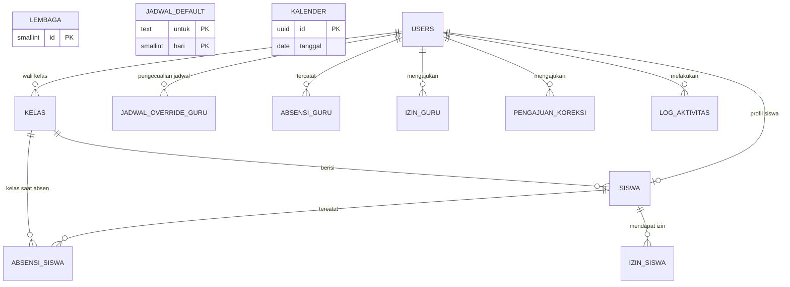

# Data Model

## Aplikasi Absensi Guru dan Siswa Berbasis Geo Tagging

| | |
|---|---|
| **Versi** | 1.0 (draf untuk persetujuan) |
| **Tanggal** | 4 Oktober 2026 |
| **Sumber** | BRD v1.0, FS v1.0 (Bagian 5 SF, 10 Data), Rancangan Final v1.0 |
| **Basis data sasaran** | PostgreSQL (kompatibel dengan Supabase) |
| **Dokumen turunan** | Wireframe/UI-UX → Prompt Playbook → Pembangunan |

> ### Tujuan rancangan data: **sederhana dan anti-konflik**
> **13 tabel**, tanpa tabel perantara yang tidak perlu, tanpa enum khusus, tanpa trigger wajib. Konflik data dicegah lewat **kunci unik, aturan CHECK, dan satu sumber kebenaran per fakta**, bukan lewat logika yang tersebar di banyak tempat. Istilah dan aturan mengikuti **Pedoman Konsistensi** (BRD Bagian 3; FS Bagian 2).

---

## Daftar Isi

1. [Informasi Dokumen](#1-informasi-dokumen)
2. [Prinsip Desain Sederhana dan Anti-Konflik](#2-prinsip-desain-sederhana-dan-anti-konflik)
3. [Gambaran Model Data](#3-gambaran-model-data)
4. [Konvensi](#4-konvensi)
5. [Kamus Data per Tabel](#5-kamus-data-per-tabel)
6. [Pencegahan Konflik Data](#6-pencegahan-konflik-data)
7. [Fungsi Basis Data](#7-fungsi-basis-data)
8. [Akses, Keamanan, dan Penyimpanan Berkas](#8-akses-keamanan-dan-penyimpanan-berkas)
9. [Pemetaan Fungsi ke Tabel](#9-pemetaan-fungsi-ke-tabel)
10. [Data Awal (Seed)](#10-data-awal-seed)
11. [Penyesuaian atas FS dan Keputusan Data Model](#11-penyesuaian-atas-fs-dan-keputusan-data-model)
12. [Pengujian Data](#12-pengujian-data)
13. [Persetujuan](#13-persetujuan)
- [Lampiran A: Skrip SQL Lengkap](#lampiran-a-skrip-sql-lengkap)
- [Lampiran B: Contoh Data untuk Fase Frontend](#lampiran-b-contoh-data-untuk-fase-frontend)

---

## 1. Informasi Dokumen

### 1.1 Tujuan
Dokumen ini menetapkan **struktur data**: tabel, kolom, tipe, kunci, aturan integritas, dan pemetaan ke fungsi FS. Dokumen ini menjadi dasar skrip database dan **data contoh** untuk fase frontend.

### 1.2 Cara Membaca
| Kode | Arti |
|---|---|
| **BR / AB / PK** | Kebutuhan, Aturan Bisnis, Pedoman (BRD) |
| **FR / SF / SCR** | Fungsi, Fungsi Inti, Layar (FS) |
| **DM-P*n*** | Prinsip desain data (Bagian 2) |
| **DM-D*n*** | Keputusan Data Model (Bagian 11) |
| **DM-H*n*** | Hal terbuka data (Bagian 11) |

### 1.3 Riwayat Revisi
| Versi | Tanggal | Perubahan |
|---|---|---|
| 1.0 | 4 Okt 2026 | Data Model disusun dari FS v1.0 |

---

## 2. Prinsip Desain Sederhana dan Anti-Konflik

| ID | Prinsip | Akibat pada struktur |
|---|---|---|
| **DM-P1** | **Satu fakta, satu tempat.** Tidak ada kolom yang menyimpan fakta sama di dua tabel. | Angka bisnis hanya di `lembaga` (PK-E2); kelas siswa dicatat sekali di `siswa` dan sekali sebagai *foto saat absen* di `absensi_siswa` (alasan di DM-P6). |
| **DM-P2** | **Satu baris per orang per hari.** Masuk dan Pulang dalam satu baris. | `unique (orang, tanggal)` pada tabel absensi; laporan cukup agregasi (AB, FS SF-09). |
| **DM-P3** | **Jadwal tidak disimpan per hari.** Jadwal efektif **dihitung** oleh satu fungsi. | Hanya 3 tabel jadwal (`jadwal_default`, `jadwal_override_guru`, `kalender`) + fungsi `jadwal_efektif` (SF-01). |
| **DM-P4** | **Teks + CHECK, bukan enum.** Nilai terbatas dijaga `CHECK`. | Mudah diubah di versi berikutnya tanpa migrasi tipe. |
| **DM-P5** | **Data tidak dihapus** (AB-17). Semua kunci asing `ON DELETE RESTRICT`; penonaktifan memakai `aktif`. | Riwayat absen selalu utuh. |
| **DM-P6** | **Riwayat tidak berubah ketika master berubah.** Kenaikan kelas tidak boleh menggeser laporan lama. | `absensi_siswa.kelas_id` = kelas **saat absen** (AB-18). |
| **DM-P7** | **Waktu sederhana:** tanggal = `date`, jam absen = `time` dalam **WIB**; jejak audit = `timestamptz`. | Tidak ada konversi zona waktu pada laporan; tidak ada selisih tanggal vs jam. |
| **DM-P8** | **Kunci unik dan CHECK mencegah data tidak sah**, bukan hanya validasi aplikasi. | Bagian 6. |
| **DM-P9** | **Semua tulis lewat server.** Klien tidak menulis langsung ke tabel. | RLS aktif, tanpa kebijakan klien (Bagian 8). |
| **DM-P10** | **Penamaan baku:** `snake_case` Bahasa Indonesia sesuai glosarium (PK-D). | Bagian 4. |

---

## 3. Gambaran Model Data

### 3.1 Diagram Hubungan



### 3.2 Daftar 13 Tabel

| # | Tabel | Kelompok | Fungsi | Baris (perkiraan) |
|---|---|---|---|---|
| 1 | `lembaga` | Pengaturan | Identitas, koordinat, dan **semua angka bisnis** | 1 |
| 2 | `users` | Akun | Akun semua peran (admin, kepala, guru, siswa) | puluhan–ratusan |
| 3 | `siswa` | Master | Profil siswa (1:1 dengan `users`) | ratusan |
| 4 | `kelas` | Master | Kelas, wali kelas, tahun ajaran | puluhan |
| 5 | `jadwal_default` | Jadwal | Jadwal default guru dan siswa per hari | 14 |
| 6 | `jadwal_override_guru` | Jadwal | Pengecualian jadwal per guru per hari | sedikit |
| 7 | `kalender` | Jadwal | Libur dan Hari Khusus | puluhan/tahun |
| 8 | `absensi_guru` | Transaksi | Absensi guru (dan Kepala bila absen) per hari | ~puluhan/hari |
| 9 | `absensi_siswa` | Transaksi | Absensi siswa per hari | ~ratusan/hari |
| 10 | `izin_guru` | Transaksi | Izin guru dan persetujuannya | sedikit |
| 11 | `izin_siswa` | Transaksi | Izin/sakit siswa | sedang |
| 12 | `pengajuan_koreksi` | Transaksi | Pengajuan koreksi absen guru | sedikit |
| 13 | `log_aktivitas` | Audit | Jejak perubahan dan koreksi | tumbuh bertahap |

> **Pertumbuhan data:** tabel terbesar adalah `absensi_siswa` (± jumlah siswa × hari aktif). Dengan ratusan siswa, ukuran ini wajar bagi satu basis data tanpa partisi.

---

## 4. Konvensi

### 4.1 Penamaan
- Tabel dan kolom: huruf kecil, `snake_case`, Bahasa Indonesia sesuai glosarium baku (PK-D).
- Kunci utama: `id` (uuid); kunci asing: `user_id`, `siswa_id`, `kelas_id`.
- Pelaku: `*_oleh` (uuid pengguna); waktu kejadian: `*_pada` (timestamptz); rentang tanggal: `tgl_mulai`, `tgl_selesai`.
- Berkas di penyimpanan: `*_path` (bukan URL), lihat Bagian 8.3.
- Boolean tanpa awalan (`aktif`, `dikoreksi`).

### 4.2 Tipe Data
| Kebutuhan | Tipe |
|---|---|
| Kunci | `uuid` (`gen_random_uuid()`) |
| Teks pendek/panjang | `text` + `CHECK` panjang bila perlu |
| Tanggal | `date` |
| Jam absen/jadwal (WIB) | `time` |
| Jejak waktu | `timestamptz` |
| Koordinat | `double precision`; akurasi `real`; jarak `integer` (meter) |
| Pilihan terbatas | `text` + `CHECK ... IN (...)` |

### 4.3 Pemetaan Hari (`hari`, 0–6)
Urutan mengikuti FS 2.7 (awal pekan **Sabtu**):

| `hari` | 0 | 1 | 2 | 3 | 4 | 5 | 6 |
|---|---|---|---|---|---|---|---|
| Hari | Sabtu | Ahad | Senin | Selasa | Rabu | Kamis | Jumat |

Konversi dari tanggal: `hari = (EXTRACT(DOW FROM tanggal) + 1) % 7` (fungsi `hari_ke`, Bagian 7). *Contoh:* 4 Okt 2026 (Ahad) → `hari = 1`.

### 4.4 Kode Nilai ↔ Label Tampil (PK-D)
> Kode di basis data bersifat tetap; **label tampil** mengikuti glosarium baku. Layar tidak menampilkan kode mentah.

| Kolom | Kode → Label |
|---|---|
| `users.role` | `admin` → Admin · `kepala` → Kepala · `guru` → Guru · `siswa` → Siswa |
| `absensi_*.status` | `hadir` → Hadir · `terlambat` → Terlambat · `izin` → Izin · `sakit` → Sakit · `dinas_luar` → Dinas Luar · `alpa` → Alpa |
| `izin_guru.jenis` | `sakit` → Sakit · `izin` → Izin · `cuti` → Cuti · `dinas_luar` → Dinas Luar |
| `izin_siswa.jenis` | `izin` → Izin · `sakit` → Sakit |
| `kalender.jenis` | `libur` → Libur · `khusus` → Hari Khusus |
| `kalender.untuk`, `jadwal_default.untuk` | `semua` → Semua · `guru` → Guru · `siswa` → Siswa |
| `izin_guru.status`, `pengajuan_koreksi.status` | `menunggu` → Menunggu · `disetujui` → Disetujui · `ditolak` → Ditolak |

**Penanda** (Pulang Awal, Tidak Lengkap, Dikoreksi, Lokasi Mencurigakan) disimpan sebagai **kolom boolean** terpisah dari status utama (FS 5.4 / BRD AB-06), sehingga seseorang bisa **Terlambat sekaligus Pulang Awal**.

**Pemetaan jenis izin → status absensi** (SF-06): `sakit`→`sakit`; `izin`→`izin`; **`cuti`→`izin`**; `dinas_luar`→`dinas_luar`.

---

## 5. Kamus Data per Tabel

> Kolom **Wajib**: ✔ = NOT NULL. **Ref FS** menunjuk sumber aturan. Skrip lengkap ada di Lampiran A.

### 5.1 `lembaga` (1 baris)
Satu-satunya tempat angka bisnis (PK-E2). Dipaksa **tepat satu baris** (`id = 1`).

| Kolom | Tipe | Wajib | Bawaan | Aturan | Ref FS |
|---|---|:-:|---|---|---|
| `id` | smallint | ✔ | 1 | `CHECK (id = 1)` | FR-MD-01 |
| `nama` | text | ✔ | | | FR-MD-01 |
| `npsn_nsm` | text | | | | |
| `alamat` | text | | | | |
| `logo_path` | text | | | Berkas di penyimpanan | T-06 |
| `lat` | double precision | | | −90..90; **kosong = absen belum bisa dipakai** (DM-H1) | FR-MD-01 |
| `lng` | double precision | | | −180..180 | |
| `radius_m` | integer | ✔ | 200 | 20–1000 | 6.3.1 |
| `akurasi_maks_m` | integer | ✔ | 50 | 10–200 | 6.3.1 |
| `buka_masuk_menit` | integer | ✔ | 30 | 0–120 | 6.3.1 |
| `toleransi_menit` | integer | ✔ | 10 | 0–60 | 6.3.1 |
| `tutup_masuk_menit` | integer | ✔ | 180 | 30–480 dan **≥ toleransi_menit** | 6.3.1 |
| `buka_pulang_menit` | integer | ✔ | 60 | 0–240 | 6.3.1 |
| `domain_email` | text | ✔ | `akademik.sch.id` | Dipakai email siswa otomatis | SF-08 |
| `tahun_ajaran_aktif` | text | | | Format `2026/2027` | FR-MD-01, 08 |
| `tutup_hari_terakhir` | date | | | Tanggal terakhir yang sudah diproses SF-07 | SF-07 |
| `updated_at` | timestamptz | ✔ | `now()` | | |

### 5.2 `users`
Satu tabel untuk **semua peran**. Kredensial (password) disimpan oleh sistem login (DM-D1), **bukan** di tabel ini.

| Kolom | Tipe | Wajib | Bawaan | Aturan | Ref FS |
|---|---|:-:|---|---|---|
| `id` | uuid | ✔ | | PK; sama dengan id akun login (`auth.users.id`) | FR-AK-03 |
| `email` | text | ✔ | | Unik, **huruf kecil** (`CHECK email = lower(email)`); tidak diubah setelah dibuat | FR-AK-05, MD-05 |
| `role` | text | ✔ | | `admin`, `kepala`, `guru`, `siswa` | BRD 7 |
| `nomor_induk` | text | ✔ | | NIP/ID (admin, kepala, guru) atau NISN (siswa). **Unik per peran** (DM-D2) | 6.2.1 |
| `nama` | text | ✔ | | 3–100 karakter | 6.2.1 |
| `foto_path` | text | | | Berkas di penyimpanan | T-06 |
| `kontak` | text | | | | 6.2.1 |
| `aktif` | boolean | ✔ | true | Penonaktifan, bukan hapus (AB-17) | FR-MD-06 |
| `wajib_absen` | boolean | ✔ | false | Guru = true saat dibuat; Kepala/Admin = false. **Siswa selalu wajib** (diabaikan untuk siswa, DM-D5) | AB-14 |
| `created_at`, `updated_at` | timestamptz | ✔ | `now()` | | |

**Indeks unik:** `(role, nomor_induk)`; **hanya satu Kepala aktif**: indeks unik parsial `(role) WHERE role='kepala' AND aktif` (FR-MD-02).

### 5.3 `siswa` (profil, 1:1 dengan `users`)
`user_id` **adalah kunci utama** (satu identitas siswa di seluruh sistem).

| Kolom | Tipe | Wajib | Aturan | Ref FS |
|---|---|:-:|---|---|
| `user_id` | uuid | ✔ | PK; FK → `users(id)`; baris `users` harus berperan `siswa` (dijaga server) | FR-AK-07 |
| `kelas_id` | uuid | ✔ | FK → `kelas(id)`; kelas **saat ini** | FR-MD-05 |
| `jenis_kelamin` | char(1) | ✔ | `L` atau `P` | 6.2.1 |
| `kontak_wali` | text | | | 6.2.1 |

### 5.4 `kelas`
| Kolom | Tipe | Wajib | Aturan | Ref FS |
|---|---|:-:|---|---|
| `id` | uuid | ✔ | PK | FR-MD-07 |
| `nama` | text | ✔ | | |
| `tahun_ajaran` | text | ✔ | Format `2026/2027` | |
| `wali_user_id` | uuid | | FK → `users(id)`; guru yang ditunjuk (dijaga server). **Satu guru maksimal satu kelas per tahun ajaran** (`unique (tahun_ajaran, wali_user_id)`) | FR-MD-07 |
| `created_at` | timestamptz | ✔ | | |

**Unik:** `(nama, tahun_ajaran)`.

### 5.5 `jadwal_default`
Dua set (guru dan siswa) × tujuh hari = **14 baris tetap**.

| Kolom | Tipe | Wajib | Aturan | Ref FS |
|---|---|:-:|---|---|
| `untuk` | text | ✔ | `guru` atau `siswa` | FR-JD-01 |
| `hari` | smallint | ✔ | 0–6 (4.3) | |
| `aktif` | boolean | ✔ | | |
| `jam_masuk` | time | | **Wajib bila aktif** | |
| `jam_pulang` | time | | Wajib bila aktif dan **> jam_masuk** | |

**PK:** `(untuk, hari)`.

### 5.6 `jadwal_override_guru`
Ada baris = ada pengecualian. **Tidak ada baris = Default.**

| Kolom | Tipe | Wajib | Aturan | Ref FS |
|---|---|:-:|---|---|
| `user_id` | uuid | ✔ | FK → `users(id)` | FR-JD-02 |
| `hari` | smallint | ✔ | 0–6 | |
| `aktif` | boolean | ✔ | `false` = **Nonaktif**; `true` = **Override** (jam sendiri) | |
| `jam_masuk`, `jam_pulang` | time | | Wajib bila aktif, `pulang > masuk` | |

**PK:** `(user_id, hari)`. Pemetaan layar: *Default* = tanpa baris; *Override* = `aktif = true`; *Nonaktif* = `aktif = false`.

### 5.7 `kalender`
| Kolom | Tipe | Wajib | Aturan | Ref FS |
|---|---|:-:|---|---|
| `id` | uuid | ✔ | PK | FR-JD-03 |
| `tanggal` | date | ✔ | Satu baris per tanggal | |
| `jenis` | text | ✔ | `libur` atau `khusus` | |
| `untuk` | text | ✔ | `semua` (bawaan), `guru`, `siswa` | AB-11 |
| `keterangan` | text | ✔ | | |
| `jam_masuk`, `jam_pulang` | time | | **Libur: kosong. Hari Khusus: wajib**, `pulang > masuk` | |
| `created_at` | timestamptz | ✔ | | |

**Unik:** `(tanggal, jenis, untuk)`.
**Aturan bila dua entri cocok pada tanggal yang sama:** entri **spesifik** (`guru`/`siswa`) menang atas `semua` (diterapkan di `jadwal_efektif`); **Libur** menang atas Hari Khusus (SF-01).

### 5.8 `absensi_guru`
Berisi guru **dan Kepala** (bila Kepala memilih absen). **Satu baris per orang per hari.**

| Kolom | Tipe | Wajib | Aturan | Ref FS |
|---|---|:-:|---|---|
| `id` | uuid | ✔ | PK | |
| `user_id` | uuid | ✔ | FK → `users(id)` | |
| `tanggal` | date | ✔ | Tanggal WIB | SF-04 |
| `jam_masuk` | time | | WIB, dari jam server | AB-02 |
| `jam_pulang` | time | | WIB; **hanya bila `jam_masuk` ada** | |
| `status` | text | ✔ | `hadir`, `terlambat`, `izin`, `sakit`, `dinas_luar`, `alpa`; **`hadir`/`terlambat` wajib punya `jam_masuk`** | AB-05 |
| `pulang_awal` | boolean | ✔ | false | AB-06 |
| `tidak_lengkap` | boolean | ✔ | false | AB-06 |
| `flag_curiga` | boolean | ✔ | false | SF-05 |
| `alasan_flag` | text | | Keterangan singkat penanda | SF-05 |
| `dikoreksi` | boolean | ✔ | false | AB-16 |
| `catatan` | text | | | |
| `lat_masuk`, `lng_masuk` | double precision | | Koordinat saat Masuk | KP-7 |
| `akurasi_masuk` | real | | meter | |
| `jarak_masuk_m` | integer | | jarak dari titik madrasah | MSG-09 |
| `lat_pulang`, `lng_pulang`, `akurasi_pulang`, `jarak_pulang_m` | | | Untuk Pulang | |
| `created_at`, `updated_at` | timestamptz | ✔ | | |

**Unik:** `(user_id, tanggal)`.

### 5.9 `absensi_siswa`
Struktur sama seperti `absensi_guru`, dengan perbedaan:

| Kolom | Tipe | Wajib | Aturan | Ref FS |
|---|---|:-:|---|---|
| `siswa_id` | uuid | ✔ | FK → `siswa(user_id)` | |
| `kelas_id` | uuid | ✔ | FK → `kelas(id)`; **kelas saat absen** (snapshot), diisi saat baris dibuat | AB-18 |
| `discan_masuk_oleh` | uuid | | FK → `users(id)`; guru pemindai Masuk | FR-AS-05 |
| `discan_pulang_oleh` | uuid | | FK → `users(id)`; guru pemindai Pulang (bisa berbeda) | FR-AS-05 |

Koordinat/akurasi/jarak pada tabel ini adalah **lokasi guru pemindai** (SF-03). **Unik:** `(siswa_id, tanggal)`.

### 5.10 `izin_guru`
| Kolom | Tipe | Wajib | Aturan | Ref FS |
|---|---|:-:|---|---|
| `id` | uuid | ✔ | PK | |
| `user_id` | uuid | ✔ | FK → `users(id)` | |
| `jenis` | text | ✔ | `sakit`, `izin`, `cuti`, `dinas_luar` | FR-IZ-01 |
| `tgl_mulai`, `tgl_selesai` | date | ✔ | `selesai ≥ mulai`; durasi **maks 90 hari** | T-11 |
| `alasan` | text | ✔ | ≤ 300 karakter | T-13 |
| `lampiran_path` | text | | JPG/PNG/PDF ≤ 2 MB | T-07 |
| `status` | text | ✔ | `menunggu` (bawaan), `disetujui`, `ditolak` | FR-IZ-03 |
| `diajukan_oleh` | uuid | ✔ | FK; guru sendiri atau Admin (input atas nama) | FR-IZ-04 |
| `diputuskan_oleh` | uuid | | FK; **wajib bila status ≠ menunggu** (Kepala) | |
| `diputuskan_pada` | timestamptz | | | |
| `catatan_keputusan` | text | | ≤ 200; **wajib bila ditolak** | FR-IZ-03 |
| `created_at` | timestamptz | ✔ | | |

### 5.11 `izin_siswa`
| Kolom | Tipe | Wajib | Aturan | Ref FS |
|---|---|:-:|---|---|
| `id` | uuid | ✔ | PK | |
| `siswa_id` | uuid | ✔ | FK → `siswa(user_id)` | |
| `jenis` | text | ✔ | `izin` atau `sakit` | FR-IZ-05 |
| `tgl_mulai`, `tgl_selesai` | date | ✔ | `selesai ≥ mulai`; durasi maks 90 hari | |
| `keterangan` | text | ✔ | ≤ 200 karakter | T-13 |
| `lampiran_path` | text | | | T-07 |
| `diinput_oleh` | uuid | ✔ | FK; wali kelas atau Admin | |
| `dibatalkan` | boolean | ✔ | false | FR-IZ-06 |
| `dibatalkan_oleh`, `dibatalkan_pada` | uuid, timestamptz | | | |
| `created_at` | timestamptz | ✔ | | |

### 5.12 `pengajuan_koreksi` (khusus guru)
| Kolom | Tipe | Wajib | Aturan | Ref FS |
|---|---|:-:|---|---|
| `id` | uuid | ✔ | PK | |
| `user_id` | uuid | ✔ | FK → `users(id)` | FR-AG-05 |
| `tanggal` | date | ✔ | Maks 30 hari ke belakang (validasi server, T-11) | |
| `usulan_jam_masuk`, `usulan_jam_pulang` | time | | **Minimal salah satu terisi** | |
| `alasan` | text | ✔ | ≤ 300 | |
| `status` | text | ✔ | `menunggu` (bawaan), `disetujui`, `ditolak` | FR-KR-02 |
| `diproses_oleh` | uuid | | FK; **wajib bila status ≠ menunggu** (Admin) | |
| `diproses_pada` | timestamptz | | | |
| `catatan_keputusan` | text | | Wajib bila ditolak (validasi server) | |
| `created_at` | timestamptz | ✔ | | |

**Unik parsial:** satu pengajuan **Menunggu** per `(user_id, tanggal)`.

> Koreksi absen **siswa** dan koreksi langsung Admin **tidak** memakai tabel ini; langsung mengubah baris absensi, ditandai `dikoreksi = true`, dan dicatat di `log_aktivitas` (FR-KR-03, 04).

### 5.13 `log_aktivitas`
Hanya-tambah (*append-only*); tidak dapat diubah atau dihapus (SF-10).

| Kolom | Tipe | Wajib | Aturan |
|---|---|:-:|---|
| `id` | bigint identity | ✔ | PK |
| `waktu` | timestamptz | ✔ | `now()` |
| `user_id` | uuid | | FK; kosong untuk tindakan sistem (mis. Tutup Hari) |
| `aksi` | text | ✔ | Kode, mis. `izin_guru.setujui`, `absensi.koreksi` |
| `entitas` | text | | Nama tabel objek |
| `entitas_id` | text | | Id objek |
| `ringkasan` | text | | Kalimat singkat untuk layar (FR-KR-05) |
| `data_lama`, `data_baru` | jsonb | | Nilai sebelum dan sesudah |

Absen normal **tidak dicatat** di log (FS 4.1).

---

## 6. Pencegahan Konflik Data

| # | Risiko konflik | Pencegahan | Lapisan |
|---|---|---|---|
| 1 | Absen ganda pada satu hari | `unique (user_id, tanggal)` / `unique (siswa_id, tanggal)`; operasi tulis memakai *upsert* | Basis data |
| 2 | Tutup Hari berjalan dua kali atau terlewat | Penyisipan baris Alpa memakai `ON CONFLICT DO NOTHING` (aman diulang); `lembaga.tutup_hari_terakhir` menyusul tanggal tertinggal | Basis data + server |
| 3 | Jam pulang tanpa jam masuk; status Hadir tanpa jam | `CHECK` pada tabel absensi | Basis data |
| 4 | Status atau jenis di luar daftar | `CHECK ... IN (...)` pada semua kolom pilihan | Basis data |
| 5 | Dua Kepala aktif | Indeks unik parsial `role='kepala' AND aktif` | Basis data |
| 6 | Wali kelas ganda / guru wali dua kelas | `unique (tahun_ajaran, wali_user_id)` | Basis data |
| 7 | Laporan kelas lama bergeser setelah kenaikan kelas | `absensi_siswa.kelas_id` menyimpan kelas saat absen (DM-P6) | Basis data |
| 8 | Dua entri Kalender cocok pada tanggal sama | `unique (tanggal, jenis, untuk)`; entri spesifik menang atas `semua`; Libur menang atas Hari Khusus | Basis data + fungsi |
| 9 | Jam jadwal tidak masuk akal (pulang ≤ masuk, jam kosong saat aktif) | `CHECK` pada ketiga tabel jadwal | Basis data |
| 10 | Pengajuan koreksi menumpuk untuk tanggal sama | Indeks unik parsial `status='menunggu'` | Basis data |
| 11 | Izin tumpang tindih (MSG-22) | Validasi server; **penguat opsional** berupa *exclusion constraint* (Lampiran A bagian 8) | Server + opsional |
| 12 | Email ganda atau huruf besar-kecil berbeda | `unique (email)` + `CHECK email = lower(email)` | Basis data |
| 13 | NIP/NISN ganda dalam peran yang sama | `unique (role, nomor_induk)` | Basis data |
| 14 | Keputusan izin tanpa pemutus; penolakan tanpa catatan | `CHECK` pada `izin_guru` dan `pengajuan_koreksi` | Basis data |
| 15 | Riwayat hilang karena penghapusan | Semua FK `ON DELETE RESTRICT`; tidak ada fitur hapus (AB-17) | Basis data |
| 16 | Akun login dan `users` tidak sinkron | `users.id = auth.users.id`; pembuatan akun satu langkah di server (8.2) | Server |
| 17 | Log diubah | Trigger penolak ubah/hapus (Lampiran A bagian 9) | Basis data |
| 18 | Angka bisnis tersebar | Hanya di `lembaga` (PK-E2) | Rancangan |
| 19 | Tanggal dan jam tidak sinkron akibat zona waktu | `tanggal` (date) dan `jam_*` (time) sama-sama WIB, ditetapkan satu kali di server | Rancangan |
| 20 | Jadwal ganda tersimpan per hari lalu bertentangan dengan pengaturan | Jadwal **tidak** disimpan per hari; dihitung (DM-P3) | Rancangan |

---

## 7. Fungsi Basis Data

Dua fungsi kecil, disarankan agar **logika jadwal hidup di satu tempat** dan dipakai bersama oleh absen, Tutup Hari, dan laporan (SF-01). Kode lengkap di Lampiran A bagian 7.

### 7.1 `hari_ke(tanggal) → smallint`
Mengubah tanggal menjadi nomor hari 0–6 (Sabtu = 0), Bagian 4.3.

### 7.2 `jadwal_efektif(user_id, tanggal) → (boleh_absen, wajib, jam_masuk, jam_pulang, sumber)`
Menerapkan SF-01 persis:

1. **Libur** (kalender, `untuk` ∈ {semua, peran}) → `boleh_absen=false`, `wajib=false`.
2. Guru dengan **Override Nonaktif**: `wajib=false`; `boleh_absen=true` **hanya bila ada Hari Khusus** (jam khusus), selain itu `false`.
3. Hari **aktif** = Hari Khusus (ada) → **ya**; selain itu Override (bila ada) → `aktif` override; selain itu `jadwal_default.aktif` (H-02).
4. **Jam** = `khusus ?? override ?? default`.
5. `wajib` = hari aktif **dan** (siswa selalu wajib; guru/kepala sesuai `users.wajib_absen`).

`sumber` ∈ `libur`, `khusus`, `override`, `default`. **Tutup Hari (SF-07)** dijalankan oleh fungsi terjadwal di server yang memanggil `jadwal_efektif`; tidak diduplikasi di SQL agar mudah dipelihara.

---

## 8. Akses, Keamanan, dan Penyimpanan Berkas

### 8.1 Pola Akses (DM-P9)
- **Semua baca/tulis lewat server** (API) memakai kunci server (*service role*), yang **tidak pernah** dikirim ke peramban.
- **Row Level Security (RLS) diaktifkan pada seluruh tabel tanpa kebijakan untuk klien**; artinya akses langsung dari peramban ditolak.
- Otorisasi per peran dan kepemilikan (FS Bagian 9, KP-1..KP-7) diterapkan **di server**. Bila kelak diperlukan akses langsung dari klien, kebijakan RLS dapat ditambahkan **tanpa mengubah struktur tabel**.

### 8.2 Akun Login (DM-D1)
- Kredensial dikelola sistem login (Supabase Auth); `users.id` = id akun login.
- **Pembuatan akun (satu langkah di server):** (1) buat akun login dengan email terkonfirmasi (tanpa aktivasi, D-05) dan password awal peran; (2) sisipkan baris `users` dengan `id` yang sama; (3) bila langkah 2 gagal, **batalkan akun login** agar tidak yatim.
- **Atur ulang password oleh Admin** (FR-AK-08) memperbarui kredensial di sistem login; tercatat di `log_aktivitas`.
- Email dan nomor induk tidak diubah setelah dibuat (FR-MD-05). Salah ketik ditangani lewat DM-H2.

### 8.3 Penyimpanan Berkas
Berkas **tidak** disimpan di tabel; tabel hanya menyimpan **path**.

| Wadah (bucket) | Isi | Kolom | Aturan |
|---|---|---|---|
| `logo` | Logo lembaga | `lembaga.logo_path` | JPG/PNG |
| `foto` | Foto profil | `users.foto_path` | JPG/PNG ≤ 1 MB, dikompres 512 px (T-06) |
| `lampiran` | Lampiran izin | `izin_guru.lampiran_path`, `izin_siswa.lampiran_path` | JPG/PNG/PDF ≤ 2 MB (T-07) |

Semua wadah **privat**; tampilan memakai tautan bertanda tangan sementara yang dibuat server.

### 8.4 Hak Data Sensitif
- **Koordinat absen** hanya diteruskan ke Admin dan Kepala (KP-7); pengguna biasa hanya menerima **jarak** (`jarak_*_m`).
- **`flag_curiga` dan `alasan_flag`** hanya untuk Admin dan Kepala (KP-6).

---

## 9. Pemetaan Fungsi ke Tabel

**C** = buat, **R** = baca, **U** = ubah. (Tidak ada **D**: data tidak dihapus, kecuali entri `kalender` masa depan, FR-JD-05.)

| Fungsi (FS) | `lembaga` | `users` | `siswa` | `kelas` | jadwal (3 tabel) | `absensi_guru` | `absensi_siswa` | `izin_guru` | `izin_siswa` | `pengajuan_koreksi` | `log_aktivitas` |
|---|:-:|:-:|:-:|:-:|:-:|:-:|:-:|:-:|:-:|:-:|:-:|
| FR-AK Login, profil, ganti password | | R/U | R | | | | | | | | C (reset) |
| FR-MD Master data, impor, kenaikan kelas | R/U | C/R/U | C/R/U | C/R/U | | | | | | | C |
| FR-JD Jadwal, kalender, pengaturan | R/U | R | | | C/R/U | | | | | | C |
| SF-01 Jadwal efektif | R | R | | | R | | | | | | |
| FR-AG / SF-04 Absen guru | R | R | | | R | C/R/U | | R | | | |
| FR-AS / SF-04 Absen siswa | R | R | R | R | R | | C/R/U | | R | | |
| SF-07 Tutup Hari | R/U | R | R | | R | C/U | C/U | R | R | | C |
| FR-IZ Izin dan SF-06 | | R | R | R | R | U | U | C/R/U | C/R/U | | C |
| FR-KR Koreksi | | R | R | R | | U | U | | | C/R/U | C |
| FR-LP Dashboard dan laporan | R | R | R | R | R | R | R | R | R | | |
| FR-PD Kartu QR, Bantuan | R | R | R | R | | | | | | | |

---

## 10. Data Awal (Seed)

| Data | Isi awal | Catatan |
|---|---|---|
| `lembaga` | 1 baris (`id = 1`), nama sementara, `radius_m` 200 dan angka bawaan lain (5.1) | Admin melengkapi nama, **koordinat**, dan tahun ajaran di SCR-10 |
| `jadwal_default` | **14 baris**: Sabtu–Rabu 07:00–14:00, Kamis 07:00–12:00, Jumat tidak aktif; untuk **guru dan siswa** | Sesuai BRD AB-21 |
| `users` (Admin, Kepala) | 2 akun awal berformat `admin@[domain]` dan `kepala@[domain]` dengan nomor induk sementara | Nilai password awal per peran: **Rancangan Final §4.1** (ditulis satu kali, PK-E1). Admin memperbarui data lewat SCR-11 |
| `kalender`, `kelas`, `siswa`, guru | Kosong | Diisi lewat layar dan impor |

Akun login Admin dan Kepala dibuat lewat prosedur 8.2 (bukan lewat SQL biasa).

---

## 11. Penyesuaian atas FS dan Keputusan Data Model

### 11.1 Keputusan Data Model

| ID | Keputusan | Alasan (sederhana dan anti-konflik) |
|---|---|---|
| **DM-D1** | **Kredensial di sistem login**; `users` **tanpa** `password_hash`. | Satu sumber kebenaran untuk password; tidak ada dua tempat yang bisa berbeda. Bila nanti pindah ke server sendiri, cukup menambah kolom hash. |
| **DM-D2** | **`nomor_induk` unik per peran**, bukan unik global. | Mencegah bentrok semu antara NIP dan NISN yang kebetulan sama. |
| **DM-D3** | **Jam absen bertipe `time` (WIB)** dan tanggal bertipe `date`. | Tidak ada konversi zona waktu dan tidak ada selisih tanggal-jam. |
| **DM-D4** | **Berkas disimpan sebagai `*_path`** di penyimpanan, bukan URL. | URL dapat berubah; path stabil. |
| **DM-D5** | **`siswa.user_id` menjadi PK** dan dirujuk langsung oleh `absensi_siswa` dan `izin_siswa`. | Satu identitas siswa, tanpa dua id yang harus disinkronkan. Siswa **selalu wajib absen**; `users.wajib_absen` diabaikan untuk siswa. |
| **DM-D6** | **Penanda sebagai kolom boolean** terpisah dari `status`. | Status utama tetap tunggal, penanda bisa bersamaan (AB-06). |
| **DM-D7** | **Tidak ada tabel untuk Fase 2.** Antrean offline hidup di perangkat; notifikasi dapat menambah satu tabel kelak. | Fase 1 tetap ringan. |
| **DM-D8** | **Entri `kalender` hanya dihapus untuk tanggal ≥ besok**; selain itu tidak ada penghapusan data (FR-JD-05). | Konsisten dengan AB-12 dan AB-17. |

### 11.2 Penyesuaian yang Perlu Masuk ke FS (FS v1.1)
> Sesuai PK-E4, temuan ini **dikembalikan ke FS sebelum kode ditulis**.

1. **FS 5.2 / 10.2:** hapus `password_hash` dari daftar kolom `users` (DM-D1); `nomor_induk` unik **per peran** (DM-D2).
2. **FS 10.2 butir 1:** `discan_oleh` diganti **`discan_masuk_oleh`** dan **`discan_pulang_oleh`** (sudah dipakai di Data Model ini).
3. **FS 6.2.1 / 6.3:** kolom foto/logo/lampiran bernama **`*_path`** (DM-D4).
4. **FR-KR-03 dan FR-KR-04:** bila status koreksi **Hadir/Terlambat**, **Jam Masuk wajib diisi** (menjaga `CHECK` pada absensi).
5. **Pesan baru MSG-25** (Lampiran A FS): "Lokasi madrasah belum diatur. Hubungi Admin." ditampilkan bila `lembaga.lat/lng` kosong (DM-H1); Dashboard Admin menampilkan banner pengingat (KOM-13).
6. **Catatan wajib_absen:** Siswa selalu wajib; kolom `wajib_absen` hanya berlaku untuk guru/kepala/admin (DM-D5).

### 11.3 Hal Terbuka Data

| ID | Hal | Usulan bawaan |
|---|---|---|
| **DM-H1** | Absen belum dapat dipakai sebelum koordinat madrasah diisi. | Absen ditolak dengan MSG-25; Admin diingatkan di Dashboard. |
| **DM-H2** | Salah ketik **email, NIP, atau NISN** (dikunci setelah dibuat, FR-MD-05). | Admin **menonaktifkan akun** lalu membuat akun baru; bila data absen harus ikut, gunakan **prosedur khusus oleh pengembang** yang tercatat di log. Tidak dipasang trigger pengunci agar prosedur ini tetap mungkin. |
| **DM-H3** | Penguat **exclusion constraint** untuk izin tumpang tindih (butuh ekstensi `btree_gist`). | **Opsional**; tersedia di Lampiran A bagian 8. Validasi server tetap berlaku. |
| **DM-H4** | Pengarsipan data lama (bila `absensi_siswa` sangat besar). | Tidak diperlukan di Fase 1; tinjau ulang setelah beberapa tahun ajaran. |

---

## 12. Pengujian Data

Skenario basis data yang harus lulus (melengkapi UAT di BRD dan FS):

| ID | Skenario | Hasil yang diharapkan |
|---|---|---|
| DT-01 | Sisipkan dua baris absensi untuk orang dan tanggal yang sama | Ditolak (unik) |
| DT-02 | Sisipkan `jam_pulang` tanpa `jam_masuk` | Ditolak (CHECK) |
| DT-03 | Sisipkan status `hadir` tanpa `jam_masuk` | Ditolak (CHECK) |
| DT-04 | Sisipkan status di luar daftar (mis. `libur`) | Ditolak (CHECK) |
| DT-05 | Aktifkan dua Kepala | Yang kedua ditolak (indeks unik parsial) |
| DT-06 | Tunjuk satu guru sebagai wali dua kelas pada tahun ajaran sama | Ditolak (unik) |
| DT-07 | Jadwal aktif dengan `jam_pulang ≤ jam_masuk` | Ditolak (CHECK) |
| DT-08 | Hari Khusus tanpa jam; Libur dengan jam | Ditolak (CHECK) |
| DT-09 | Tolak pengajuan koreksi tanpa pemroses | Ditolak (CHECK) |
| DT-10 | Dua pengajuan koreksi **Menunggu** pada tanggal sama | Yang kedua ditolak |
| DT-11 | Jalankan Tutup Hari dua kali untuk tanggal yang sama | Hasil sama; tidak ada baris ganda |
| DT-12 | `jadwal_efektif` pada: hari libur; hari biasa; guru Override; guru Nonaktif; Hari Khusus di hari default-libur | Sesuai SF-01 dan H-02 |
| DT-13 | Naikkan kelas lalu ambil laporan kelas lama | `kelas_id` pada absensi lama tidak berubah |
| DT-14 | Ubah/hapus baris `log_aktivitas` | Ditolak (trigger) |
| DT-15 | Akses tabel langsung dari klien (tanpa server) | Ditolak (RLS) |
| DT-16 | Sisipkan siswa dengan email kosong lewat impor | Email otomatis `NISN@siswa.[domain]` (SF-08) |

---

## 13. Persetujuan

| Peran | Nama | Tanda tangan | Tanggal |
|---|---|---|---|
| Kepala | | | |
| Admin / Pemilik proses | | | |
| Pelaksana pembangunan | | | |

*Data Model dinyatakan final setelah disetujui dan penyesuaian FS v1.1 (Bagian 11.2) dikonfirmasi. Perubahan berikutnya dicatat sebagai versi baru (PK-E3).*

---

## Lampiran A: Skrip SQL Lengkap

> PostgreSQL/Supabase. Jalankan **berurutan**. Bagian 8 (opsional) dan 9 dapat ditunda. Semua objek berada di skema `public`.
> Tabel `users` merujuk `auth.users` (bawaan Supabase). Bila dipakai di luar Supabase, hapus bagian `references auth.users(id)` dan sesuaikan sistem login (DM-D1).

```sql
-- =====================================================================
-- 1. LEMBAGA (tepat satu baris)
-- =====================================================================
create table public.lembaga (
  id                  smallint primary key default 1 check (id = 1),
  nama                text not null,
  npsn_nsm            text,
  alamat              text,
  logo_path           text,
  lat                 double precision check (lat between -90 and 90),
  lng                 double precision check (lng between -180 and 180),
  radius_m            integer not null default 200 check (radius_m between 20 and 1000),
  akurasi_maks_m      integer not null default 50  check (akurasi_maks_m between 10 and 200),
  buka_masuk_menit    integer not null default 30  check (buka_masuk_menit between 0 and 120),
  toleransi_menit     integer not null default 10  check (toleransi_menit between 0 and 60),
  tutup_masuk_menit   integer not null default 180 check (tutup_masuk_menit between 30 and 480),
  buka_pulang_menit   integer not null default 60  check (buka_pulang_menit between 0 and 240),
  domain_email        text not null default 'akademik.sch.id',
  tahun_ajaran_aktif  text check (tahun_ajaran_aktif ~ '^[0-9]{4}/[0-9]{4}$'),
  tutup_hari_terakhir date,
  updated_at          timestamptz not null default now(),
  constraint ck_lembaga_tutup_ge_toleransi check (tutup_masuk_menit >= toleransi_menit)
);

-- =====================================================================
-- 2. USERS (id = id akun login di auth.users)
-- =====================================================================
create table public.users (
  id           uuid primary key references auth.users(id) on delete restrict,
  email        text not null unique check (email = lower(email)),
  role         text not null check (role in ('admin','kepala','guru','siswa')),
  nomor_induk  text not null,
  nama         text not null check (char_length(nama) between 3 and 100),
  foto_path    text,
  kontak       text,
  aktif        boolean not null default true,
  wajib_absen  boolean not null default false,   -- guru: true saat dibuat; siswa: diabaikan (selalu wajib)
  created_at   timestamptz not null default now(),
  updated_at   timestamptz not null default now(),
  constraint uq_users_role_nomor unique (role, nomor_induk)
);
-- hanya satu Kepala aktif
create unique index ux_users_kepala_aktif on public.users (role)
  where role = 'kepala' and aktif;
create index ix_users_role_aktif on public.users (role, aktif);

-- =====================================================================
-- 3. KELAS
-- =====================================================================
create table public.kelas (
  id            uuid primary key default gen_random_uuid(),
  nama          text not null,
  tahun_ajaran  text not null check (tahun_ajaran ~ '^[0-9]{4}/[0-9]{4}$'),
  wali_user_id  uuid references public.users(id) on delete restrict,
  created_at    timestamptz not null default now(),
  constraint uq_kelas_nama unique (nama, tahun_ajaran),
  constraint uq_kelas_wali unique (tahun_ajaran, wali_user_id)  -- satu guru maksimal satu kelas per tahun ajaran
);

-- =====================================================================
-- 4. SISWA (profil 1:1 dengan users; user_id = kunci utama)
-- =====================================================================
create table public.siswa (
  user_id        uuid primary key references public.users(id) on delete restrict,
  kelas_id       uuid not null references public.kelas(id) on delete restrict,
  jenis_kelamin  char(1) not null check (jenis_kelamin in ('L','P')),
  kontak_wali    text
);
create index ix_siswa_kelas on public.siswa (kelas_id);

-- =====================================================================
-- 5. JADWAL DEFAULT (14 baris: guru/siswa x hari 0..6; 0 = Sabtu)
-- =====================================================================
create table public.jadwal_default (
  untuk       text     not null check (untuk in ('guru','siswa')),
  hari        smallint not null check (hari between 0 and 6),
  aktif       boolean  not null,
  jam_masuk   time,
  jam_pulang  time,
  primary key (untuk, hari),
  constraint ck_jadwal_default_jam check (
    not aktif or (jam_masuk is not null and jam_pulang is not null and jam_pulang > jam_masuk))
);

-- =====================================================================
-- 6. JADWAL OVERRIDE GURU (tidak ada baris = Default)
-- =====================================================================
create table public.jadwal_override_guru (
  user_id     uuid     not null references public.users(id) on delete restrict,
  hari        smallint not null check (hari between 0 and 6),
  aktif       boolean  not null,          -- false = Nonaktif; true = Override (jam sendiri)
  jam_masuk   time,
  jam_pulang  time,
  primary key (user_id, hari),
  constraint ck_jadwal_override_jam check (
    not aktif or (jam_masuk is not null and jam_pulang is not null and jam_pulang > jam_masuk))
);

-- =====================================================================
-- 7. KALENDER (Libur dan Hari Khusus)
-- =====================================================================
create table public.kalender (
  id          uuid primary key default gen_random_uuid(),
  tanggal     date not null,
  jenis       text not null check (jenis in ('libur','khusus')),
  untuk       text not null default 'semua' check (untuk in ('semua','guru','siswa')),
  keterangan  text not null,
  jam_masuk   time,
  jam_pulang  time,
  created_at  timestamptz not null default now(),
  constraint uq_kalender unique (tanggal, jenis, untuk),
  constraint ck_kalender_jam check (
    (jenis = 'libur'  and jam_masuk is null and jam_pulang is null) or
    (jenis = 'khusus' and jam_masuk is not null and jam_pulang is not null and jam_pulang > jam_masuk))
);
create index ix_kalender_tanggal on public.kalender (tanggal);

-- =====================================================================
-- 8. ABSENSI GURU (guru dan Kepala bila absen; satu baris per orang per hari)
-- =====================================================================
create table public.absensi_guru (
  id               uuid primary key default gen_random_uuid(),
  user_id          uuid not null references public.users(id) on delete restrict,
  tanggal          date not null,
  jam_masuk        time,
  jam_pulang       time,
  status           text not null check (status in ('hadir','terlambat','izin','sakit','dinas_luar','alpa')),
  pulang_awal      boolean not null default false,
  tidak_lengkap    boolean not null default false,
  flag_curiga      boolean not null default false,
  alasan_flag      text,
  dikoreksi        boolean not null default false,
  catatan          text,
  lat_masuk        double precision,
  lng_masuk        double precision,
  akurasi_masuk    real,
  jarak_masuk_m    integer,
  lat_pulang       double precision,
  lng_pulang       double precision,
  akurasi_pulang   real,
  jarak_pulang_m   integer,
  created_at       timestamptz not null default now(),
  updated_at       timestamptz not null default now(),
  constraint uq_absensi_guru unique (user_id, tanggal),
  constraint ck_absensi_guru_masuk  check (status not in ('hadir','terlambat') or jam_masuk is not null),
  constraint ck_absensi_guru_pulang check (jam_pulang is null or jam_masuk is not null)
);
create index ix_absensi_guru_tanggal on public.absensi_guru (tanggal);

-- =====================================================================
-- 9. ABSENSI SISWA (kelas_id = kelas SAAT ABSEN)
-- =====================================================================
create table public.absensi_siswa (
  id                  uuid primary key default gen_random_uuid(),
  siswa_id            uuid not null references public.siswa(user_id) on delete restrict,
  kelas_id            uuid not null references public.kelas(id) on delete restrict,
  tanggal             date not null,
  jam_masuk           time,
  jam_pulang          time,
  status              text not null check (status in ('hadir','terlambat','izin','sakit','dinas_luar','alpa')),
  pulang_awal         boolean not null default false,
  tidak_lengkap       boolean not null default false,
  flag_curiga         boolean not null default false,
  alasan_flag         text,
  dikoreksi           boolean not null default false,
  catatan             text,
  discan_masuk_oleh   uuid references public.users(id) on delete restrict,
  discan_pulang_oleh  uuid references public.users(id) on delete restrict,
  lat_masuk           double precision,   -- lokasi guru pemindai
  lng_masuk           double precision,
  akurasi_masuk       real,
  jarak_masuk_m       integer,
  lat_pulang          double precision,
  lng_pulang          double precision,
  akurasi_pulang      real,
  jarak_pulang_m      integer,
  created_at          timestamptz not null default now(),
  updated_at          timestamptz not null default now(),
  constraint uq_absensi_siswa unique (siswa_id, tanggal),
  constraint ck_absensi_siswa_masuk  check (status not in ('hadir','terlambat') or jam_masuk is not null),
  constraint ck_absensi_siswa_pulang check (jam_pulang is null or jam_masuk is not null)
);
create index ix_absensi_siswa_tanggal on public.absensi_siswa (tanggal);
create index ix_absensi_siswa_kelas_tanggal on public.absensi_siswa (kelas_id, tanggal);

-- =====================================================================
-- 10. IZIN GURU
-- =====================================================================
create table public.izin_guru (
  id                 uuid primary key default gen_random_uuid(),
  user_id            uuid not null references public.users(id) on delete restrict,
  jenis              text not null check (jenis in ('sakit','izin','cuti','dinas_luar')),
  tgl_mulai          date not null,
  tgl_selesai        date not null,
  alasan             text not null check (char_length(alasan) <= 300),
  lampiran_path      text,
  status             text not null default 'menunggu' check (status in ('menunggu','disetujui','ditolak')),
  diajukan_oleh      uuid not null references public.users(id) on delete restrict,
  diputuskan_oleh    uuid references public.users(id) on delete restrict,
  diputuskan_pada    timestamptz,
  catatan_keputusan  text check (char_length(catatan_keputusan) <= 200),
  created_at         timestamptz not null default now(),
  constraint ck_izin_guru_tgl    check (tgl_selesai >= tgl_mulai and tgl_selesai - tgl_mulai < 90),
  constraint ck_izin_guru_putus  check ((status = 'menunggu' and diputuskan_oleh is null)
                                     or (status <> 'menunggu' and diputuskan_oleh is not null)),
  constraint ck_izin_guru_tolak  check (status <> 'ditolak' or catatan_keputusan is not null)
);
create index ix_izin_guru_user_tgl on public.izin_guru (user_id, tgl_mulai, tgl_selesai);
create index ix_izin_guru_menunggu on public.izin_guru (status) where status = 'menunggu';

-- =====================================================================
-- 11. IZIN SISWA
-- =====================================================================
create table public.izin_siswa (
  id               uuid primary key default gen_random_uuid(),
  siswa_id         uuid not null references public.siswa(user_id) on delete restrict,
  jenis            text not null check (jenis in ('izin','sakit')),
  tgl_mulai        date not null,
  tgl_selesai      date not null,
  keterangan       text not null check (char_length(keterangan) <= 200),
  lampiran_path    text,
  diinput_oleh     uuid not null references public.users(id) on delete restrict,
  dibatalkan       boolean not null default false,
  dibatalkan_oleh  uuid references public.users(id) on delete restrict,
  dibatalkan_pada  timestamptz,
  created_at       timestamptz not null default now(),
  constraint ck_izin_siswa_tgl check (tgl_selesai >= tgl_mulai and tgl_selesai - tgl_mulai < 90)
);
create index ix_izin_siswa_siswa_tgl on public.izin_siswa (siswa_id, tgl_mulai, tgl_selesai);

-- =====================================================================
-- 12. PENGAJUAN KOREKSI (khusus guru)
-- =====================================================================
create table public.pengajuan_koreksi (
  id                 uuid primary key default gen_random_uuid(),
  user_id            uuid not null references public.users(id) on delete restrict,
  tanggal            date not null,
  usulan_jam_masuk   time,
  usulan_jam_pulang  time,
  alasan             text not null check (char_length(alasan) <= 300),
  status             text not null default 'menunggu' check (status in ('menunggu','disetujui','ditolak')),
  diproses_oleh      uuid references public.users(id) on delete restrict,
  diproses_pada      timestamptz,
  catatan_keputusan  text check (char_length(catatan_keputusan) <= 200),
  created_at         timestamptz not null default now(),
  constraint ck_koreksi_usulan check (usulan_jam_masuk is not null or usulan_jam_pulang is not null),
  constraint ck_koreksi_putus  check ((status = 'menunggu' and diproses_oleh is null)
                                   or (status <> 'menunggu' and diproses_oleh is not null))
);
-- satu pengajuan Menunggu per orang per tanggal
create unique index ux_koreksi_menunggu on public.pengajuan_koreksi (user_id, tanggal)
  where status = 'menunggu';

-- =====================================================================
-- 13. LOG AKTIVITAS (hanya-tambah)
-- =====================================================================
create table public.log_aktivitas (
  id          bigint generated always as identity primary key,
  waktu       timestamptz not null default now(),
  user_id     uuid references public.users(id) on delete restrict,   -- kosong = tindakan sistem
  aksi        text not null,
  entitas     text,
  entitas_id  text,
  ringkasan   text,
  data_lama   jsonb,
  data_baru   jsonb
);
create index ix_log_waktu   on public.log_aktivitas (waktu desc);
create index ix_log_entitas on public.log_aktivitas (entitas, entitas_id);

-- =====================================================================
-- 7. FUNGSI BASIS DATA
-- =====================================================================
-- nomor hari: 0 Sabtu, 1 Ahad, 2 Senin, 3 Selasa, 4 Rabu, 5 Kamis, 6 Jumat
create or replace function public.hari_ke(p_tanggal date)
returns smallint
language sql immutable
as $$
  select ((extract(dow from p_tanggal)::int + 1) % 7)::smallint
$$;

-- SF-01: Libur -> Hari Khusus -> Override Guru -> Default
create or replace function public.jadwal_efektif(p_user_id uuid, p_tanggal date)
returns table (boleh_absen boolean, wajib boolean, jam_masuk time, jam_pulang time, sumber text)
language plpgsql stable
as $$
declare
  v_role        text;
  v_wajib_user  boolean;
  v_untuk       text;
  v_wajib       boolean;
  v_hari        smallint;
  v_libur       boolean;
  v_khusus      boolean := false;
  k_masuk       time;
  k_pulang      time;
  v_ada_o       boolean := false;
  o_aktif       boolean;
  o_masuk       time;
  o_pulang      time;
  d_aktif       boolean;
  d_masuk       time;
  d_pulang      time;
  v_aktif       boolean;
begin
  select u.role, u.wajib_absen into v_role, v_wajib_user
    from public.users u where u.id = p_user_id;
  if not found then
    return;
  end if;

  v_untuk  := case when v_role = 'siswa' then 'siswa' else 'guru' end;
  v_wajib  := case when v_role = 'siswa' then true else v_wajib_user end;  -- siswa selalu wajib
  v_hari   := public.hari_ke(p_tanggal);

  -- 1) Libur
  select exists (
    select 1 from public.kalender c
     where c.tanggal = p_tanggal and c.jenis = 'libur' and c.untuk in ('semua', v_untuk)
  ) into v_libur;
  if v_libur then
    return query select false, false, null::time, null::time, 'libur'::text;
    return;
  end if;

  -- 2) Hari Khusus (entri spesifik menang atas 'semua')
  select c.jam_masuk, c.jam_pulang into k_masuk, k_pulang
    from public.kalender c
   where c.tanggal = p_tanggal and c.jenis = 'khusus' and c.untuk in ('semua', v_untuk)
   order by case when c.untuk = 'semua' then 1 else 0 end
   limit 1;
  v_khusus := found;

  -- 3) Override guru (hanya set guru/kepala)
  if v_untuk = 'guru' then
    select o.aktif, o.jam_masuk, o.jam_pulang into o_aktif, o_masuk, o_pulang
      from public.jadwal_override_guru o
     where o.user_id = p_user_id and o.hari = v_hari;
    v_ada_o := found;
  end if;

  -- 4) Default
  select d.aktif, d.jam_masuk, d.jam_pulang into d_aktif, d_masuk, d_pulang
    from public.jadwal_default d
   where d.untuk = v_untuk and d.hari = v_hari;
  if not found then
    d_aktif := false;
  end if;

  -- Guru dengan Override Nonaktif
  if v_ada_o and o_aktif = false then
    if v_khusus then
      return query select true, false, k_masuk, k_pulang, 'khusus'::text;   -- boleh tetap absen, tidak wajib
    else
      return query select false, false, null::time, null::time, 'override'::text;
    end if;
    return;
  end if;

  v_aktif := case when v_khusus then true
                  when v_ada_o  then o_aktif
                  else d_aktif end;                                          -- H-02
  if not v_aktif then
    return query select false, false, null::time, null::time, 'default'::text;
    return;
  end if;

  return query select true, v_wajib,
                      coalesce(k_masuk, o_masuk, d_masuk),
                      coalesce(k_pulang, o_pulang, d_pulang),
                      (case when v_khusus then 'khusus'
                            when v_ada_o  then 'override'
                            else 'default' end)::text;
end;
$$;

-- =====================================================================
-- RLS: aktif di semua tabel, tanpa kebijakan klien (akses lewat server)
-- =====================================================================
alter table public.lembaga              enable row level security;
alter table public.users                enable row level security;
alter table public.siswa                enable row level security;
alter table public.kelas                enable row level security;
alter table public.jadwal_default       enable row level security;
alter table public.jadwal_override_guru enable row level security;
alter table public.kalender             enable row level security;
alter table public.absensi_guru         enable row level security;
alter table public.absensi_siswa        enable row level security;
alter table public.izin_guru            enable row level security;
alter table public.izin_siswa           enable row level security;
alter table public.pengajuan_koreksi    enable row level security;
alter table public.log_aktivitas        enable row level security;

-- =====================================================================
-- DATA AWAL
-- =====================================================================
insert into public.lembaga (id, nama) values (1, 'Nama Madrasah')
  on conflict (id) do nothing;

-- Sabtu-Rabu (hari 0-4) 07:00-14:00; Kamis (5) 07:00-12:00; Jumat (6) tidak aktif
insert into public.jadwal_default (untuk, hari, aktif, jam_masuk, jam_pulang)
select u.untuk, h.hari,
       h.hari <= 5,
       case when h.hari <= 5 then time '07:00' end,
       case when h.hari <= 4 then time '14:00'
            when h.hari  = 5 then time '12:00' end
  from (values ('guru'), ('siswa')) as u(untuk)
 cross join generate_series(0, 6) as h(hari)
on conflict (untuk, hari) do nothing;

-- Akun Admin dan Kepala dibuat lewat prosedur 8.2 (akun login + baris users),
-- bukan lewat SQL biasa.
```

### Bagian 8 (Opsional): Penguat Integritas Izin Tumpang Tindih

```sql
-- Mencegah rentang izin tumpang tindih (MSG-22). Butuh ekstensi btree_gist.
create extension if not exists btree_gist;

alter table public.izin_guru
  add constraint ex_izin_guru_tumpang
  exclude using gist (
    user_id with =,
    daterange(tgl_mulai, tgl_selesai, '[]') with &&
  ) where (status in ('menunggu','disetujui'));

alter table public.izin_siswa
  add constraint ex_izin_siswa_tumpang
  exclude using gist (
    siswa_id with =,
    daterange(tgl_mulai, tgl_selesai, '[]') with &&
  ) where (not dibatalkan);
```

### Bagian 9: Log Tidak Dapat Diubah atau Dihapus

```sql
create or replace function public.tolak_ubah_log()
returns trigger
language plpgsql
as $$
begin
  raise exception 'Log aktivitas tidak dapat diubah atau dihapus';
end;
$$;

create trigger trg_log_tidak_diubah
  before update or delete on public.log_aktivitas
  for each row execute function public.tolak_ubah_log();
```

### Uji Cepat Fungsi

```sql
-- 4 Okt 2026 jatuh pada hari Ahad -> hari_ke = 1
select public.hari_ke(date '2026-10-04');

-- jadwal efektif seorang guru pada suatu tanggal
-- select * from public.jadwal_efektif('<uuid-guru>', date '2026-10-04');
```

---

## Lampiran B: Contoh Data untuk Fase Frontend

> Untuk **data contoh (mock)** pada fase frontend (FS 11.1). Struktur kolom **sama** dengan tabel; `id` boleh berupa teks pendek pada mock. Nilai password tidak dimasukkan.

### B.1 `users`
| id | email | role | nomor_induk | nama | aktif | wajib_absen |
|---|---|---|---|---|---|---|
| u-admin | admin@akademik.sch.id | admin | ADM-001 | Admin Madrasah | true | false |
| u-kepala | kepala@akademik.sch.id | kepala | KPL-001 | Kepala Madrasah | true | false |
| u-g1 | guru1@akademik.sch.id | guru | G-001 | Guru Satu (wali kelas VII-A) | true | true |
| u-g2 | guru2@akademik.sch.id | guru | G-002 | Guru Dua (override jadwal) | true | true |
| u-g3 | guru3@akademik.sch.id | guru | G-003 | Guru Tiga (izin menunggu) | true | true |
| u-s1 | 0012345601@siswa.akademik.sch.id | siswa | 0012345601 | Siswa Contoh Satu | true | false |
| u-s2 | 0012345602@siswa.akademik.sch.id | siswa | 0012345602 | Siswa Contoh Dua | true | false |

### B.2 `kelas` dan `siswa`
| kelas.id | nama | tahun_ajaran | wali_user_id |
|---|---|---|---|
| k-7a | VII-A | 2026/2027 | u-g1 |
| k-7b | VII-B | 2026/2027 | (kosong) |

| siswa.user_id | kelas_id | jenis_kelamin | kontak_wali |
|---|---|---|---|
| u-s1 | k-7a | L | 081200000001 |
| u-s2 | k-7a | P | 081200000002 |

### B.3 `jadwal_override_guru` dan `kalender`
| user_id | hari | aktif | jam_masuk | jam_pulang |
|---|---|---|---|---|
| u-g2 | 1 (Ahad) | true | 10:00 | 12:00 |
| u-g2 | 3 (Selasa) | false | | |

| tanggal | jenis | untuk | keterangan | jam_masuk | jam_pulang |
|---|---|---|---|---|---|
| 2026-10-10 | libur | semua | Libur contoh | | |
| 2026-10-14 | khusus | guru | Rapat guru | 09:00 | 12:00 |

### B.4 `absensi_guru` (mencakup semua status dan penanda)
| user_id | tanggal | jam_masuk | jam_pulang | status | pulang_awal | tidak_lengkap | dikoreksi |
|---|---|---|---|---|---|---|---|
| u-g1 | 2026-10-03 | 06:55 | 14:02 | hadir | false | false | false |
| u-g2 | 2026-10-03 | 07:25 | 12:30 | terlambat | true | false | false |
| u-g3 | 2026-10-03 | 07:00 | | hadir | false | true | false |
| u-g3 | 2026-10-04 | | | sakit | false | false | false |
| u-g1 | 2026-10-02 | | | alpa | false | false | false |
| u-g2 | 2026-10-01 | 07:05 | 14:00 | hadir | false | false | true |

### B.5 `absensi_siswa`
| siswa_id | kelas_id | tanggal | jam_masuk | jam_pulang | status | discan_masuk_oleh | discan_pulang_oleh |
|---|---|---|---|---|---|---|---|
| u-s1 | k-7a | 2026-10-03 | 06:50 | 14:01 | hadir | u-g1 | u-g2 |
| u-s2 | k-7a | 2026-10-03 | 07:20 | | terlambat | u-g1 | |
| u-s2 | k-7a | 2026-10-02 | | | izin | | |
| u-s1 | k-7a | 2026-10-02 | | | alpa | | |

### B.6 `izin_guru`, `izin_siswa`, `pengajuan_koreksi`
| tabel | contoh |
|---|---|
| `izin_guru` | u-g3, jenis `sakit`, 2026-10-04 s.d. 2026-10-06, status `disetujui` (diputuskan u-kepala); u-g2, jenis `izin`, 2026-10-12, status `menunggu` |
| `izin_siswa` | u-s2, jenis `izin`, 2026-10-02, keterangan "Acara keluarga", diinput u-g1 |
| `pengajuan_koreksi` | u-g1, tanggal 2026-10-02, usulan masuk 07:00, alasan "Lupa absen", status `menunggu` |
